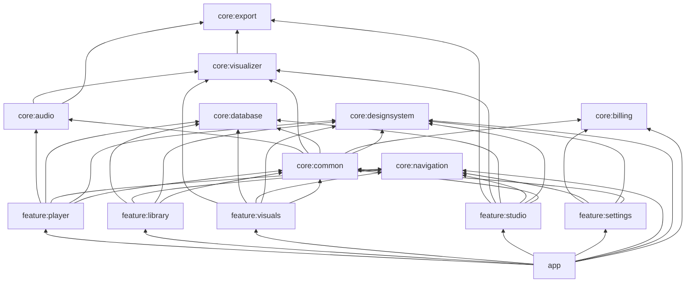
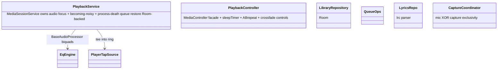
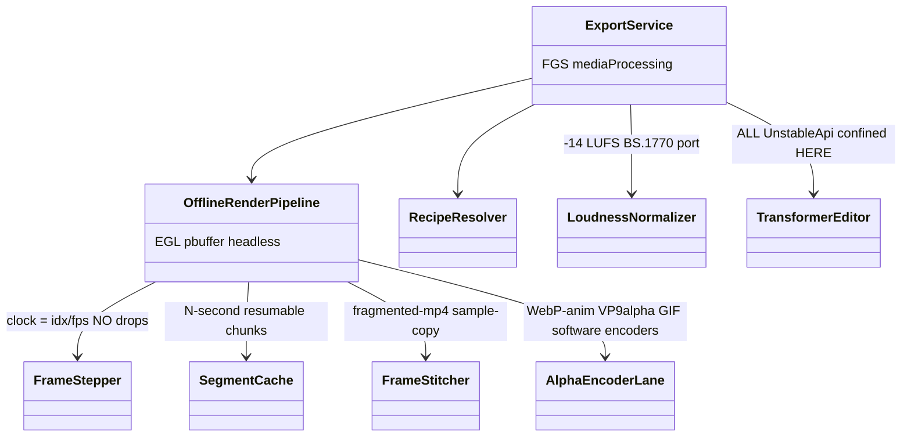
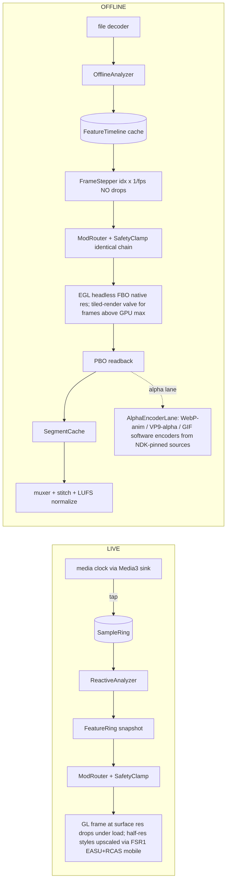

# Synesthesia — Architecture Blueprint
Living navigation map · updated after EVERY merged feature (law L3) · Owner tessie1993 · v0.9 DRAFT (M2, under review)
Contracts: specs/SPEC_BLUEPRINT.md (product) · specs/TECH_STRATEGY.md (stack) · specs/LEGACY_VERDICTS.md (what we ported) · specs/STYLE_CATALOG.md (visual bar) · REBUILD_PLAN.md (laws/progress)

**How to find your way:** five pillars = P1 audio+render core (`:core:audio`, `:core:visualizer`) → P2 styles (styles pkg of `:core:visualizer`) → P3 player (`:feature:player`) → P4 export (`:core:export` + `:feature:studio`) → P5 UI (`:app`, `:core:designsystem`, features). Billing seams live in `:core:billing`. Dependency law: P1 knows nothing about P3/P4/P5; P2 consumes P1; P4 re-drives P1+P2 offline; P5 orchestrates.

## 1. Module DAG (~14 modules)



`FSTUDIO→VIS` exists for READ-ONLY style/preset metadata when composing recipes; rendering itself never leaves `:core:visualizer`.

Edges are the ONLY allowed dependencies. Forbidden by compile-time convention plugin check: any `core:*`→`feature:*`; reverse `ui→engine` edges; Media3 session/UI types inside `:core:audio` except behind its `AudioSource` ports. `:app` owns DI wiring (Hilt), `SynesthesiaApp`, `MainActivity`, service declarations.

## 2. Class diagrams by pillar

### P1a — :core:audio

```mermaid
classDiagram
    class AudioSource <<interface>> { +start() +stop() +attach(sink: PcmSink) }
    class PcmSink <<fun interface>> { +write(f32 interleaved, frames, ch) }
    AudioSource ..> PcmSink
    PlayerTapSource ..|> AudioSource : legacy PcmTap TeeAudioProcessor sink
    MicSource ..|> AudioSource : legacy MicCapture
    CaptureSource ..|> AudioSource : API29 playback capture FGS
    FileDecoderSource ..|> AudioSource : offline direct decode
    class SampleRing { +write() +snapshotLatest() +beginEpoch() }
    PcmSink <|.. SampleRing : single-writer ring
    SampleRing --> ReactiveAnalyzer
    class ReactiveAnalyzer { +bands[64] +rms +bass +bpm +onset +beatPhase }
    ReactiveAnalyzer --> LogBands : FFT2048 to 64 log bands
    ReactiveAnalyzer --> OnsetTracker : legacy SuperFlux+OnsetPeakPicker merged
    ReactiveAnalyzer --> TempoGrid : legacy TempoTracker+BeatGrid+BarTracker merged
    ReactiveAnalyzer --> FeatureRing
    class OfflineAnalyzer { +analyze(uri) FeatureTimeline }
    OfflineAnalyzer --> FeatureTimeline
    FeatureTimeline --> AnalysisCache : key contentHash+paramsVersion
```

Ports law: `AudioSource` is the ONLY seam between Media3/mic/projection/file and the analysis bus.

### P1b — :core:visualizer core

```mermaid
classDiagram
    class StyleFramework { +render(clock, audioFrame, params) frame }
    class StyleManifest { +styleId +costClass base|high|ultra +glesFloor +modTargets }
    class ParamRegistry { +paramId to typed schema } : legacy ParamKeys+ParamScope
    class ModRoute { +paramId +source +depth +curve } : legacy LfoConfig/AdsrConfig as JSON
    class SceneParams { +stylable fields }
    class RenderClock { media OR frameIndex }
    class TierGovernor { auto tier from frametime } : legacy ThermalGovernor+GlTier probe
    class SafetyClamp { WCAG <=3 flash/s LAST non-defeatable } : legacy VisualSafety+FlashBudget VERBATIM
    class ArtifactRegistry { recipes presets themes modroutes schemas }
    ArtifactRegistry --> Tolerant : legacy TemplateFormat ForeignFields machinery
```

### P2 — style families (:core:visualizer/styles)

```mermaid
classDiagram
    class Style <<interface>> { manifest() params() render(frame) }
    ShaderStyleBase ..|> Style : legacy ShaderScene re-grade
    FluidStyleBase ..|> Style : legacy FluidScene family
    ProjectMStyle ..|> Style : interface in core; JNI bridge impl in feature:visuals
    CymaticsStyles --|> FluidStyleBase
    Bgfx3DStyleBase ..|> Style : NEW bgfx renders into FBO texture
    StyleRepository --> Style : picker model
```

projectM placement (aligns LEGACY_VERDICTS): the `ProjectMStyle` *interface* lives in `:core:visualizer/styles`; the JNI bridge implementation (`ProjectMEngine` native bindings, `.so` packaging) lives in `:feature:visuals`, which depends on VIS.

### P3 — :feature:player (REBUILD — zero legacy player code)



### P4 — :core:export



### P5 + billing
`NavGraph` (Nav3 typed NavKeys: Home/Library/Visuals/Studio/Settings/NowPlaying) · `AppShell` slot API (topBar/content/nowPlayingOverlay) · `ThemeEngine(packs)` mineral+glass composition, packs procedurally generated · `UnlockSheet(entitlement)` cadence governor (D-SAFE-2). Billing: `PurchasePort` ← PBL 9.x impl; `EntitlementRepository` (DataStore-cached, queryPurchasesAsync on resume); `DebugPurchasePort` simulates grant/pending/expiry/suspended. Legacy AdPolicy dropped (no ads v1).

## 3. Data schemas (registry-owned; every artifact carries schemaVersion; forward-compatible reads; breaking change = major bump + migrator)

```json
{"kind":"synesthesia.recipe","schemaVersion":1,"id":"r7","seed":1337,
 "presetRef":{"presetId":"p3","contentHash":"sha256:.."},
 "themeRef":{"themeId":"t2","contentHash":"sha256:.."},
 "grade":{"brightness":1.0,"saturation":1.05},"caption":{"pattern":"{title}"},
 "qualityLock":{"res":"2160p","fps":60}}
```
```json
{"kind":"synesthesia.preset","schemaVersion":1,"id":"p3","styleId":"neon_terrain",
 "params":{"speed":1.2,"marchDetail":0.8},"modRouteIds":["mr1"],"randomLocks":["palette"]}
```
```json
{"kind":"synesthesia.theme","schemaVersion":1,"id":"obsidian_neon",
 "mineralPack":"obsidian_v2","soundPack":"crystal"}
```
```json
{"kind":"synesthesia.modroute","schemaVersion":1,"paramId":"zoom","routes":[
 {"type":"band_follower","band":3,"attack":0.02,"release":0.08,"depth":0.4},
 {"type":"beat_impulse","curve":"exp_decay"}]}
```

**Room entities:** `Track(uri PK, title, artist, album, durationMs, contentHash, folderRoot)` · `Playlist(id, name)` · `PlaylistTrack(playlistId, trackId, position)` · `HistoryDay(day, trackId, playCount, listenedMs)` · `Favorite(trackId, addedAt)`.
**DataStore keys:** entitlement.cache · player.eq.bands · player.eq.preset.<deviceId> · player.playback.* · visuals.activeRecipeId · visuals.tier.override · comfort.flashDepth · comfort.reducedMotion · paywall.lastSheetAtMs · export.defaults.
**Backup-excluded (D-SAFE-4):** entitlement cache, analysis cache, crash ring buffer.

## 4. Runtime architecture



Identical math both paths (SPEC §2.1) — including the SafetyClamp, which runs LAST in BOTH chains (D-SAFE-1). Live-only upscaling never runs offline; offline renders native-res.

### 4.1 Failure & lifecycle ownership
| Concern | Owner | Mechanism |
|---|---|---|
| GL context loss | StyleFramework (per style) + GlUtil.resetFrameState port | rebuild scene, re-upload program binaries via ProgramBinaryCache port |
| Projection revoked mid-capture | CaptureCoordinator (:feature:player) | system callback → stop CaptureSource through AudioSource port; settings card explains |
| Mic/capture seam | CaptureCoordinator drives MicSource/CaptureSource THROUGH the AudioSource port; permissions + D-SAFE-5 disclosure strings live in :feature:player/:core:designsystem | :core:audio stays permission-free |
| Disk-full during export | SegmentCache | flush partials as `.partial`, keep resumable state, surface retry |
| Crash ring buffer | :core:common CrashRing (backup-excluded, write-time sanitization per §12/D-SAFE-4) | share-sheet pull, sanitized |
| Process death (player) | PlaybackService | Room-backed queue snapshot restore |
| Audio focus / becoming noisy | PlaybackService | Media3 default handling + pause-on-unplug pref |
| Parity harness (§2.1) | **:core:visualizer test source set** — Tier-1 offline↔offline pixel-exact suite; Tier-2 pHash structural check | CI-run |

Legacy-target name map: LEGACY_VERDICTS "render-engine" ≙ `:core:visualizer` · "stores" ≙ `:core:database`+`:core:common` · ":feature:player capture" ≙ CaptureCoordinator flow · "style families" ≙ `:core:visualizer/styles`.

Identical math both paths (SPEC §2.1). **Threads:** main (UI/session) · GL thread(s) (live renderer; bgfx worker for the 2 bgfx-assisted styles) · audio thread (sink tap writes ring — never locks) · Dispatchers.IO (cache, Room) · Default (offline analyze) · export runs under foreground service `mediaProcessing`, doze-safe.

## 5. Key decisions register

| # | Decision | Rationale | Ref |
|---|---|---|---|
| 1 | Single-writer lock-free SampleRing | audio thread never blocks GL | §2.2 |
| 2 | One schema-registry module owns all 4 JSON kinds w/ Tolerant+ForeignFields | nothing silently dropped on upgrade | §2.5 |
| 3 | ALL @UnstableApi confined to TransformerEditor (:core:export) | Media3 churn touches one module | TS §6 |
| 4 | Injected clock: media-clock vs frame-index — one render fn | determinism soul | §2.1 |
| 5 | SafetyClamp LAST, non-defeatable, not a setting | photosafety untouchable by tiers/paywall | D-SAFE-1 |
| 6 | AudioSource port unifies tap/mic/capture/file behind PcmSink | engine source-agnostic | §2.2 |
| 7 | bgfx ONLY for Bass Vortex + Cymatic Cathedral, FBO-composited | contained cost; GLES spine hand-rolled | TS §2 |
| 8 | Room for library; DataStore for prefs/EQ/entitlement | FTS impossible in DataStore | TS §1 |
| 9 | Serverless client-side billing via PurchasePort; RC excluded | INTERNET violates no-network law | §7 D-SAFE-3 |
| 10 | Segment cache + fragmented-muxer stitch | cancellable/resumable long renders | §4.5 |
| 11 | projectM pinned commit 2f244141 until 4.2.0 tags | bridge needs render_frame_fbo | TS §2 |
| 12 | Entitlement as data (ExportLimits-style), not scattered ifs | one place defines free tier | legacy Entitlement.kt |
| 13 | Parity harness owned by :core:visualizer test source set | SPEC §2.1 names render-engine module = this one | §2.1 |
| 14 | Alpha lane = software encoders bundled from NDK-pinned sources, branch after PBO readback | HW VP9 encode absent on phones | §4.5 |
| 15 | Capture permission/disclosure surface in feature layer; core audio permission-free | policy copy near user, engine pure | §12 D-SAFE-5 |

## 6. Name ledger (legacy semantics carried forward)
Unchanged: SampleRing, ReactiveAnalyzer, LogBands, FeatureRing, OfflineAnalyzer, FeatureTimeline, AnalysisCache, SceneParams, AudioBus, PlaybackService, QueueOps, ProjectMScene.
Renamed: OnsetTracker←SuperFlux/OnsetPeakPicker · TempoGrid←TempoTracker+BeatGrid+BarTracker · TierGovernor←ThermalGovernor/GlTier · SafetyClamp←VisualSafety(+FlashBudget) · ModRoute←LfoConfig/AdsrConfig · ParamRegistry←ParamKeys/ParamScope · StyleManifest←VisualStyleCatalog entries · StyleRepository←PresetStore · EqEngine←MvzAudioProcessorChain · LibraryRepository←TrackLibrary · CaptureCoordinator←CaptureController · LoudnessNormalizer←LoudnessMeter/Target · ThemeEngine←ThemePackCatalog · FrameStitcher←LoopRender seam logic.
New: RenderClock, RecipeResolver, SegmentCache, FrameStepper, UnlockSheet, PurchasePort, DebugPurchasePort, Bgfx3DStyleBase.
