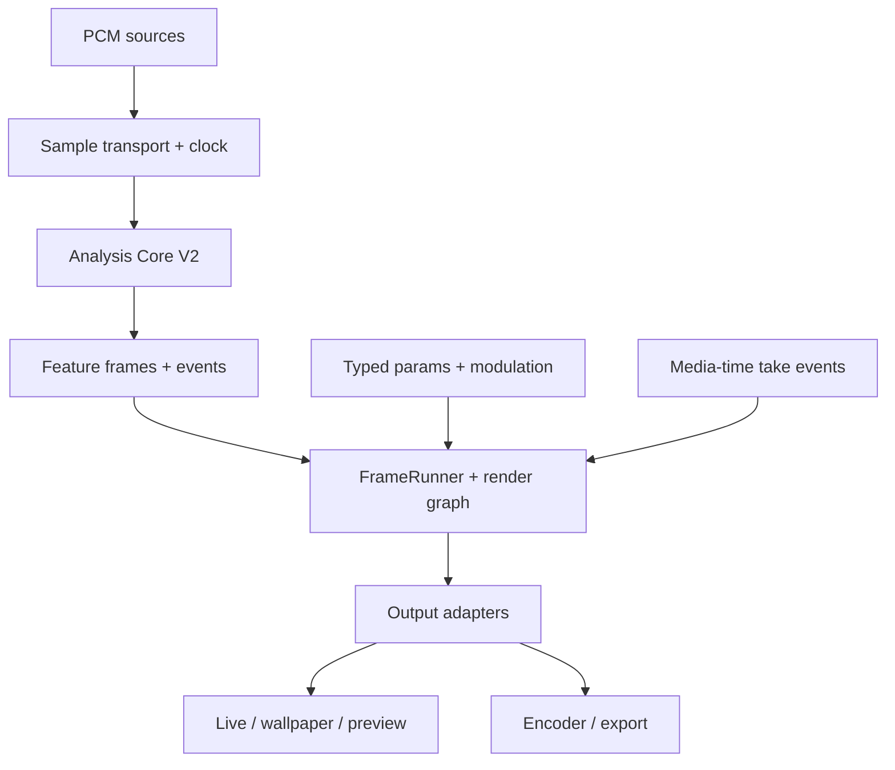
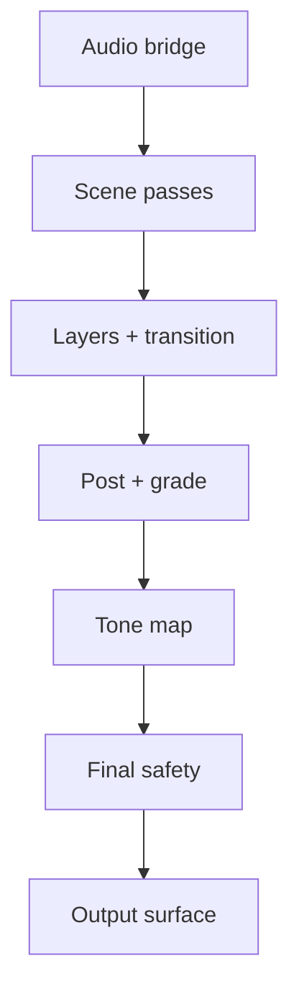

# MusicViz 2.0 — Strict Claude Code Implementation Harness

> **Purpose:** This is the sole executable work order and state machine for rebuilding MusicViz's audio-reactive and visual engine as version 2.0 without losing the working product around it. It is deliberately stricter than the repository's old plans, agent prompts, review queues, and generic coding skills.
>
> **Audited repository:** `tessie1993/music-visualizer-2`
>
> **Audit baseline:** `main` at `05aca01ca0d7162c204ac803040b5cda74a97877` (2026-08-13)
>
> **Project root inside the repository:** `musicviz-project/musicviz`
>
> **Audience:** Claude Code or another implementation agent working directly in the repository.

> **Path convention:** Unless a path starts with `musicviz-project/`, paths such as `docs/`, `app/`, `tools/`, and `gradle/` are relative to the Gradle project root `musicviz-project/musicviz/`. From the repository root, this master plan's actual destination is `musicviz-project/musicviz/docs/v2/MASTER_PLAN.md`.

> **Harness revision:** 2 — repository prompt-surface purge, legacy no-growth rules, evidence ledger, deletion ledger, phase state machine, and resumable Claude launch contract added after a second audit of the repository at the same baseline SHA.

> **Mandatory operating sentence:** Read this file completely, obey its authority order, execute only the current unlocked slice, prove its gate, update the ledgers, commit it, and only then unlock the next slice.

---

## H0. Strict harness — enter this before Section 0

This document is not a suggestion list. It is a gated execution harness. Claude must not convert it into a shorter plan, replace it with a new plan, resume an older queue, or select visually exciting work out of order.

### H0.1 Required launch prompt

The operator should start Claude Code with this exact request after placing this file at `musicviz-project/musicviz/docs/v2/MASTER_PLAN.md`:

```text
Implement MusicViz 2.0 under the strict repository harness.

First read musicviz-project/musicviz/docs/v2/MASTER_PLAN.md completely. Then
read CLAUDE.md, musicviz-project/musicviz/docs/v2/STATUS.md,
musicviz-project/musicviz/docs/v2/RETIREMENT_LEDGER.md, all accepted ADRs,
git status, and the last two commits. Treat MASTER_PLAN.md as the only
implementation work order. Other Markdown is non-authoritative unless the
master plan explicitly allowlists it for the current slice.

Resume only the single slice marked ACTIVE in STATUS.md. If no slice is
ACTIVE, perform the next locked phase's discovery step and write the proposed
slice contract before changing production code. Do not skip gates, weaken
tests, extend legacy architecture, launch an unbounded agent loop, or claim
anything passed without recorded command/device evidence. Stop only for a
listed user-decision boundary or an unrecoverable environment/permission
blocker. Otherwise continue slice by slice.
```

### H0.2 Harness state machine

Every phase and slice has exactly one state:

```text
LOCKED -> DISCOVERY -> SPECIFIED -> RED -> IMPLEMENTING -> VERIFYING
       -> REVIEWING -> READY_TO_COMMIT -> COMPLETE

Any failed gate -> BLOCKED
Any discovered scope/contract error -> SPECIFIED
Any regression after completion -> REOPENED -> RED
```

Rules:

1. Only one slice may be `IMPLEMENTING`, `VERIFYING`, or `REVIEWING` at a time.
2. A later phase stays `LOCKED` until every exit gate of its predecessor has evidence.
3. `DISCOVERY` is read-only. It produces a concrete slice contract and affected-file list.
4. `SPECIFIED` names behavior, owners, interfaces, migrations, tests, performance budget, deletion consequences, and rollback.
5. `RED` requires a failing behavioral/architecture test or a recorded characterization result. A test that fails because it does not compile is not automatically a valid red test.
6. `IMPLEMENTING` changes only the approved slice files plus unavoidable build/generated files recorded in `STATUS.md`.
7. `VERIFYING` runs the slice matrix from Section 5. Failures return the slice to `IMPLEMENTING`; they are never waived silently.
8. `REVIEWING` rereads the complete diff, searches for duplicate paths and legacy growth, and checks the retirement ledger.
9. `READY_TO_COMMIT` requires a completed evidence block. Then make one conventional commit and record its SHA.
10. `COMPLETE` means merged behavior and evidence, not merely code written. Do not mark a whole phase complete from unit tests alone when the phase requires GL/device/performance proof.

### H0.3 Mandatory control plane

Create and maintain these files. They are part of the implementation, not optional documentation:

| File | Purpose | Update rule |
|---|---|---|
| `docs/v2/MASTER_PLAN.md` | Immutable work order | Never rewrite to match implementation drift. Amend only through a dated ADR plus an explicit user-approved scope decision. |
| `docs/v2/STATUS.md` | Single current state, active slice, last verified baseline, next command | Update before and after every slice commit and before ending a session. |
| `docs/v2/INVENTORY.md` | Current owners, entry points, outputs, tests, durable formats, GL resources, source-text gates | Populate in Phase 0; update when ownership moves. |
| `docs/v2/RETIREMENT_LEDGER.md` | File/type-level `KEEP`, `ADAPT`, `BRIDGE`, `REPLACE`, `DELETE_AFTER_GATE`, or `DELETE_NOW` disposition | No replacement subsystem may be called complete while its old owners lack dispositions. |
| `docs/v2/VERIFICATION_LOG.md` | Commands, exact result, duration, environment, device/GPU, artifact and benchmark evidence | Append facts only; unknown and not-run remain explicit. |
| `docs/v2/SOURCE_ARCHIVE.md` | External source provenance, pinned revision, license, adapted files/ideas and notices | Update before any external code or shader enters the tree. |
| `docs/v2/decisions/ADR-NNNN-*.md` | Material decisions and divergence from the master plan | Accept before implementation of the affected decision. |

`STATUS.md` must remain short enough to read at every session start. Detailed historical output belongs in `VERIFICATION_LOG.md`, not in status prose.

### H0.4 Markdown quarantine

Until the Phase 0 instruction purge is committed, Claude may read only:

- this master plan;
- root `CLAUDE.md` for repository location and actual Gradle commands;
- `.claude/skills/music-visualizer-2/SKILL.md` for verified stack facts;
- `.claude/rules/ecc/kotlin/` for Kotlin style, after checking each rule against the build;
- `docs/AUDIO_CHAIN.md` for the tap-first invariant;
- a Markdown file explicitly named by the current slice for evidence extraction.

All other Markdown is quarantined. It may be searched for facts, but its commands, priorities, status claims, agent assignments, quality verdicts, pinned SHAs, and pending tasks are never executable. Do not follow a cross-reference from quarantined Markdown unless this plan or the current slice allowlists the target.

Git history is the archive. Do not keep wrong instructions in the working tree merely to preserve history.

### H0.5 Legacy no-growth rule

The following legacy surfaces are frozen except for characterization, a narrow compatibility adapter, or a correctness fix required to keep the strangler migration shippable:

- `analysis/AnalysisEngine.kt`, legacy `AudioFeatures.kt`, `AudioBus.kt`, cache-v2 runtime and duplicated offline analysis;
- `render/VisualizerRenderer.kt`, legacy `Scene`, `ParticleSceneBase`, CPU particle subclasses, `FlowField` readback, and global render/layer buses;
- flat `SceneParams.kt`, reflective interpolation, hardcoded LFO/ADSR target switches;
- the visual loop/compositor half of `VideoExporter.kt`, `FxCompositor.kt`, and legacy take replay.

Do not add a new feature, renderer, audio feature, parameter, modulation target, output mode, or user-facing behavior to these surfaces. Build it in V2 and bridge it. If a slice appears to require meaningful new legacy behavior, return to `SPECIFIED` and redesign the seam.

Add architecture tests during Phase 0 that fail when:

- a new `dev.musicviz.engine`, `analysis.v2`, `render.v2`, `take.v2`, or `export.v2` source imports a frozen legacy implementation rather than an allowed bridge/API;
- an output creates its own analysis core, scene registry, safety pass, color grade, modulation evaluator, or visual frame loop;
- normal-frame code calls `glReadPixels` outside an explicitly allowlisted screenshot/debug boundary;
- new production code constructs a frozen legacy type.

### H0.6 Anti-cheating rules

Claude must never:

- change expected values, delete a test, widen a tolerance, lower a benchmark, mark a device `N/A`, or add a silent fallback merely to obtain green output;
- replace a failed command with a narrower command and report the broader gate as passed;
- infer shader/device correctness from JVM tests;
- infer live/export parity from shared type names rather than rendering both paths;
- infer absence of allocation or readback by code inspection when the gate requires a profiler/trace;
- keep both old and new architecture indefinitely and call the migration complete;
- create empty packages, speculative abstractions, placeholder scenes, TODO implementations, fake metrics, or documents that claim future work is already done;
- use subagents or autonomous loops to edit overlapping files. A bounded read-only review may be delegated only when its exact scope and returned evidence are recorded in `STATUS.md`;
- push, merge, rewrite history, delete user data, change repository settings, or release an artifact unless the operator explicitly requested that external action.

When a required environment is unavailable, record `BLOCKED_ENVIRONMENT`, the exact failing command and error, what remains unverified, and the first retry command. Never convert unavailable into failed or passed.

---

## 0. Execution contract — read this first

Claude, treat this document as the sole implementation work order for MusicViz 2.0. Do not treat old backlog documents, paused-agent state, old review verdicts, changelog prose, or prior one-off plans as active instructions.

This document does **not** override your system or safety instructions. Within the repository, use this precedence order:

1. The user's current request and this 2.0 plan.
2. Current source code and tests for facts about behavior that already exists.
3. The replacement `CLAUDE.md`, the minimal MusicViz repo skill, and verified Kotlin rules for repository location, build commands, code style, hot-path constraints, and review discipline — only where they do not conflict with this plan. `.codex/AGENTS.md` is not a Claude instruction source.
4. `docs/AUDIO_CHAIN.md` for the pre-DSP PCM tap invariant.
5. Generated contracts such as `docs/PARAM_MATRIX.md`; never edit generated files by hand.
6. Everything else under `docs/quality/`, `.claude/`, the changelog, and historical Markdown is evidence or reference material, not an executable queue.

When old prose conflicts with current code, do not blindly follow either one. Reproduce the behavior, inspect the tests and history, decide which behavior belongs in 2.0, and record the decision in an ADR. Never resurrect a task merely because an old document says it was pending.

### First actions

Before changing production code:

1. Save this plan unchanged at `docs/v2/MASTER_PLAN.md`.
2. Create `docs/v2/STATUS.md`, `INVENTORY.md`, `RETIREMENT_LEDGER.md`, `VERIFICATION_LOG.md`, `SOURCE_ARCHIVE.md`, and `docs/v2/decisions/` from this plan's templates/rules.
3. Record the actual starting branch, commit SHA, dirty files, Java/SDK/Gradle versions, and baseline command results. Do not edit a production file first.
4. Compare the actual HEAD with the audit baseline above. If HEAD is newer, inspect every intervening commit and record the impact in `STATUS.md`. Do not reset newer work and do not rewrite this master plan to pretend the divergence does not exist.
5. If the worktree is already dirty, preserve the user's changes. Identify overlapping files before editing. Never discard or overwrite unrelated work.
6. Execute the instruction/document purge in Appendix E as the first repository change. Replace root `CLAUDE.md` with the minimal harness pointer in Appendix F. Do not let obsolete repo-local agents or commands remain active while implementation begins.
7. Run and record the clean baseline from the real Gradle root. If dependency/network setup blocks it, record `BLOCKED_ENVIRONMENT`; resolve the environment before production edits.
8. Populate the inventory and retirement ledger from code and tests, not from old review prose.
9. Start Phase 0. Do not jump directly to a new scene, shader, parameter surface, or visual effect.

### Working mode

- Implement one vertical slice at a time.
- Keep exactly one active slice and one writer. Do not run overlapping edit agents.
- Write or change the behavioral test first, see it fail for the intended reason, then implement, then refactor.
- Keep the legacy engine runnable behind a generation switch until each 2.0 slice passes its migration gates.
- Make one conventional commit per completed slice. Do not bundle unrelated cleanup.
- Update `docs/v2/STATUS.md` after every commit with evidence: commit SHA, commands run, results, device used, benchmark delta, known gaps, and next slice.
- Re-read the complete diff before every commit.
- Run the legacy-growth and duplicate-owner searches before every commit.
- Never claim a command, device test, shader compile, performance target, or visual comparison passed unless it actually ran.
- Do not weaken, delete, skip, or broaden tolerances in an existing gate just to make a refactor green.
- Do not leave placeholder implementations, `TODO()` calls, silent fallbacks, false-success UI, or dead compatibility branches and call a phase complete.
- If context is running low, finish the current slice, commit it, update `STATUS.md`, and stop. A fresh session must resume by reading this plan, `STATUS.md`, open ADRs, `git status`, and the last two commits.

### Stop and ask the user only when

Stop rather than guessing if a decision would:

- add network access or the `INTERNET` permission;
- remove an existing user-facing feature instead of migrating it;
- change `minSdk`, `targetSdk`, supported ABI, the projectM dynamic-link boundary, or the license model;
- make saved presets or takes unrecoverable;
- require copying source with unclear, noncommercial, GPL/AGPL-incompatible, or study-only licensing;
- require a large new native dependency after the measured Kotlin/JTransforms path already meets its budget;
- change the public 2.0 scope or visual identity below.

For ordinary implementation details, choose the simplest compatible option, document it, and continue.

---

## 1. Product definition

MusicViz 2.0 is a deterministic, sample-timed, GPU-resident audio-visual engine inside the existing offline Android music app. It is not a rewrite of the entire app, a switch to a game engine, or a redesign of the crystal UI.

The release succeeds when the same audio, parameters, safety policy, seed, and media-time event timeline produce the same creative performance across:

- the live Now Playing visualizer;
- full-screen and second-screen output;
- the live wallpaper;
- performance-take replay;
- offline video export.

The engine must be expressive enough for particles, cymatics, living fields, feedback systems, phase/scope forms, raymarched Hyperspace, and fluid/spatial effects without CPU particle uploads, normal-frame GPU readback, renderer-specific feature forks, or hand-copied composite logic.

### Product promises that must survive

- Local-first playback and analysis; no `INTERNET` permission.
- Player, queue, lyrics, history, favorites, other-app audio capture, microphone mode, wallpaper, Export Studio, presets, projectM support, and the current crystal/mineral design system remain available.
- The existing pre-user-DSP PCM tap order remains intact, so audio-reactive visuals represent the source rather than EQ/speed effects.
- The existing Hyperspace and Cymatics style IDs and all current saved-preset IDs continue to resolve.
- The ten authored Hyperspace variants and ten authored Cymatics variants remain recognizable, then gain the new engine's richer feature inputs and shared output pipeline.
- Named crystal packs remain mineral-specific rather than collapsing into generic glassmorphism.
- Unsafe visual behavior is never the silent default.
- Export status, persistence status, source status, capability downgrades, and failures are truthful.
- No steady-state allocation on the real-time PCM, analysis, simulation, or draw hot paths after warm-up.

### Explicit non-goals for 2.0

- No Vulkan-first rewrite.
- No Rust/wgpu rewrite.
- No Unity, Godot, Filament, or other game-engine migration.
- No multi-module Gradle reorganization until the new boundaries are stable; package boundaries are sufficient for 2.0.
- No cloud accounts, telemetry service, content feed, remote shader store, online lyrics, or web preset marketplace.
- No direct source reuse from ShaderToy, Baryon, GPL/AGPL projects, noncommercial projects, or repositories with unclear licensing.
- No statically absorbing projectM into proprietary code. Preserve the existing replaceable/dynamic LGPL boundary and notices.
- No general UI rewrite. UI work is limited to safety, engine controls, previews, truthful state, and integration with the existing crystal system.
- No shipping Oboe, PFFFT, libebur128, or another native dependency merely because it might be faster. Benchmark first; add only when a written ADR proves the current path misses a release budget and the dependency clears licensing, ABI, and 16 KB gates.

---

## 2. What the audit found

The following is the current-state map at the audit SHA. Re-check every claim against the actual execution SHA before acting.

| Area | Current state | 2.0 consequence |
|---|---|---|
| App/build | Single Android app module; Kotlin/Compose; GLES 3; Media3; arm64; `minSdk 26`, `targetSdk 36`; v1.7.0/code 31 | Keep the module and platform baseline during the strangler migration. |
| Privacy | Manifest has no `INTERNET`; mic, media playback/capture, notification and projection-related permissions exist | Do not add network access. Preserve explicit consent for capture sources. |
| Ownership | `PlaybackSession` is process-wide and owns player, ring, FX, timer, and `AnalysisEngine` | Keep process scope, but replace anonymous global interest counting and ViewModel-owned engine domains with explicit leases and an app graph. |
| Demand | `AudioBus` exposes global latest features, an integer consumer count, and one callback slot | Replace with idempotent typed leases, multiple observers, source epochs, and lifecycle-specific demand. |
| PCM tap | `PcmTapSink` is first in the player processor chain and writes pre-DSP stereo PCM into `PcmRingBuffer` | Preserve tap order and audio-thread preallocation; extend transport with sample metadata and discontinuities. |
| PCM ring | Lock-free single-writer mid/side arrays, latest-window snapshots, no sample timestamp/source epoch | Keep the proven ring concept; replace polling/latest semantics with cursor-based consumption and explicit clock metadata. |
| Live analysis | `AnalysisEngine` wakes every ~16 ms by wall clock and snapshots the latest 2048 samples | Replace. It can analyze a window twice or skip samples and is not media-time deterministic. |
| Features | `FftProcessor` + `FeatureExtractor` produce 64 bands, waveform, beat/rhythm/stereo/chroma fields; arrays are copied | Keep useful musical behavior only behind characterization tests; replace the public backbone with versioned multi-resolution frames and events. |
| Offline analysis | `OfflineAnalyzer.StreamingPipeline` duplicates live setup and timing; cache schema is v2 | Unify live and offline through one `AnalysisCore`; introduce a checksummed versioned cache. |
| Renderer | `VisualizerRenderer` is a ~1,690-line owner of scene registry, clocks, transitions, layers, params, sims, FBOs, safety, projectM, and export factories | Replace with a `FrameRunner`, render graph, resource pool, typed scene runtime, output adapters, and one composite/safety path. |
| Params | `SceneParams` is a flat ~169-field data class; per-frame morphing uses reflection/copy; LFO/ADSR targets are hardcoded | Migrate to typed namespaced schemas and a generic modulation matrix. |
| Particles | `ParticleSceneBase` and nine subclasses simulate on CPU and upload vertex arrays every frame | Replace with GPU-resident state; delete the CPU hierarchy after migrated scenes clear gates. |
| Flow | `FlowField` performs synchronous `glReadPixels` for CPU advection | Remove all normal-frame readback. Preserve only explicit screenshot/debug readback. |
| Fluid | Half-float format probes and ping-pong buffers are useful; scene wiring is duplicated and monolithic | Adapt the capability probes/resource patterns into Render Core V2. |
| Export | `VideoExporter` creates its own scene/EGL loop and `FxCompositor`; live/export composite uniforms are kept in sync by a source-text parity test | Replace the duplicate visual half with the same `FrameRunner`; retain codec/EGL/muxing expertise. |
| Takes | `PerformanceTake` stores wall-clock deltas and sparse parameter snapshots; scene switches are recorded but export constructs one scene | Replace with a versioned media-time event timeline that export and replay both consume. |
| Wallpaper | Service renders continuously while visible and reads settings at startup | Make it an output adapter with explicit leases, live settings, frame pacing, thermal/battery quality, and no Activity/ViewModel dependency. |
| Safety | A useful `VisualSafety` clamp exists, but `GuiPrefs.safeVisuals` and persisted default are false; a 9 Hz full-frame strobe remains reachable | P0: safe-on migration and onboarding, then a final-frame temporal safety pass and offline validation. |
| UI | `PlayerViewModel` is roughly 4,000 lines and owns multiple domains; current ten crystal packs are implemented | Shrink the ViewModel incrementally; preserve and integrate with the current crystal system. |
| Native packaging | Gradle requests modern uncompressed JNI packaging and comments mention 16 KB alignment | Do not infer compliance from the Gradle flag. Verify both bundle zip alignment and every ELF load segment on real artifacts. |

### Baseline verification note

During this audit, `./gradlew :app:testDebugUnitTest` could not start because the Gradle 8.13 wrapper distribution was unavailable from the restricted environment. Java 17 was available and the repository stayed clean. This is **not** a test failure and it is **not** a green baseline. Claude must run and record the full baseline in a connected development environment before production edits.

### Markdown classification

| File/group | How to use it |
|---|---|
| `CLAUDE.md` | Bootstrap evidence only until Phase 0. Replace it with Appendix F so future Claude sessions enter this harness before reading anything else. Retain the verified Gradle root/commands, JDK/SDK requirements, hot-path exception and source-text-gate warning. Remove its old “Key Docs” queue. |
| `.codex/AGENTS.md` | Codex-specific historical configuration, not a Claude work order. It must not influence Claude execution. Keep only if Codex still needs it; otherwise delete it in a separate tooling-scope decision. Never copy its agent/MCP assumptions into this harness. |
| `.claude/skills/music-visualizer-2/SKILL.md` | Retain but rewrite to a minimal repository-facts companion that points to `docs/v2/MASTER_PLAN.md`. It may describe stack, roots and commands; it may not own architecture or backlog. |
| `.claude/rules/ecc/kotlin/` | Retain only rules verified against this Android/Kotlin build. This plan overrides generic immutability/minimal-change rules in preallocated real-time paths and explicitly replaced subsystems. |
| `docs/AUDIO_CHAIN.md` | Current invariant. The player tap stays before silence skipping, Sonic, and user DSP. Do not enable Media3 float output if it bypasses the custom processor chain. |
| `docs/PARAM_MATRIX.md` | Generated evidence. Regenerate through tests/tools; never hand edit. |
| `README.md`, `CHANGELOG.md` | Descriptive history. Verify claims in current code; do not use as an architecture plan. “Working tree” language around current style/theme work is stale. |
| `docs/VISUAL_STYLE_RESEARCH.md` | Preserve its authored Hyperspace/Cymatics catalogue and mineral design research; ignore its old implementation-status wording. |
| `docs/DEVICE_CHECKS.md` | Incomplete reconstruction. Replace it with actual 2.0 evidence; unknown entries are not passes. Delete the old form once the V2 device matrix contains every surviving requirement. |
| `docs/quality/BLUEPRINT_REVIEW.md`, `PRODUCT_REVIEW.md`, `FEATURE_TRIAGE.md`, `QUALITY_BAR.md`, `bar-*` | Historical research only. Extract an independently verified surviving criterion into V2 gates with provenance, then delete these working-tree copies. Git preserves history. Do not resume their queues or accept old “wowed” verdicts. |
| `docs/quality/GAUNTLET_STATE.md`, `GAUNTLET_BACKLOG.md` | Delete in the Phase 0 purge. They are obsolete execution queues; `GAUNTLET_STATE.md` points to an unavailable user-session path and explicitly says the work was paused. |
| `.claude/agents/**` | Delete in the Phase 0 purge. They create competing personas and many contain unrelated SaaS/browser/GAN assumptions. The master plan supplies planning, review and verification roles through explicit slice gates. |
| `.claude/commands/**` | Delete in the Phase 0 purge. The repository currently includes npm/TypeScript formatting hooks, Kotest/MockK/Kover commands and generic KMP build advice that do not match this JUnit/Android project. Use Section 5 only. |
| `.claude/skills/verification-loop`, `continuous-agent-loop`, `compose-multiplatform-patterns`, generic workflow/architecture skills | Delete in the Phase 0 purge. Their useful universal advice is already represented here; their wrong stacks, nonexistent scripts and unbounded-loop vocabulary are dangerous. |
| `.claude/rules/matt-pocock-methods.md` | Keep only if reduced to a short pointer to this harness. Its vertical-slice/TDD principle survives; any generic example or competing process does not. |

---

## 3. Binding invariants

Every phase must preserve these. Add contract tests before touching code that currently enforces them.

### Audio and time

1. The player audio chain is `source -> pre-DSP PCM tap -> silence skipping/Sonic -> user DSP -> output`. Visuals, offline analysis, and export are based on the same pre-user-DSP signal.
2. An input sample belongs to exactly one source epoch and is analyzed at most once per analysis cursor.
3. Switching player/microphone/playback-capture source increments the epoch and emits a discontinuity. No window may mix epochs.
4. Media time comes from sample position plus an explicit source clock mapping, not `SystemClock` polling.
5. Wall clock may schedule work but never defines the musical timeline.
6. Live and offline analysis call the same feature code with the same configuration. Differences may only be source I/O and processing speed.
7. Audio-thread callbacks do not allocate, lock, block, log per buffer, touch Compose state, or call GL.

### Rendering

1. A scene owns only scene-specific simulation and draw behavior. It does not own app lifecycle, output surfaces, encoder setup, wallpaper service state, global safety, or composite grading.
2. Live, wallpaper, preview, replay, and export drive the same `FrameRunner` and render graph.
3. Simulation advances on a fixed media-time step. Rendering may occur at a different cadence.
4. A normal frame performs no GPU-to-CPU readback.
5. GL resources are created, resized, pooled, invalidated on context loss, and released by explicit owners.
6. The main color path is linear, premultiplied, and HDR-capable (`RGBA16F`) when supported, with a tested `RGBA8` fallback. Tone mapping happens exactly once.
7. Safety runs after all scenes, layers, transitions, post effects, and tone mapping decisions that can change delivered luminance.
8. GLES 3.0 is the required baseline. GLES 3.1 compute is an optional accelerator selected by capability, never the only implementation.

### State and persistence

1. Every durable format has a schema version, migration path, stable identifiers, and corrupt/unknown-field behavior.
2. Saving reports success only after the primary durable write completes. SAF mirroring or optional secondary writes report separate status.
3. Concurrent mutations are serialized or transacted; last-completing background jobs may not silently overwrite newer user state.
4. Preset/style IDs are stable. Unknown fields survive a read/write cycle when practical, enabling forward compatibility.
5. Export and take jobs survive UI/ViewModel recreation. Cancellation is cooperative and leaves either a valid completed file or a clearly identified removable partial.

### Product, privacy, and licensing

1. Safe visuals are enabled for users who have not made an explicit v2 safety choice. Opt-out requires an explicit warning and is remembered with a choice-version marker.
2. Reduced motion stays independent from photosensitivity safety.
3. Microphone and playback capture start only from explicit user action and expose visible system state as Android requires.
4. No captured PCM is persisted unless the user explicitly starts a supported recording/export action; no captured PCM is transmitted.
5. No network permission is added.
6. Every reused dependency/source is recorded with URL, revision, license, copied/derived files, modifications, and notice action.
7. Mathematical ideas may be reimplemented from papers; copied source requires compatible terms and notice. Study-only sources never enter shipping code.

---

## 4. Target architecture



The app-level `MusicVizGraph` owns long-lived services. An Activity or ViewModel obtains typed leases and exposes UI state; it does not create the analysis engine, control wallpaper lifetime, or own an export job.

### Proposed package boundaries

Create these packages only as their first vertical slice needs them. Do not create an empty framework forest.

```text
dev.musicviz.engine
  MusicVizGraph, EngineHost, ConsumerLease, EngineDemand, EngineState

dev.musicviz.audio.v2
  AudioSourceId, SourceEpoch, PcmFormat, PcmChunkMeta, SampleCursor,
  SampleClock, PcmTransport, SourceRouter, Resampler

dev.musicviz.analysis.v2
  AnalysisConfig, AnalysisCore, AnalysisFrame, AnalysisEvent,
  FeaturePublisher, OfflineAnalysisRunner, AnalysisCacheV3

dev.musicviz.render.v2
  FrameRunner, FrameInput, FrameClock, RenderGraph, RenderPass,
  GpuCapabilities, GlResourcePool, ColorPipeline, SafetyPass

dev.musicviz.render.v2.audio
  GpuAudioBridge, AudioTextureLayout

dev.musicviz.render.v2.params
  ParamKey, ParamSpec, ParamSchema, ParamValueBuffer,
  ModSource, ModRoute, ModulationEngine, PresetV2

dev.musicviz.render.v2.scene
  SceneDefinition, SceneInstance, SceneContext, LegacySceneAdapter

dev.musicviz.render.v2.sim
  GpuParticleState, PingPongSimulation, SimulationClock

dev.musicviz.output
  LiveOutput, WallpaperOutput, PreviewOutput, EncoderOutput

dev.musicviz.take.v2
  PerformanceTakeV2, TakeEvent, AutomationLane, TakeRecorder, TakePlayer

dev.musicviz.export.v2
  ExportJob, ExportQueue, ExportService, ExportCapabilityPlan
```

### Core contracts

These shapes are architectural contracts, not copy-paste-complete code. Refine exact Kotlin names in ADRs, but do not collapse their responsibilities.

#### Consumer lease

```kotlin
interface ConsumerLease : AutoCloseable {
    val id: LeaseId
    override fun close() // idempotent
}

data class EngineDemand(
    val pcm: Boolean,
    val analysis: AnalysisDemand?,
    val source: RequestedSource,
    val reason: ConsumerKind,
)
```

Each lease has a unique ID, owner kind, creation trace in debug builds, and an idempotent close. The registry derives aggregate demand and can list leaks. There is no public `addConsumer()/removeConsumer()` pair and no single global callback slot.

#### PCM transport

```kotlin
data class PcmChunkMeta(
    val epoch: Long,
    val source: AudioSourceId,
    val sampleRateHz: Int,
    val channelCount: Int,
    val firstFrame: Long,
    val frameCount: Int,
    val presentationTimeUs: Long,
    val discontinuity: Discontinuity?,
)
```

Metadata entering the audio hot path must live in preallocated ring slots or primitive fields. Do not allocate a `data class` per callback just to resemble this public contract.

The transport exposes cursor reads, overrun counts, and epoch changes. A consumer asks for “new frames after cursor X,” never “latest 2048 samples.”

#### Analysis output

```kotlin
data class AnalysisFrameView(
    val schemaVersion: Int,
    val epoch: Long,
    val sequence: Long,
    val centerSample: Long,
    val mediaTimeUs: Long,
    val hopFrames: Int,
    val spectrum: FloatArray,
    val waveform: FloatArray,
    val chroma: FloatArray,
    val scalars: FeatureScalars,
    val events: AnalysisEventSlice,
)
```

The hot path publishes into a fixed ring/triple buffer. A render consumer borrows a generation-stable view for one frame. Compose receives a throttled immutable summary, not the hot arrays and not every analysis hop.

Required scalar/event coverage:

- true time-domain RMS and peak;
- bass/mid/treble energy and spectral flux;
- spectral centroid, spread, rolloff, flatness, and dominant-frequency confidence;
- onset strength and multi-band transient channels;
- beat pulse, phase, BPM, confidence, bar/downbeat estimate where confidence permits;
- stereo width, correlation, balance, and mid/side energy;
- twelve-bin chroma, key estimate/confidence, tonal change;
- macro energy/section trend computed causally for live use and identically in offline streaming mode;
- discontinuity, silence, source change, seek, and overrun events.

#### Frame runner

```kotlin
data class FrameInput(
    val outputTimeUs: Long,
    val mediaTimeUs: Long,
    val frameIndex: Long,
    val viewport: Viewport,
    val features: AnalysisFrameView,
    val params: ParamValueBuffer,
    val safety: SafetyPolicy,
    val quality: QualityProfile,
)

interface FrameRunner {
    fun attach(output: RenderOutput)
    fun render(input: FrameInput)
    fun detach()
}
```

The runner owns the graph, fixed-step accumulator, shared output stages, capability plan, and resource pool. A scene instance receives a restricted `SceneContext`; it cannot reach Android UI state or an encoder.

#### Typed parameters and modulation

Every parameter has a stable namespaced key such as `scene.hyperspace.melt.strength`, a type, default, range, unit, UI group, interpolation rule, randomization policy, safety classification, and capability predicate.

A modulation route has:

- stable route ID;
- source (`bass`, `onset`, `beatPhase`, `chroma.3`, `stereoWidth`, `lfo.1`, etc.);
- typed target key;
- depth, polarity, curve, smoothing, and optional quantization;
- deterministic evaluation order;
- a defined behavior when its target is unavailable in another scene.

The modulation engine evaluates into preallocated primitive buffers. It must not reflect over Kotlin fields or call `copy()` per frame.

---

## 5. Verification rules used by every phase

### Required local feedback loop

Run focused tests while developing, then before each slice commit run from `musicviz-project/musicviz`:

```bash
./gradlew :app:testDebugUnitTest
./gradlew :app:ktlintCheck
./gradlew :app:lintDebug
./gradlew :app:assembleDebug
```

Before a phase merge/release checkpoint also run:

```bash
./gradlew :app:connectedDebugAndroidTest
./gradlew :app:bundleRelease
```

If signing prevents `bundleRelease`, build the closest unsigned release artifact and record the limitation. Do not silently substitute a debug build for release-native verification.

Source-text tests currently pin paths and duplicate implementations. While a legacy subsystem exists, keep its gates. When the subsystem is removed, replace the source-text assertion with a behavioral/architecture gate in the same slice, see the new gate fail against the unwanted structure where possible, then delete the obsolete gate. Never edit `PARAM_MATRIX.md` manually.

### Evidence format

Every `STATUS.md` slice entry must include:

- commit and files changed;
- focused red test and why it failed;
- complete commands and pass/fail counts;
- benchmark/device/artifact identifiers;
- screenshots or frame hashes where visual comparison is part of acceptance;
- known risks and explicit deferred work;
- legacy code made unreachable or deleted;
- next exact slice.

### Performance gates

Measure after warm-up on at least one low/mid/high physical arm64 device, including both Adreno and Mali before release. Record device model, SoC/GPU, OS/API, refresh rate, resolution, thermal status, quality profile, and scene.

| Gate | Release target |
|---|---|
| PCM callback | Zero allocations and locks; no underrun regression versus v1 baseline. |
| Analysis | Average under 3 ms and p95 under 6 ms per base hop on the mid-tier reference device; no cursor backlog in real-time playback. |
| Analysis scheduling | Every source frame is either consumed once or covered by a reported overrun/discontinuity; zero silent duplicate windows. |
| Render CPU | Zero steady-state allocations after warm-up in `FrameRunner`, modulation, and scene update. |
| GPU readback | Zero `glReadPixels`, buffer mapping waits, or fence-blocking CPU reads in normal live/export/wallpaper frames. |
| Live balanced profile | p95 frame time at or under 16.7 ms at 1080p/60 on mid-tier reference; no more than 1% missed frames in a 10-minute representative run. |
| Live low profile | p95 at or under 33.3 ms at 720p/30 on low-tier reference during a 20-minute run. |
| Export | No A/V drift beyond ±20 ms at start, after a seek/event, and at end; output duration within one video frame of requested range. |
| Determinism | CPU analysis and event timeline exactly repeat for identical input/config; rendered frames are exact on the same GPU/driver and perceptually bounded across supported GPUs. |
| Memory | Live balanced GL resources <=128 MiB at 1080p; live high <=192 MiB; 4K export <=384 MiB; no monotonic growth over repeated scene switches/context recreation. |
| Lifecycle | Analysis stops within 500 ms after the last analysis lease closes; wallpaper/export continue independently of Activity destruction when their own lease/job is active. |
| Thermal | Quality degrades without crash or black output at severe thermal status and recovers conservatively after sustained relief. |

If a target is impossible on a named reference device, do not quietly relax it. Capture a trace, change the design or quality tier, and write an ADR if the product target itself must change.

### Device/release matrix

At minimum verify:

- API 26 and API 29 compatibility paths;
- API 34, 35, and 36 lifecycle/permission/foreground-service paths;
- 4 KB and 16 KB page-size arm64 environments;
- Adreno and Mali GLES 3.0 baseline; at least one GLES 3.1 compute-capable device;
- local player PCM at 44.1 and 48 kHz, mono and stereo, pause/resume, seek, gapless/track switch;
- microphone permission grant/deny/revoke;
- playback capture allowed audio, protected/silent app behavior, projection revoke;
- Activity rotate/recreate, process background/foreground, screen off, audio continuing;
- wallpaper visible/hidden/preview, settings change, battery saver, thermal pressure;
- export cancel, process/UI recreation, storage-full, encoder rejection, all capability fallbacks;
- EGL context loss/recreation and shader compile fallback;
- accessibility font scale, TalkBack traversal, reduced motion, safe visuals onboarding/opt-out.

---

## 6. Phase-by-phase implementation

Each numbered slice below should become one reviewable commit unless it is explicitly marked as a multi-commit track. Do not start a later phase until the preceding phase's exit gate is met, except for documentation or test-fixture work that has no production dependency.

### Phase 0 — Establish authority, baseline, and immediate safety

**Goal:** Make the long migration resumable, measure the real starting point, and remove the current unsafe-by-default product state before adding expressive power.

#### 0.0 Purge competing instructions before implementation

This is the first repository commit. It is documentation/tooling cleanup only; it must not change app behavior.

Actions:

1. Put this file at `docs/v2/MASTER_PLAN.md` and replace root `CLAUDE.md` with Appendix F.
2. Apply Appendix E's `DELETE_NOW` prompt-surface list. Do not archive obsolete instructions elsewhere in the working tree; Git history is the archive.
3. Rewrite `.claude/skills/music-visualizer-2/SKILL.md` to the minimal companion in Appendix G. Delete all other repo-local Claude skills, agents and commands unless Appendix E explicitly retains them.
4. Search remaining Markdown for `npm`, `pnpm`, `TypeScript`, `Python`, `Kotest`, `MockK`, `Kover`, `KMP`, `GAN`, `Playwright`, unavailable session paths, old agent run IDs, `resume`, `wowed`, and pinned old task queues. Classify every hit as legitimate product/tooling evidence or remove it.
5. Search `CLAUDE.md`, `.claude/`, `.agents/`, `.codex/`, `docs/`, `README.md`, and `CHANGELOG.md` for phrases that compete with this master plan. Record retained exceptions in `INVENTORY.md`.
6. Commit the purge as `chore(harness): establish MusicViz 2.0 authority` before touching production Kotlin/GLSL/XML.

Gates:

- Opening Claude at repository root leads to `docs/v2/MASTER_PLAN.md` before any other implementation queue.
- No remaining repo-local Claude command names a package/test/coverage/build tool absent from the actual Gradle build.
- No active Markdown tells Claude to resume the gauntlet, launch GAN/browser agents, follow a stale pinned SHA, or extend the legacy renderer.
- `git diff` for this commit contains no production source, resource, manifest, Gradle dependency, or generated binary change.

#### 0.1 Create the v2 control documents

Files:

- `docs/v2/MASTER_PLAN.md` — this document, unchanged;
- `docs/v2/STATUS.md` — concise current state and resume pointer;
- `docs/v2/INVENTORY.md` — owners, entry points, outputs, tests, durable schemas and GL resources;
- `docs/v2/RETIREMENT_LEDGER.md` — disposition and gate for every legacy owner;
- `docs/v2/VERIFICATION_LOG.md` — append-only command/device/performance evidence;
- `docs/v2/SOURCE_ARCHIVE.md` — source provenance and licensing;
- `docs/v2/decisions/ADR-0001-engine-v2-strangler.md`;
- `docs/v2/BASELINE.md`;
- `docs/v2/LICENSE_LEDGER.md`;
- `docs/v2/DEVICE_MATRIX.md`.

Actions:

1. Record current SHA, branch, dirty state, repo file counts, app version, SDK/AGP/Kotlin/Media3 versions, supported ABI and native libraries.
2. Run the complete baseline commands and record exact results. If infrastructure blocks a command, record the command, full root cause, and what must be rerun; do not mark it passed.
3. Capture baseline APK/AAB size, startup time, analysis timing, allocations, representative scene frame times, live/export reference frames, and a five-minute memory trace.
4. Copy the existing device checklist's known facts into the new matrix only when backed by current evidence. Mark everything else `NOT RUN`, never `PASS` by inheritance.
5. Write ADR-0001: keep one app module, use a strangler flag, GLES 3.0 baseline/GLES 3.1 optional, process-scoped engine host, and unified live/export runner.
6. Populate the retirement ledger for every file in `analysis/`, `audio/`, `render/`, `export/`, wallpaper, performance-take code, related UI plumbing and source-text tests. Unknown disposition blocks production changes in that owner.
7. Generate a dependency/ownership map from imports, constructors, service lookup, callbacks, source-text tests, reflection and native/JNI boundaries. Do not rely on package names alone.

Tests/gates:

- No production behavior change.
- Baseline is reproducible by a second clean checkout.
- `STATUS.md` identifies the first failing or blocked baseline gate.

#### 0.2 Add engine generation and diagnostics scaffolding

Expected files:

- `dev.musicviz.engine.EngineGeneration`;
- a debug-only generation selector in existing settings/diagnostics;
- `dev.musicviz.engine.EngineDiagnostics`;
- tests for persisted/default selection and production fallback.

Actions:

1. Add `LEGACY` and `V2` generation states. Default production behavior remains legacy until the v2 vertical slice passes Phase 4.
2. The flag selects one active visual/analysis generation; do not run both full engines continuously.
3. Add local diagnostics counters: active leases, source/epoch, PCM cursor/overruns, analysis latency/backlog, feature sequence, frame CPU/GPU time, resource bytes, dropped frames, quality tier, output type, export fallback, context-loss count. No remote telemetry.
4. Expose the diagnostics as a bounded in-memory snapshot and an explicit user-exportable text report.

Tests/gates:

- Release builds cannot accidentally expose unsafe debug controls.
- Selecting an unavailable v2 engine falls back visibly and records a reason; it never renders black silently.

#### 0.3 Make photosensitivity safety an explicit v2 choice

Current affected files include `render/VisualSafety.kt`, `ui/AppTheme.kt`, `ui/BehaviorSettings.kt`, preset/randomizer code, onboarding/shell code, wallpaper, and export.

Actions:

1. Add a versioned `safetyChoiceVersion` preference. Absence means the user has never made the v2 choice.
2. On first 2.0 launch or first dogfood activation, default safe visuals **on** and show a concise blocking-before-visuals explanation with “Keep safer visuals” as the primary action and a clearly warned opt-out.
3. Honor an explicit v2 choice thereafter. Do not interpret the old default `false` as informed consent.
4. Keep reduced motion independent and seed its default from the relevant system accessibility setting where available without silently persisting that detection as a user choice.
5. Ensure randomization cannot create an unsafe route while safety is enabled. The final modulated value and rate are still clamped.
6. Apply the same choice/policy in live, wallpaper, preview, take replay, and export.
7. Add UI and migration tests, not just clamp unit tests.
8. Preserve an explicit opt-out for adult users, but log/display `SafetyPolicy.UnrestrictedByUserChoice` so exports and takes are truthful.

Exit gate:

- A fresh install and an upgraded install with no v2 choice cannot reach a 9 Hz full-screen strobe before seeing the choice.
- Opt-in/out, wallpaper, export, preset randomization, and migration tests pass.
- Existing `VisualSafetyTest` coverage is preserved or strengthened.

---

### Phase 1 — Process ownership, leases, and truthful durable state

**Goal:** Create lifecycle boundaries strong enough to support one engine across Activity, wallpaper, and export without introducing a DI framework or breaking playback.

#### 1.1 Introduce `MusicVizGraph` and `EngineHost`

Expected touchpoints: `MusicVizApp`, `playback/PlaybackEngine.kt`, `PlayerViewModel`, capture controllers/services, wallpaper service, export host.

Actions:

1. Create a hand-written app graph in `MusicVizApp`; avoid adding Hilt/Koin during the migration.
2. Move construction/ownership of process-long player session, PCM transport, source router, analysis coordinator, repositories, and export queue behind the graph.
3. Keep Android components as thin adapters that obtain graph services.
4. Do not move an EGL context or surface into the app graph. Each output owns its context; the graph owns engine-neutral state and factories.
5. Extract ViewModel behavior one domain at a time. `PlayerViewModel` remains a UI façade until all consumers migrate; do not big-bang rewrite its 4,000 lines.

Red tests:

- Activity recreation returns the same process engine host/player session.
- Destroying the ViewModel does not cancel an independently owned wallpaper or export job.
- A fresh process constructs each singleton once and can shut test instances down cleanly.

#### 1.2 Replace `AudioBus` counting with typed leases

Actions:

1. Add `LeaseId`, `ConsumerKind`, `EngineDemand`, `ConsumerLease`, and a registry under `dev.musicviz.engine`.
2. Make `close()` idempotent; track creation/close and leaked leases in debug builds.
3. Aggregate demand by capability: raw PCM, fast analysis, full analysis, UI summary, render clock, source. Wallpaper and export must not masquerade as a generic integer.
4. Support multiple state observers. Remove the single `onInterestChanged` slot.
5. Migrate Now Playing, Home spectrum, wallpaper, preview, diagnostics, take replay, and export consumers individually.
6. Keep a temporary `LegacyAudioBusAdapter` only while unmigrated code exists.
7. Test concurrent open/close, double-close, exception cleanup, and zero-demand shutdown.

Exit gate:

- No production caller invokes `AudioBus.addConsumer/removeConsumer`.
- Analysis demand is explainable by listing active leases.
- Closing the last analysis lease stops work within 500 ms without stopping playback.

#### 1.3 Move source sessions out of `PlayerViewModel`

Actions:

1. Put microphone/playback-capture session state behind process-scoped coordinators, but require an explicit Activity/user action and platform permission/projection token to start.
2. A ViewModel closing does not accidentally tear down a source still owned by a foreground service or output lease.
3. A wallpaper cannot silently start microphone or playback capture. It may use a source already explicitly active or idle features.
4. Projection revoke, permission revoke, audio-route loss, and source silence create typed states/events and release resources.
5. Keep the “Spotify/protected app may yield silence” diagnosis truthful; do not label silence as a capture error without the existing corroborating conditions.

#### 1.4 Make persistence serialized and truthful

Target the stores touched by 2.0: engine/settings preferences, presets, analysis cache, takes, export jobs, and optional SAF preset mirrors.

Actions:

1. Define a small store contract that returns a typed completion/failure only after the primary write is durable.
2. Serialize mutations per store on one dispatcher or mutex outside hot paths; attach a monotonic revision so an older async completion cannot replace newer state.
3. For file formats, write a temporary sibling, flush/sync where supported, then atomically replace. Keep a last-known-good backup for user-authored presets/takes.
4. Treat the SAF mirror as a secondary result. “Saved in MusicViz; mirror failed” is not “Save failed” and is not silent success.
5. Add corruption recovery and concurrent-update tests.

Exit gate for Phase 1:

- App behavior is still legacy by default.
- Activity recreation, wallpaper, source sessions, and export ownership pass lifecycle tests.
- No anonymous analysis consumer counter remains in production.
- Save UI never reports success before the primary durable result.
- Full unit/lint/assemble gates pass.

---

### Phase 2 — Sample transport and one authoritative media clock

**Goal:** Ensure analysis and rendering consume each PCM frame once in source order with explicit source, sample, and media-time identity.

#### 2.1 Characterize and preserve the audio chain

Before editing `PcmTapSink`, `TapRenderersFactory`, `MvzAudioProcessorChain`, or playback construction:

1. Strengthen `AudioChainContractTest` to pin actual processor order and the no-float-output constraint.
2. Add an integration fixture that injects known PCM, applies user DSP/speed, and proves visual PCM remains pre-user-DSP.
3. Pin 16-bit and float input conversion behavior, channel layouts, clipping, and partial buffers.
4. Measure callback allocation and time.

Do not proceed if the test cannot distinguish pre- from post-DSP data.

#### 2.2 Add source epochs and metadata without allocating on the audio thread

Actions:

1. Add stable `AudioSourceId` variants for player, microphone, playback capture, offline decode, and idle/no-source.
2. Add a monotonically increasing source epoch. Increment on source switch, seek/flush, format change that invalidates windows, decoder discontinuity, and capture restart.
3. Extend the ring to store stereo sample data plus preallocated per-chunk metadata: first frame index, frame count, source, epoch, format, and presentation mapping.
4. Keep one writer per active transport. If source arbitration changes the writer, close/flush the old source before publishing the new epoch.
5. Report overflow/overrun and the exact skipped frame range.
6. Make mid/side snapshots internally consistent; do not allow separate reads to observe different write generations.

#### 2.3 Replace latest-window polling with cursor consumption

Actions:

1. Add a `SampleCursor(epoch, nextFrame)` per analysis consumer.
2. Expose a preallocated read API that copies only frames not previously consumed, handles wrap, and reports epoch/discontinuity/overrun.
3. Wake analysis from new-data signaling with a bounded coalescing mechanism. The signal may use wall time; window positions may not.
4. Delete the analysis worker's fixed 16 ms “latest snapshot” scheduling once the v2 adapter is live.
5. Add deterministic tests with irregular callback sizes, stalled worker, wraparound, seek, source switch, and sample-rate change.

#### 2.4 Build the sample/media clock

Actions:

1. Define presentation time as a mapping from `(epoch, source frame)` to media microseconds.
2. For player PCM, reconcile tap sample count with Media3 discontinuity/position events; never poll player position to timestamp every analysis frame.
3. For microphone/playback capture, use capture frame position/timestamp where available and a monotonic origin otherwise; expose confidence and discontinuities.
4. For offline decode/export, derive time exactly from decoded frame count and sample rate.
5. Add a deterministic streaming resampler boundary. Analyze at canonical 48 kHz so live/offline windows and cached data share one schema. Start with a tested, precomputed polyphase implementation; keep native/source buffers at their actual rate.
6. Resampler state resets on epoch boundaries and never mixes sources.

Decision gate for the resampler:

- Compare frequency response, phase, impulse response, and CPU against an offline oracle.
- If the Kotlin path meets accuracy and budget, keep it.
- Add a native implementation only after an ADR covers license, ABI, deterministic equivalence, build maintenance, and 16 KB compatibility.

Exit gate for Phase 2:

- A synthetic input with randomized callback chunk sizes yields the exact same canonical sample stream and hop centers on every run.
- Seeks and source switches produce one explicit discontinuity and no mixed window.
- Every missing frame is covered by a typed overrun; there are no silent skips or duplicate analysis windows.
- PCM callback remains allocation/lock free.

---

### Phase 3 — Analysis Core V2 and cache V3

**Goal:** Replace the wall-clock/latest-window analyzer and duplicated offline pipeline with one causal, deterministic, multi-resolution feature engine.

#### 3.1 Freeze legacy behavior as characterization fixtures

Create small, redistributable or generated fixtures:

- silence;
- impulse train at known BPM;
- sine sweeps and fixed tones;
- kick/snare/hat-like synthesized bursts;
- stereo correlation/anti-correlation/pan cases;
- tempo change, syncopation, and dense transient cases;
- 44.1 kHz and 48 kHz equivalents;
- seek/source discontinuity streams.

For each, record what legacy does, but label the result either `PRESERVE`, `FIX`, or `UNSPECIFIED`. Do not enshrine known defects such as RMS computed from normalized bands or scheduler duplication.

Use independent offline oracles where useful:

- librosa for spectral/chroma/onset comparison, not shipping code;
- libebur128 for loudness comparison, not necessarily shipping code;
- published formula fixtures for windowing, FFT bin/frequency, chroma, and stereo metrics.

#### 3.2 Implement the multi-resolution analysis pipeline

Default canonical configuration at 48 kHz:

- base hop: 512 frames (~10.67 ms);
- fast FFT: 1024 every hop for transients and high-time-resolution energy;
- medium FFT: 4096 every two hops for spectrum/chroma;
- long FFT: 8192 every four hops for bass/pitch stability and macro descriptors;
- 64 perceptual/log display bands to preserve existing UI/scene expectations;
- 256-sample waveform summary with true min/max or representative shape, not point sampling;
- twelve chroma bins;
- fixed-size event ring.

Actions:

1. Precompute windows, bin maps, filter weights, resampler coefficients, and smoothing coefficients when configuration changes.
2. Reuse FFT arrays and frame slots. No `copyOf` or object construction per hop after warm-up.
3. Compute RMS/peak from time-domain PCM, not normalized spectral bands.
4. Separate raw measurements, normalization, smoothing, event detection, and publication into deep internal stages with one simple `AnalysisCore.process()` boundary.
5. Use causal smoothing for all live-visible features. Offline streaming must run the same causal path. Noncausal whole-track metadata, if later added, is a separate optional asset and cannot silently alter live parity.
6. Define units/ranges and NaN/infinity behavior for every feature.
7. Make silence decay predictably and clear stale beats/events on discontinuity.

#### 3.3 Rhythm, tonal, stereo, and structure layers

Implement in this order, each with fixtures and confidence behavior:

1. multi-band spectral flux and onset envelope;
2. kick/snare/hat transient likelihood from frequency/time cues;
3. beat pulse/phase/BPM with confidence and a safe minimum event interval;
4. bar/downbeat estimate only when confidence clears a documented threshold;
5. chroma, tonal centroid/key estimate, and tonal-change magnitude;
6. mid/side energy, width, balance, and correlation;
7. causal macro energy and section-change trend.

Scenes consume confidence. Low-confidence BPM/key/bar data must fade toward a neutral behavior rather than snapping or inventing certainty.

#### 3.4 Publish without hot-path allocation

Actions:

1. Use a fixed ring or triple buffer of mutable internal frame slots with generation counters.
2. Render borrows a stable slot for the duration of one frame; the writer never mutates a slot still borrowed.
3. UI receives a decimated immutable summary at 20 Hz or lower, preserving the current Home-list performance intent.
4. Add stress tests for one writer/multiple readers, slow consumer, slot wrap, and cancellation.
5. Add counters for analysis time, backlog, overrun, resampler ratio, publication sequence, and dropped UI summaries.

#### 3.5 Unify offline analysis and introduce cache V3

Actions:

1. Replace `OfflineAnalyzer.StreamingPipeline` internals with the same `AnalysisCore`; offline only supplies decoded chunks faster than real time.
2. Define cache identity from audio identity/content fingerprint, decoder-relevant metadata, canonical analysis config, and schema/algorithm version.
3. Cache enough data to reproduce export and waveform UI, including event time, not partial fields reconstructed from bands.
4. Add header magic, schema version, lengths, bounds, checksum/CRC, and atomic write.
5. Reject truncated, oversized, corrupt, wrong-version, or wrong-fingerprint data without crashing. Recompute and replace safely.
6. Keep old cache v2 readable only if its semantics are trustworthy. Otherwise invalidate and recompute; cached analysis is reproducible and may be discarded.
7. Add bounded eviction based on bytes and recency, not only entry count.

#### 3.6 Legacy adapter and cutover

1. Map `AnalysisFrameView` into legacy `AudioFeatures` only at the temporary boundary.
2. Run representative legacy scenes from v2 features and compare behavior.
3. Switch v2-generation consumers to the new publisher; leave legacy generation on the adapter until Render Core V2 is ready.
4. Remove wall-clock `AnalysisEngine` processing only after no production path depends on it.

Exit gate for Phase 3:

- Live and offline fixtures produce identical frame centers, feature values within declared numerical tolerances, and identical discrete events.
- Identical input/config yields byte-identical CPU analysis/cache payload.
- Analysis meets time/allocation gates and handles backlog explicitly.
- Corrupt cache never creates false success or a crash.
- Existing UI and legacy scenes still function through the adapter.

---

### Phase 4 — Render Core V2 vertical slice

**Goal:** Render one production-quality scene through the same graph to screen and encoder before migrating the full catalogue.

#### 4.1 Define capabilities, resources, clocks, and outputs

Actions:

1. Add `GpuCapabilities` probes for GLES version, extensions, renderable/filterable half-float formats, MRT, timer queries, texture limits, encoder surface formats, and known driver fallbacks.
2. Adapt the reliable empirical probes in `FluidBuffers`; do not trust extension strings alone.
3. Add a context-generation ID. Every pooled GL resource belongs to one generation and becomes invalid after context loss.
4. Add `GlResourcePool` with explicit descriptors, byte accounting, lease/release, resize, and debug leak detection.
5. Implement `FrameClock`: fixed 1/60 s simulation steps, media-time accumulator, maximum four catch-up steps live, explicit dropped-time/discontinuity policy, and unlimited deterministic stepping offline without skipping.
6. Define `LiveOutput`, `PreviewOutput`, `WallpaperOutput`, and `EncoderOutput` around surface/viewport/pacing contracts.
7. Keep GLES 3.0 baseline. Select compute/SSBO paths only when a scene supplies an equivalent baseline path.

#### 4.2 Build the render graph and one color pipeline

Initial graph:



Actions:

1. Implement explicit pass inputs/outputs and graph-owned targets. No pass looks up another pass's FBO through a global singleton.
2. Upload analysis only when its sequence changes. Standardize audio texture layout and scalar uniforms in `GpuAudioBridge`.
3. Standardize linear premultiplied color. Decode sRGB inputs, composite in linear, tone-map once, encode for the destination once.
4. Prefer `RGBA16F`; fall back to a tested `RGBA8` graph with capability/quality state exposed.
5. Unify two-scene transition and optional two-layer composition within graph budgets. Keep the current two-layer cap for 2.0 unless profiling proves more is safe.
6. Ensure render-target ownership and viewport restoration are testable without inspecting duplicated source text.

#### 4.3 Implement final-frame safety

Keep the existing parameter/event clamps as the first layer, then add a conservative output guard:

1. Run safety after post/grade/tone-map in display-referred luminance space.
2. Maintain the previous delivered safe frame or a downsampled luminance representation entirely on GPU.
3. Detect broad temporal luminance/chromatic changes with GPU reductions or tile masks and apply temporal clamping/ramping without CPU readback.
4. Treat hard cuts, inversion, feedback blow-up, NaN/inf, and context garbage as final-output concerns even when source params appeared safe.
5. When safety is unrestricted by explicit user choice, still sanitize NaN/inf and out-of-gamut values.
6. Add an offline frame-sequence validator for representative presets against WCAG-style flash frequency, area, and contrast thresholds. Runtime behavior can be conservative; the release validator must report evidence.
7. Reduced motion affects simulation/camera transition policy independently.

Do not claim formal medical safety. The UI should describe risk reduction accurately.

#### 4.4 Create the first tracer-bullet scene: Morphic Atlas

Morphic Atlas proves the architecture end to end. It is a GPU-resident field of particles that can morph among attractor, constellation, orbital, and flow topologies.

Required mappings:

- bass/macro energy -> field scale and slow attractor force;
- onset/kick -> impulse expansion;
- snare -> topology disturbance;
- treble/hat -> spawn/spark detail;
- beat phase -> coherent breathing, not a binary flash;
- chroma/key -> palette weights;
- stereo width/balance -> lateral spread/asymmetry;
- confidence fallbacks for rhythm/tonal data.

Actions:

1. Create a typed scene schema and preset with a stable new ID.
2. Implement baseline ping-pong textures under GLES 3.0.
3. Optionally implement a GLES 3.1 compute path only after baseline parity tests exist.
4. Draw from GPU state directly with instancing/texture fetch; never read particle positions to CPU.
5. Support deterministic reset from seed, resize, quality change, context loss, and fixed-step replay.
6. Render through `FrameRunner` to both live surface and encoder test surface.
7. Produce golden reference frames for silence, impulse, steady tone, stereo sweep, and beat fixture at fixed frame indices.

#### 4.5 Replace duplicate composite wiring for the tracer slice

1. Make v2 export call the same graph for Morphic Atlas.
2. Keep legacy `VideoExporter`/`FxCompositor` only for legacy scenes during migration.
3. Add behavioral live/export frame comparison. Do not add a second set of uniform uploads.
4. Once no v2 path calls duplicate composite code, modify `CompositeUniformParityTest` so it guards the remaining legacy pair only and add a v2 architecture test asserting one composite implementation.

Exit gate for Phase 4:

- Morphic Atlas runs live and exports through one `FrameRunner`.
- Same seed/audio/params/time produces matching frames on the same GPU within the declared pixel tolerance.
- Context loss rebuilds resources without a black frame loop or leak.
- No normal-frame readback or steady allocation.
- Safety and reduced-motion policies work after the complete graph.
- Balanced/low performance gates pass on reference devices.
- V2 generation may now become an explicit dogfood option, but legacy remains default until Phase 8 parity.

---

### Phase 5 — GPU simulation foundation and particle migration

**Goal:** Replace CPU particle simulation/uploads and synchronous flow readback with reusable GPU-resident primitives.

#### 5.1 Build reusable GPU state layouts

Define layouts for:

- position/life;
- velocity/seed;
- color/species/auxiliary state;
- optional trail/history targets;
- field/vector textures.

Actions:

1. Pack state into formats supported by the capability plan, with documented precision and fallback.
2. Add ping-pong simulation, deterministic initialization textures, fixed-step update, and render helpers.
3. Add debug validation that samples known results only in explicit test/debug modes; production normal frames perform no readback.
4. Add resource-budget estimates per particle count/format/resolution before allocation.
5. Define low/balanced/high particle counts and simulation resolutions from measured frame/memory budgets.

#### 5.2 Replace flow readback

1. Move advection consumers to sample the flow/vector texture directly in vertex/fragment simulation.
2. Remove the CPU `FlowField.readback` dependency from v2 scenes.
3. Add a repository gate that fails if `glReadPixels` appears in v2 render/sim packages except an allowlisted screenshot/debug utility with justification.
4. Compare v1/v2 flow character with image sequences; visual identity may improve, but regressions such as unstable explosion, frozen motion, or lost touch response are not acceptable.

#### 5.3 Migrate the CPU particle families incrementally

Migrate the concepts, not the class hierarchy, in this order:

1. Attractor/Swarm into Morphic Atlas modes;
2. Orbit/Galaxy/Fountain into shared particle emitters/topologies;
3. Burst/Storm/Nebula/Inkflow into impulse, field, and trail presets;
4. Beam only after deciding whether it is a particle mode or belongs in Phase/Scope.

For each migrated style:

- preserve its stable style/preset ID through an alias/migration map;
- identify the signature look and feature mapping with golden sequences;
- use typed params and shared modulation;
- add deterministic seed/reset tests;
- compare live/export/wallpaper;
- remove its legacy registry entry only after preset migration and UI routing pass.

Exit gate for Phase 5:

- All formerly CPU-particle style IDs resolve to v2 implementations or intentional high-quality compatibility presets.
- No v2 scene extends `ParticleSceneBase` or uploads full particle arrays per frame.
- No v2 flow/simulation path reads GPU state back to CPU.
- `ParticleSceneBase` and its subclasses are ready for deletion in Phase 10 with zero live references.

---

### Phase 6 — Complete the 2.0 scene system

**Goal:** Deliver a coherent visual instrument rather than a pile of unrelated shader demos. Each family must use the shared feature schema, modulation, graph, quality, safety, and output contracts.

Implement each family as a vertical slice: schema -> simulation/render -> presets -> UI -> live -> export -> wallpaper -> tests -> performance -> commit.

#### 6.1 Hyperspace V2

Preserve/adapt:

- `HyperspaceMath` formulas, five-act journey, body lifecycle, authored ten variants, saved IDs, melt choreography, capability fallback, and crystal/psychedelic visual character.

Change:

1. Move clock, params, audio upload, FBOs, composition, safety, and output concerns into V2 services.
2. Make the scene a graph participant with scene-owned raymarch and melt passes.
3. Feed tonal confidence, section trend, multi-band transients, stereo width, and beat phase through named modulation routes rather than direct global fields.
4. Keep raymarch quality within `QualityProfile`; expose actual downgrade state.
5. Preserve the ten current substyle/profile identifiers and visual signatures with golden sequences.
6. Validate camera never starts inside invalid estimator regions and all melt displacement bounds remain consistent.

#### 6.2 Cymatic Matter V2

Preserve/adapt:

- `CymaticsMath`, membrane/plate mode mapping, resonator behavior, ten authored variants, current IDs, and the distinction between Water Dish and Chladni Plate.

Add:

1. `Chladni Sand`: GPU particles migrate toward nodal lines, with damping, collision/noise, and event impulses.
2. `Resonant Membrane`: continuous fullscreen field using the same mode bank.
3. `Cymatic Portal`: an optional graph composition used by the existing Resonant Wormhole profile.
4. Pitch/chroma drives stable modes; transients inject energy; beat phase modulates slow coherence; no audio-frequency visual flashing.
5. Pure-tone and chord fixtures must yield stable, mathematically plausible symmetry and deterministic modal selection.

#### 6.3 Living Field

Modes:

- Physarum trails;
- Reaction Garden;
- Lenia-like continuous organisms.

Rules:

1. Implement from compatible papers/algorithms and permitted references, not copied ambiguous shader code.
2. Baseline path uses ping-pong textures; compute is optional.
3. Bound concentrations/energy, sanitize NaN/inf, and recover deterministically from instability.
4. Audio changes parameters within stable envelopes: bass nutrient/scale, onset deposits, chroma species/palette, stereo spatial bias, macro energy growth/decay.
5. Provide a calm idle behavior and reduced-motion profile.

#### 6.4 Recursive Feedback

Modes:

- geometric echo;
- kaleidoscopic recursion;
- fluid feedback;
- temporal tunnel.

Rules:

1. Feedback targets are graph resources with explicit previous-frame ownership.
2. Clamp gain and sanitize state to prevent runaway white/NaN frames.
3. Context loss/reset starts from deterministic safe state.
4. Final safety handles temporal amplification after feedback.
5. Export uses exact previous frames from the same runner, not a substitute effect.

#### 6.5 Phase / Scope

Modes:

- stereo Lissajous;
- phase sculpture;
- spectral ribbon;
- beam/scope hybrid.

Rules:

1. Use real left/right or mid/side time-domain PCM summaries with known temporal alignment.
2. Correlation and width affect form; silence decays cleanly.
3. Avoid CPU geometry rebuild each frame. Upload bounded waveform/audio textures once per new analysis sequence and generate geometry on GPU.
4. Migrate or retire the old Beam wrapper based on this family's quality and ID mapping.

#### 6.6 Spatial Fluid

Preserve/adapt:

- current stable fluid math, emitter choreography, format probes, touch mapping, Fluid/Hyperspace melt identity, and safe capability fallback.

Change:

1. Move buffers to graph/resource-pool ownership.
2. Move flow/advection fully GPU-side.
3. Make touch, beat, stereo, and tonal emitters typed inputs with deterministic media-time events.
4. Ensure low-tier fallback remains visually meaningful rather than silently disabling the defining feature.
5. Eliminate duplicate fluid/ripple setup from live/export.

#### 6.7 projectM and user shader compatibility

1. Preserve projectM behind its existing dynamic/JNI boundary and license notices.
2. Treat it as a special scene adapter feeding the common composite/safety/output graph.
3. Give projectM truthful availability/error state per output/context, not one stale global error.
4. User shaders remain local user imports with validation, last-known-good source, compile diagnostics, bounded resources, and safety/post processing.
5. Do not bundle copied ShaderToy code or presets without explicit compatible license and attribution.

Exit gate for Phase 6:

- Every mandatory family has at least one release-quality preset and all migrated legacy IDs resolve.
- Hyperspace and Cymatics each retain ten authored variants.
- Every family renders live, wallpaper, preview, and export through the same runner.
- Low/balanced/high quality and reduced-motion/safe policies exist.
- Golden audio-sequence tests and device performance evidence exist per family.

---

### Phase 7 — Typed parameters, modulation matrix, presets, and control UI

**Goal:** Remove the flat reflective parameter object and make the visual engine an understandable, extensible instrument.

#### 7.1 Build typed parameter schemas

Actions:

1. Define primitive parameter types: bounded float, integer, Boolean, enum, color, curve, and asset/reference ID.
2. Give every parameter a stable namespaced key and schema metadata: label, description, group, default, range/step/unit, interpolation, safety class, randomization policy, capability visibility, and persistence encoding.
3. Keep scene-specific parameters in scene schemas and graph/post/output parameters in their own schemas.
4. Compile schemas into dense indices/primitive buffers at scene activation. Runtime evaluation uses indices, not maps, reflection, or `Any`.
5. Add duplicate-key, invalid-default, invalid-range, orphan-UI, and complete-persistence tests.

#### 7.2 Implement generic modulation

Sources:

- analysis scalars/events/bands/chroma;
- beat phase/bar phase when confident;
- LFOs and envelopes;
- touch/gesture lanes;
- macro/section trend;
- constants and automation lanes.

Actions:

1. Define deterministic route order and combination modes.
2. Add per-route curve, smoothing, attack/release, polarity, depth, clamp/wrap, and optional quantization.
3. Compile routes on configuration changes into preallocated evaluators.
4. Apply safety after all route evaluation.
5. Expose low-confidence source behavior and prevent discontinuity spikes.
6. Add cycle detection for modulators that can target other modulator properties.
7. Migrate current LFO/ADSR behavior, preserving compatible saved routes where possible.

#### 7.3 Define Preset V2 and migrations

Required fields:

- schema version;
- preset/style/scene stable IDs;
- display metadata;
- parameter values by stable key;
- modulation routes;
- layer/transition/post state;
- safety requirement/choice metadata where relevant;
- quality hints, never hard requirements;
- unknown-field preservation bucket;
- optional content/license attribution.

Actions:

1. Create explicit migrations from every currently supported preset shape.
2. Maintain an alias table for legacy scene/style IDs, including all current Hyperspace/Cymatics profiles and CPU particle styles.
3. Clamp/repair only invalid values and report migration warnings. Do not replace the whole preset with defaults because one field is unknown.
4. Round-trip unknown fields and stable IDs.
5. Back up user presets before bulk migration and make migration idempotent.
6. Regenerate `PARAM_MATRIX.md` through tooling after the final schema migration.

#### 7.4 Generate controls without losing art direction

1. Use schema metadata to generate standard controls, lock/randomize behavior, automation/modulation affordances, reset, and accessibility semantics.
2. Allow a scene to define curated group/order/help presentation without custom persistence or runtime wiring.
3. Keep the crystal/mineral components, typography, spacing, glow, and surfaces from the current ten packs.
4. Add small live or deterministic previews so users can distinguish styles before selecting them.
5. Randomization respects locks, capability, safety, and meaningful musical ranges.

Exit gate for Phase 7:

- No V2 frame reflects over/copies a flat param object.
- Every visible V2 control has a schema, persistence round trip, migration, modulation behavior, and accessibility label.
- All existing user presets load or produce a precise recoverable warning.
- Unknown-field and concurrent-save tests pass.

---

### Phase 8 — Unified takes, export, wallpaper, previews, and all outputs

**Goal:** Make performance replay and every output a consumer of the same time, analysis, params, and renderer.

#### 8.1 Performance Take V2

Define a versioned media-time timeline:

```text
Take header
  schema, app/engine version, source reference/fingerprint
  canonical sample rate, initial media position, seed
  initial scene/preset/params/routes/layers/safety/quality intent

Ordered events
  mediaTimeUs, sequence, event type, payload

Automation lanes
  parameter/gesture target, interpolation, ordered media-time points
```

Required discrete events:

- play, pause, resume, seek, track/source change, source epoch/discontinuity;
- scene/style/preset switch and transition selection;
- parameter and modulation route add/change/remove;
- layer changes;
- safety-policy change or explicit unrestricted choice;
- touch/gesture start, samples, end when it affects the visual;
- quality fallback only when it changes deterministic content, recorded as intent versus actual output capability.

Actions:

1. Record media time from the sample clock, not elapsed wall time since pressing Record.
2. Preserve all discrete events losslessly and in stable order. Coalesce continuous controls only with a declared error threshold and interpolation rule.
3. Handle seek and track changes as epoch boundaries.
4. Take replay drives the same param/event processor and `FrameRunner` at requested output times.
5. Add schema migration/import for old takes when enough information exists; otherwise surface “legacy take can play live but cannot guarantee deterministic export” truthfully.
6. Add deterministic serialize/parse/replay, concurrent-event order, pause, seek, and scene-switch tests.

#### 8.2 Persistent export jobs and foreground execution

Actions:

1. Add a durable `ExportJob` state machine: queued, preparing, analyzing, rendering, muxing, finalizing, completed, cancelled, failed/retryable.
2. Start export only from direct user action and hand it to an application/service-owned queue. UI observes; ViewModel does not own the coroutine.
3. On API 35+, use the appropriate `mediaProcessing` foreground-service type and permission for long media conversion/rendering. Implement timeout handling and stop promptly; current Android guidance limits `mediaProcessing` foreground services to a shared six hours per 24 hours while backgrounded. Re-verify the target-SDK rules against official Android docs during implementation.
4. Persist enough checkpoint state to report/recover cleanly after UI recreation. Do not attempt unsafe mid-GOP resume unless proven; restarting a deterministic job from frame zero is acceptable if reported.
5. Cancellation checks at analysis batches, frame boundaries, encoder dequeue, mux/finalize boundaries. Remove or clearly mark partial output.
6. Storage-full, permission loss, codec crash, service timeout, process death, and output-URI failure produce typed user-visible results.

#### 8.3 One rendering path and capability ladder

1. `EncoderOutput` supplies dimensions, color destination, exact frame times, and encoder surface to `FrameRunner`.
2. Export uses cached/unified `AnalysisCore`, Take V2 events, typed params, the same graph, and the same safety policy.
3. Remove v2 visual logic from `VideoExporter`; retain/adapt encoder, EGL, audio transcoding, muxing, and MediaStore/file finalization.
4. Replace `FxCompositor` use with the shared graph.
5. Capability selection attempts and records:
   - requested 4K60;
   - 4K30;
   - 1080p60;
   - 1080p30;
   - a lower user-approved fallback if all fail.
6. Fallback considers encoder capability, GPU texture/renderbuffer limit, memory plan, scene quality, and thermal/storage state. Never label a downgraded file as the requested tier.
7. Support export range start/end and calculate analysis warm-up/preroll so the first requested frame has correct causal state.
8. Validate duration, PTS monotonicity, A/V sync, orientation, color, cancellation, and scene switches.

#### 8.4 Wallpaper and preview outputs

Wallpaper:

1. Acquire explicit source/analysis/render leases only while visible/previewing.
2. Subscribe to settings/preset changes rather than reading once at creation.
3. Use the same runner/graph with a wallpaper quality profile and frame pacer.
4. Stop or reduce work when hidden, screen-off, battery saver, or thermal status requires it.
5. Never depend on `PlayerViewModel` or Activity state.
6. Preserve idle features when no explicitly active audio source exists; idle input must stay within safety constraints.
7. Handle surface/context recreation and rapid visibility changes without leaks.

Previews:

1. Use `PreviewOutput` with a deterministic short fixture or current live features.
2. Share a bounded preview renderer/resource budget; do not create one continuous EGL engine per list cell.
3. Pause off-screen previews and honor reduced motion/battery state.

Exit gate for Phase 8:

- Live, preview, wallpaper, take replay, and export all call one `FrameRunner` implementation.
- A take with mid-performance scene switches and seek exports correctly.
- Export survives Activity/ViewModel destruction, reports downgrade and failure truthfully, and cancels cleanly.
- Wallpaper responds to settings and idles when invisible.
- A/V sync and output capability ladder pass the device matrix.
- V2 may become the default for dogfood builds.

---

### Phase 9 — UI integration and product completion

**Goal:** Make the new engine understandable and safe without replacing the app's established crystal identity.

#### 9.1 Shrink the ViewModel surface

1. Move engine lifecycle, export jobs, capture sessions, preset mutation, and take state behind their coordinators/repositories.
2. Keep ViewModels focused on screen state and user intents.
3. Replace direct mutable renderer fields in Compose (`EnginePlumbing`) with immutable commands/state snapshots at clear boundaries.
4. Remove global rendering buses such as `LayersBus` after all consumers use engine state.
5. Keep source-text API tests only until stronger interface tests cover the new boundary.

#### 9.2 Visual browser and controls

1. Show scene families, authored variants, compatibility/capability state, and previews.
2. Preserve “Feel the Frequency,” immersive full-screen emphasis, translucent/glowing cards, dark neon gradients, and named mineral texture identity.
3. Expose modulation in layers: useful defaults first, deeper route editing on demand.
4. Show low-confidence rhythm/key behavior where it matters; do not imply exact BPM/key when confidence is poor.
5. Show active quality/fallback only when actionable, with diagnostics available.

#### 9.3 Safety, accessibility, and truthfulness

1. Complete the v2 safety choice/onboarding, accessible descriptions, and a persistent easy-to-find setting.
2. TalkBack order/labels for transport, scene cards, controls, modulation routes, export progress/cancel, and warnings.
3. Font scaling without clipped critical controls; touch targets meet Android guidance.
4. Reduced motion changes preview, navigation animation, camera movement, and scene defaults without disabling audio reactivity.
5. Every long operation has cancel, progress, final location/result, and precise failure.
6. Playback errors and source/capture silence are surfaced rather than leaving a frozen visual with no explanation.

Exit gate for Phase 9:

- First-run-to-first-visual, local playback, mic, other-app capture, preset edit/save, take record/replay, wallpaper setup, and export journeys pass on devices.
- No screen directly owns engine lifetime.
- Crystal packs remain visually distinct and all ten are usable with new controls.
- Accessibility and safety device checks are complete.

---

### Phase 10 — Delete legacy architecture, do not merely abandon it

**Goal:** Remove the old engine only after replacement gates prove it is unreachable and all durable/user-facing data migrates.

Perform deletion as small commits with a pre-deletion reference report (`rg` results), focused tests, and a post-deletion architecture gate.

#### 10.1 Analysis deletion set

Delete or reduce to non-runtime migration fixtures after zero production references:

- `analysis/AnalysisEngine.kt`;
- legacy `AudioFeatures.kt` and adapter;
- `audio/AudioBus.kt` and legacy adapter;
- legacy scheduling parts of `FftProcessor`, `FeatureExtractor`, `BandSmoother`;
- duplicated `OfflineAnalyzer.StreamingPipeline` logic;
- obsolete `FeatureTimeline`, `FrameAccumulator`, and cache-v2 runtime code.

Preserve mathematical helpers only if they are used by V2, renamed into a coherent V2 internal boundary, and covered by current tests. Do not keep entire legacy classes for one helper method.

#### 10.2 Renderer deletion set

After every style/output is V2:

- `render/VisualizerRenderer.kt`;
- old `render/VisualizerView.kt` and mutable-field plumbing;
- old `render/scene/Scene.kt`/`LegacySceneAdapter`;
- `ParticleSceneBase.kt` and CPU particle subclasses;
- `FlowField` readback path;
- legacy render-owned transition/layer/FBO wiring;
- global layer/render buses.

Keep/adapt GL utilities only when they follow V2 ownership and context-generation rules.

#### 10.3 Params/export/takes deletion set

After migrations and zero references:

- flat `SceneParams.kt` and reflective `lerpParams`;
- hardcoded LFO/ADSR target switches superseded by compiled modulation routes;
- `export/FxCompositor.kt`;
- the scene/composite/render-loop half of legacy `VideoExporter`;
- legacy `PerformanceTake` and `TakeController` recording/replay logic;
- old Beam/Shader wrappers superseded by V2 adapters.

Retain/adapt:

- decoder/encoder/EGL/muxing utilities with clear output ownership;
- projectM bridge and licensing boundary;
- current Hyperspace/Cymatics math that V2 actually imports;
- empirical GL format probes;
- player, capture, Audio FX, app data, Export Studio edit functions, and crystal theme packs.

#### 10.4 Replace obsolete source-text gates

1. Identify tests that name deleted file paths or compare duplicated writers.
2. Add behavioral or architecture tests for the desired V2 rule.
3. Confirm the new test would fail if duplicate render/analysis/ownership logic were reintroduced.
4. Delete the obsolete test in the same commit as its last subject.
5. Regenerate parameter/docs outputs through their generators.

#### 10.5 Remove the generation flag

1. Run V2 default for a full stabilization cycle with legacy still buildable.
2. Remove the legacy implementation.
3. Remove `EngineGeneration.LEGACY`, adapters, migrations that are no longer needed at runtime, and debug selectors.
4. Keep durable-data migrations for every version still supported by upgrade policy.

Exit gate for Phase 10:

- Repository searches show no production references to the deletion list.
- One authoritative analysis core, frame runner, composite path, safety pass, param runtime, take player, and output path remain.
- APK/AAB size and method/native changes are explained.
- Full local and device gates pass after clean build/install/upgrade.

---

### Phase 11 — Stabilization, native compliance, licensing, and release

**Goal:** Prove 2.0 is a release, not a promising development branch.

#### 11.1 Soak, stress, and failure recovery

Run recorded scenarios:

- 60-minute playback across track changes with scene cycling;
- 30-minute microphone and playback-capture sessions;
- 60-minute wallpaper with visibility/screen/battery/thermal changes;
- repeated 100-scene/preset switches;
- repeated Activity recreation/background/foreground;
- repeated EGL context destruction/recreation;
- at least one long export approaching practical service duration, plus cancellation at every state;
- storage-full and corrupt preset/take/cache injection;
- shader compile failure and last-known-good fallback;
- low-memory kill/relaunch and truthful job state.

Collect Perfetto/CPU profiler, frame timeline/GPU inspector where supported, memory, thermal, and diagnostics reports. Fix leaks, stalls, unbounded queues, and false successes before release.

#### 11.2 Verify 16 KB page-size compatibility from artifacts

The Gradle packaging flag is not evidence by itself.

1. Build the release AAB/APKs with AGP compatible with 16 KB packaging.
2. Run `bundletool dump config --bundle=<aab>` and require `PAGE_ALIGNMENT_16K`.
3. Run `zipalign -c -P 16 -v 4 <apk>` on generated APKs.
4. Extract every shipped arm64 `.so` and inspect ELF program headers with the NDK `llvm-readelf -lW`; every relevant `LOAD` alignment must be 16 KB compatible.
5. Include projectM and every transitive native library, not only MusicViz-owned JNI.
6. Install/run on a 16 KB environment and execute playback, projectM, shaders, export, and context recreation.
7. Save command outputs in release evidence.

Current Android references to re-check at execution time:

- <https://developer.android.com/guide/practices/page-sizes>
- <https://developer.android.com/tools/zipalign>

#### 11.3 Licensing and notices

For every external influence/dependency:

1. Complete `LICENSE_LEDGER.md`: project, exact URL/revision, license, use category (dependency/copied/derived/study/math), files, modifications, attribution/notice action.
2. Update root and in-app `THIRD_PARTY_NOTICES` together and add a test that they remain synchronized.
3. Verify source/binary license texts ship where required.
4. Preserve projectM's LGPL replacement mechanism and dynamic boundary.
5. Audit bundled presets/shaders/assets individually; a permissive engine license does not license every community asset.
6. Remove anything with ambiguous, noncommercial, GPL/AGPL-incompatible, or study-only terms unless the user approves a compatible distribution strategy.

Reference policy for ideas already considered:

| Source | Allowed role |
|---|---|
| Fosfora | Architecture/feature/scene study under its permissive terms; copy only with exact license ledger. |
| SwissGL examples | Algorithm/GPGPU study; Apache-2.0 obligations if source is adapted. |
| ShaderEditor, WebGL Fluid Simulation, Colourful Attraction, compatible Physarum/Lenia and Wavefield references | Study or adapt only after exact repository/file license verification and notices. |
| librosa, libebur128 | Test/oracle use unless a separate ADR approves shipping. |
| Oboe, PFFFT | Benchmark candidates, not default dependencies. |
| projectM | Existing dynamic LGPL boundary only. |
| Baryon/PolyForm Strict, ambiguous ShaderToy, GPL/AGPL or noncommercial code/assets | Study-only or prohibited from shipping. No copied source. |

#### 11.4 Release acceptance

Before versioning 2.0:

- all phase exit gates are checked with linked evidence;
- no `NOT RUN` remains for a required device/release cell;
- baseline-to-v2 performance, memory, APK size, behavior, and visual comparisons are summarized;
- safe default/onboarding and explicit opt-out are verified on clean install and upgrade;
- all supported preset/take migrations are tested from real fixtures;
- export capability/failure truthfulness and foreground rules are verified on target APIs;
- 16 KB, native licenses, notices, privacy/permissions, min/target SDK, and ABI are verified;
- release build installs, starts, plays, renders, wallpapers, and exports without debug flags;
- changelog and README describe only shipped behavior;
- `docs/DEVICE_CHECKS.md` is replaced or clearly superseded by the evidence-backed v2 matrix;
- the final `STATUS.md` contains no known P0/P1 defect and lists any accepted lower-priority issue with owner/release target.

---

## 7. Detailed acceptance tests

### Audio and analysis

- Ring wrap at every boundary and randomized callback length.
- 44.1 -> 48 kHz and 48 -> 48 kHz sample/time mapping over at least one hour with no cumulative off-by-one drift.
- Seek flush, rapid seeks, gapless track switch, format/channel change, source switch, projection revoke.
- Silence, denormal, clipped samples, NaN input defense, mono duplication/downmix, anti-phase stereo.
- Identical chunked versus one-shot canonical stream.
- Live versus offline frame time/value/event parity.
- Beat minimum interval under safe policy, including high-BPM/double-time input.
- Low-confidence tempo/key fallbacks.
- Cache corruption, version/fingerprint mismatch, eviction, concurrent readers/writer, interrupted write.
- Zero allocations after warm-up, bounded backlog, explicit overrun.

### Render and GL

- Capability combinations including no half-float filtering/render target, no timer query, GLES 3.0 only, GLES 3.1 compute.
- Context generation invalidates every pooled object; recreate after background and forced context loss.
- Resize/rotation/aspect changes, encoder surface switch, wallpaper surface churn.
- Fixed-step equivalence at live 30/60/90/120 Hz display pacing and offline 24/30/60 fps output.
- Same seed reset and scene switch sequence.
- No normal-frame readback repository gate plus runtime GL trace spot check.
- Linear/premultiplied alpha composition fixtures; exactly one tone map; `RGBA8` fallback comparison.
- Safety after layers/transitions/feedback/post, NaN/inf recovery, hard cut, inversion, 9 Hz source attempt.
- Memory resource accounting and no growth across 100 switches.
- Shader compile/link failure keeps last-known-good output and exposes error.

### Parameters, presets, and takes

- Duplicate keys, invalid schema ranges/defaults, unavailable capabilities.
- Every schema param persists, migrates, randomizes/locks as declared, and has UI coverage.
- Unknown field preservation and deterministic JSON/binary encoding.
- V1 preset fixtures for every family, all Hyperspace/Cymatics variants, custom shader/projectM references.
- Concurrent saves and interrupted migration recovery.
- Modulation route order, curves, smoothing, confidence fallback, cycle rejection, discontinuity reset, safety-last rule.
- Take event total ordering at identical media time, pause/resume/seek/source change, scene transition, touch lane, safety change.
- Record -> serialize -> parse -> replay -> export equivalence.

### Outputs and product journeys

- Now Playing enter/leave/re-enter while audio continues.
- Home spectrum lease does not keep full render alive.
- Wallpaper visible/hidden/preview/settings change/process without Activity.
- Preview list scroll does not leak renderers or continue off-screen.
- Export every capability rung, exact range/preroll, Activity destruction, cancel, storage full, codec rejection, service timeout.
- Output metadata reports actual resolution/FPS/codec/duration/safety/quality fallback.
- First-run and upgraded safety choice; reduced motion independent; TalkBack and font scale.
- No network permission in merged manifest and no unexpected network client dependency.

---

## 8. Architecture enforcement tests to leave behind

Add durable gates so 2.0 does not decay back into v1's shape:

1. One production `AnalysisCore` implementation is used by live and offline runners.
2. One production composite/post/safety graph is used by every output.
3. No ViewModel constructs or closes an engine host, EGL runner, or export coroutine.
4. No `AudioBus.addConsumer/removeConsumer` API or anonymous consumer counter.
5. No reflection or `SceneParams.copy()` on the frame hot path.
6. No CPU particle base class or full particle-array upload per frame.
7. No `glReadPixels` in v2 production frame packages outside an explicit screenshot allowlist.
8. No direct `SystemClock` value enters analysis/take media timestamps.
9. No scene imports UI, wallpaper, or export packages.
10. No output implements scene/composite uniforms independently.
11. Every GL resource is associated with a context generation and owner/pool descriptor.
12. Every durable v2 format exposes a schema version and corruption handling.
13. All stable legacy scene/preset IDs appear in a migration/alias test.
14. Root and in-app third-party notices remain synchronized.
15. Merged release manifest remains without `INTERNET`.

Prefer compile-time package boundaries and behavioral tests. Use source-text scans only for rules that cannot be expressed otherwise; make path assumptions explicit and update them with deliberate moves.

---

## 9. Risk register

| Risk | Early warning | Mitigation |
|---|---|---|
| Migration expands indefinitely | Slices span multiple domains and cannot commit green | Enforce tracer bullets, status ledger, and phase exits; defer non-goals. |
| New abstractions recreate a monolith | `FrameRunner` or `EngineHost` gains scene/UI/export details | Keep restricted interfaces; add package/ownership gates; split by responsibility only when used. |
| Live/offline parity drifts | Separate conditionals or feature math appear in offline code | One `AnalysisCore`, one config, fixture parity on every algorithm change. |
| GPU baseline too slow | GLES 3.0 path misses targets while compute path passes | Reduce quality/resolution/particle count algorithmically; GLES 3.1 remains enhancement. |
| Driver variability | Half-float/MRT/compute works in emulator but fails on vendor | Empirical probes, capability plan, Mali+Adreno physical matrix, last-known-good fallback. |
| Safety only clamps sliders | Feedback/post/transition still flashes | Final-frame GPU safety plus offline sequence validator and safe-on migration. |
| Export remains “almost” live | A special export effect/scene branch appears | Encoder is only an output; one runner/graph; same-frame comparisons. |
| Takes cannot reproduce reality | Wall time, sparse snapshots, or missing discrete events | Versioned media-time event log, stable sequence order, exact replay tests. |
| User data loss | Flat preset rewrite drops unknown/old fields | Stable keys, explicit migrations, backup, unknown preservation, atomic writes. |
| Native change breaks release | New `.so` fails alignment/ABI/license | Dependency ADR, release artifact 16 KB inspection, physical test, license ledger. |
| Old docs reassert stale work | Claude resumes GAUNTLET/FEATURE_TRIAGE items | Precedence rules and `STATUS.md`; old docs explicitly historical. |
| ViewModel rewrite destabilizes app | Huge diff mixes UI, player, engine, stores | Extract one domain per vertical slice; keep façade until consumers migrate. |
| Quality fallback is dishonest | Requested label remains after downgrade | Persist and display actual output plan/metadata; test every rung. |
| Thermal/battery regression | Continuous wallpaper/preview and full analysis when hidden | Typed demand, frame pacing, quality controller, thermal/battery tests. |

---

## 10. Definition of done for MusicViz 2.0

2.0 is done only when all statements are true:

- [ ] Sample-time transport with epochs/discontinuities is authoritative for audio, analysis, takes, and render timing.
- [ ] One allocation-free Analysis Core runs live and offline and passes deterministic cache/parity gates.
- [ ] One `FrameRunner`/render graph produces live, preview, wallpaper, replay, and export visuals.
- [ ] GLES 3.0 baseline and GLES 3.1 optional paths are capability-tested on physical Mali and Adreno devices.
- [ ] No normal-frame GPU readback or CPU particle simulation/full upload remains.
- [ ] Morphic Atlas, Hyperspace, Cymatic Matter, Living Field, Recursive Feedback, Phase/Scope, and Spatial Fluid are release-quality.
- [ ] Ten authored Hyperspace and ten authored Cymatics variants retain stable IDs and recognizable signatures.
- [ ] Typed parameter schemas and compiled modulation replace flat reflective frame params.
- [ ] Existing presets migrate safely; unknown fields and stable IDs survive.
- [ ] Take V2 records media-time events and exports scene switches, seeks, controls, gestures, and safety decisions deterministically.
- [ ] Export is application/service owned, cancellable, range-aware, survives UI recreation, uses the full fallback ladder, and reports actual output truthfully.
- [ ] Wallpaper is Activity-independent, settings-reactive, frame-paced, and lifecycle/thermal aware.
- [ ] Safe visuals are on absent an explicit v2 choice; final-output safety and reduced motion are verified across all outputs.
- [ ] The crystal/mineral design system, offline privacy, player/capture/projectM/export-studio features, and pre-DSP tap invariant remain intact.
- [ ] Legacy analyzer, bus, monolithic renderer, CPU particle hierarchy, flat params, duplicate compositor, and legacy take runtime are deleted.
- [ ] Unit, lint, assemble, instrumentation, device, performance, soak, A/V sync, migration, licensing, and 16 KB gates have real linked evidence.
- [ ] No required release-matrix cell is `NOT RUN`, and no P0/P1 defect remains open.

---

## Appendix A — `docs/v2/STATUS.md` template

```markdown
# MusicViz 2.0 Status

## Authority

- Master plan: `docs/v2/MASTER_PLAN.md`
- Starting SHA: `<sha>`
- Current SHA: `<sha>`
- Branch: `<branch>`
- Worktree at start: `<clean or exact files>`
- Last updated: `<UTC timestamp>`
- Current phase/slice: `<ID and name>`

## Baseline

| Command/evidence | Result | Date/environment | Link/path |
|---|---|---|---|
| `:app:testDebugUnitTest` | PASS/FAIL/BLOCKED | | |
| `:app:ktlintCheck` | | | |
| `:app:lintDebug` | | | |
| `:app:assembleDebug` | | | |
| Reference performance | | | |

## Phase ledger

| Slice | State | Commit | Evidence | Legacy removed | Next |
|---|---|---|---|---|---|
| 0.0 | LOCKED | | | | |

Allowed states: `LOCKED`, `DISCOVERY`, `SPECIFIED`, `RED`, `IMPLEMENTING`, `VERIFYING`, `REVIEWING`, `READY_TO_COMMIT`, `COMPLETE`, `BLOCKED`, `BLOCKED_ENVIRONMENT`, `REOPENED`, `SUPERSEDED`.

## Current slice

- Problem:
- Chosen boundary:
- Expected files:
- Red test:
- Acceptance criteria:
- Risks:

## Verification report

- Focused tests:
- Full unit tests:
- Ktlint:
- Lint:
- Assemble:
- Instrumentation/device:
- Performance/allocations:
- Visual/golden comparison:
- Not run and why:

## Open decisions/blockers

1. `<decision, owner, exact evidence needed>`

## Known defects

| Severity | Defect | Reproduction | Owner/target |
|---|---|---|---|

## Resume instructions

1. Read `MASTER_PLAN.md` sections `<...>`.
2. Read ADRs `<...>`.
3. Inspect `git status`, current diff, and last two commits.
4. Re-run `<focused command>`.
5. Continue with `<one exact next action>`.
```

---

## Appendix B — ADR template

```markdown
# ADR-NNNN: <Decision>

- Status: Proposed / Accepted / Superseded
- Date:
- Deciders:
- Related phase/slice:

## Context

What current evidence and constraint require a decision?

## Decision

What will be done? State boundaries and invariants precisely.

## Alternatives considered

### Alternative A
- Benefits:
- Costs/risks:
- Evidence:

## Consequences

- Positive:
- Negative:
- Migration:
- Rollback:
- Tests/measurements that validate the decision:
```

---

## Appendix C — Slice commit checklist

Before each commit:

- [ ] The slice has one user/architecture outcome.
- [ ] A focused test failed first for the intended reason.
- [ ] No unrelated user changes were overwritten.
- [ ] Hot-path allocation/ownership consequences were reviewed.
- [ ] Durable schema/ID/migration consequences were reviewed.
- [ ] Live/export/wallpaper parity consequences were reviewed.
- [ ] Safety/reduced-motion consequences were reviewed after final modulation/composition.
- [ ] Licensing/notice consequences were recorded.
- [ ] Focused and full required commands actually ran.
- [ ] The entire diff was reviewed for dead code, stale comments, path-pinned gates, false success, and hidden fallbacks.
- [ ] `STATUS.md` contains evidence, remaining risk, and one exact next action.
- [ ] Commit message is conventional and scoped.

---

## Appendix D — Resuming in a fresh Claude session

Give Claude this instruction:

> Work on MusicViz 2.0 under the strict harness. First read `musicviz-project/musicviz/docs/v2/MASTER_PLAN.md` completely, then `CLAUDE.md`, `musicviz-project/musicviz/docs/v2/STATUS.md`, `musicviz-project/musicviz/docs/v2/RETIREMENT_LEDGER.md`, `musicviz-project/musicviz/docs/v2/INVENTORY.md`, and every accepted ADR referenced by current status. Then inspect `git status`, the current diff, and the last two commits. Other Markdown is non-authoritative unless the current slice explicitly allowlists it. Do not resume any old quality/backlog/gauntlet/agent plan. Continue only the single active slice in `STATUS.md`, beginning by reproducing its focused test. Do not start the next slice until the current one is verified, reviewed, committed, and recorded with real evidence.

---

## Appendix E — Phase 0 instruction and documentation purge manifest

This appendix is authoritative for repository prompt cleanup at audit SHA `05aca01ca0d7162c204ac803040b5cda74a97877`. If HEAD differs, inventory added files and classify them by the same rule before deleting anything.

### E.1 Delete now: competing Claude prompt surface

Delete these paths in the first harness commit:

```text
.claude/agents/
.claude/commands/
.claude/skills/android-clean-architecture/
.claude/skills/coding-standards/
.claude/skills/compose-multiplatform-patterns/
.claude/skills/continuous-agent-loop/
.claude/skills/ecc-guide/
.claude/skills/git-workflow/
.claude/skills/kotlin-coroutines-flows/
.claude/skills/kotlin-patterns/
.claude/skills/kotlin-testing/
.claude/skills/product-lens/
.claude/skills/verification-loop/
.claude/rules/matt-pocock-methods.md
musicviz-project/musicviz/docs/quality/GAUNTLET_STATE.md
musicviz-project/musicviz/docs/quality/GAUNTLET_BACKLOG.md
```

Why this is safe and required:

- `.claude/agents/` includes three GAN/browser agents and generic planner/architect personas whose examples and default “minimize changes” behavior compete with this overhaul.
- `.claude/commands/quality-gate.md` points at an npm/TypeScript formatter hook and a `scripts/hooks/quality-gate.js` flow that is not this Android build.
- `.claude/commands/kotlin-test.md` mandates Kotest, MockK and Kover, while this repository uses JUnit/Robolectric/Compose testing and does not declare those tools.
- generic build/review commands discuss KMP, JavaScript, Python, SaaS and absent coverage tasks. Keeping them makes a fresh Claude session nondeterministic.
- `continuous-agent-loop` references absent loop infrastructure and encourages execution modes forbidden by this harness.
- `GAUNTLET_STATE.md` is explicitly paused, carries old run IDs and points into an unavailable user-session directory; `GAUNTLET_BACKLOG.md` is an obsolete work queue.
- anything useful in these files is already stated more precisely in this master plan. Git history remains available if provenance is needed.

Retain exactly one Claude skill directory: `.claude/skills/music-visualizer-2/`, rewritten from Appendix G. Retain `.claude/rules/ecc/kotlin/` only after verifying each remaining rule against the actual project. If a rule names absent tools or conflicts with this harness, delete or rewrite it in the same purge commit.

### E.2 Extract, then delete: historical review corpus

The following files are not active instructions:

```text
musicviz-project/musicviz/docs/quality/BLUEPRINT_REVIEW.md
musicviz-project/musicviz/docs/quality/FEATURE_TRIAGE.md
musicviz-project/musicviz/docs/quality/PRODUCT_REVIEW.md
musicviz-project/musicviz/docs/quality/QUALITY_BAR.md
musicviz-project/musicviz/docs/quality/bar-android-engineering.md
musicviz-project/musicviz/docs/quality/bar-audio-player.md
musicviz-project/musicviz/docs/quality/bar-visualizer.md
```

For each file:

1. Search for requirements relevant to the V2 scope.
2. Reproduce or verify the claim against current source/tests/device behavior or an authoritative current external source.
3. Copy only surviving measurable criteria—with provenance—into `docs/v2/QUALITY_GATES.md`, `INVENTORY.md`, an ADR, or an issue outside this overhaul.
4. Record rejected/stale claims in the purge commit description; do not carry their prose forward.
5. Delete the original file. Do not move it to another active docs folder.

Complete this extraction during Phase 0 before any phase uses a quality claim from the corpus. The old “independent critic unanimously wowed” verdict is not a release gate; Section 5, Phase 11, and the Definition of Done contain the measured gates.

### E.3 Retain with narrow authority

| Path | Disposition |
|---|---|
| `musicviz-project/musicviz/docs/AUDIO_CHAIN.md` | Keep and update only with verified chain behavior. Binding for tap order until superseded by an accepted ADR plus contract tests. |
| `musicviz-project/musicviz/docs/PARAM_MATRIX.md` | Keep while legacy parameter generators/tests require it; never hand-edit. Delete with the legacy param surface after the V2 generated schema docs replace it. |
| `musicviz-project/musicviz/docs/VISUAL_STYLE_RESEARCH.md` | Keep only as authored visual catalogue/provenance. Remove implementation-status and task language. |
| `musicviz-project/musicviz/docs/DEVICE_CHECKS.md` | Keep temporarily as extraction input; replace with `docs/v2/DEVICE_MATRIX.md`, then delete. |
| `musicviz-project/musicviz/README.md` | Keep as user/developer orientation; rewrite architecture/status sections after V2 is default. It is never a backlog. |
| `musicviz-project/musicviz/CHANGELOG.md` | Keep as release history; never infer a present pass from an old entry. |
| `musicviz-project/musicviz/tools/build-projectm.md` | Keep while it accurately documents the replaceable LGPL build boundary; verify commands during Phase 11. |
| `musicviz-project/musicviz/tools/shaderpreview/README.md` | Keep only if the tool remains used and its commands pass; otherwise retire the tool and document together. |
| `.agents/skills/music-visualizer-2/`, `.codex/AGENTS.md` | Non-Claude tooling. They have no authority over this implementation. Change/delete only in an explicitly scoped Codex-tooling commit. |

### E.4 Purge verification searches

Run from repository root and attach exact output to the purge evidence:

```bash
rg -n -i 'npm|pnpm|typescript|kotest|mockk|kover|compose multiplatform|kmp|gan-harness|playwright|resumeFromRunId|~/.claude/projects|unanimously wowed' CLAUDE.md .claude musicviz-project/musicviz/docs || true
rg -n -i 'implement|must|next|pending|backlog|resume|agent|run id|pinned sha' musicviz-project/musicviz/docs --glob '*.md'
find .claude -type f -print | sort
```

Every remaining hit needs an allowlist explanation in `docs/v2/INVENTORY.md`. `|| true` prevents a no-match search from failing the shell; it does not make unexpected matches acceptable.

---

## Appendix F — replacement root `CLAUDE.md`

Replace root `CLAUDE.md` with the following, changing only facts that the Phase 0 baseline proves different:

````markdown
# MusicViz 2.0 repository harness

Before any task, read `musicviz-project/musicviz/docs/v2/MASTER_PLAN.md`
completely. It is the sole implementation work order for the MusicViz 2.0
audio/visual overhaul. Then read `musicviz-project/musicviz/docs/v2/STATUS.md`,
the current accepted ADRs,
`musicviz-project/musicviz/docs/v2/RETIREMENT_LEDGER.md`, `git status`, and the
last two commits. Continue only the one active slice.

All other Markdown is non-authoritative unless `MASTER_PLAN.md` or the current
slice explicitly allowlists it. Never resume historical gauntlet, backlog,
review, changelog, agent, or quality-plan tasks.

## Repository facts

- Native Android/Kotlin app; Gradle root: `musicviz-project/musicviz`.
- Application module: `:app`; package: `dev.musicviz`.
- JDK 17+; Android SDK with compileSdk 36 at the harness baseline.
- GLES 3.0 is required; GLES 3.1 compute is optional.
- Run commands from `musicviz-project/musicviz/`.

## Required local gate

```bash
./gradlew :app:testDebugUnitTest
./gradlew :app:ktlintCheck
./gradlew :app:lintDebug
./gradlew :app:assembleDebug
```

Run focused tests first, then the required slice/full matrix from
`musicviz-project/musicviz/docs/v2/MASTER_PLAN.md`. Never report an unrun
command as passed.

## Hard rules

- Preserve user changes; never discard a dirty worktree.
- Do not extend frozen legacy visualizer architecture. Build V2 and bridge it.
- Preserve the pre-user-DSP PCM tap and real-time no-allocation/no-lock rule.
- Before moving/renaming source, search tests for hard-coded paths/identifiers.
- One active slice, one writer, one conventional commit after its gate.
- Update `musicviz-project/musicviz/docs/v2/STATUS.md`, `RETIREMENT_LEDGER.md`, and verification evidence
  before ending a session.
- Do not add dependencies, permissions, ABI/platform changes, unclear-license
  code, or destructive migrations without the decision process in the master plan.
````

---

## Appendix G — replacement MusicViz Claude skill

Replace `.claude/skills/music-visualizer-2/SKILL.md` with this minimal companion:

````markdown
---
name: music-visualizer-2
description: Repository facts and entrypoint for the strict MusicViz 2.0 harness.
---

# MusicViz repository entrypoint

Read `musicviz-project/musicviz/docs/v2/MASTER_PLAN.md` completely before
acting. That file owns scope, architecture, sequencing, retirement, testing and
release gates. This skill does not define a separate plan.

Verified baseline facts:

- Android/Kotlin/Jetpack Compose application.
- Gradle root: `musicviz-project/musicviz`; app module: `:app`.
- Main package: `dev.musicviz`; JDK 17+; compileSdk 36 at the audit baseline.
- GLES 3.0 baseline with optional GLES 3.1 paths.
- JUnit/Robolectric/Compose tests under `app/src/test`; ktlint, Android lint and
  detekt are configured in Gradle.
- Main-source paths and identifiers are parsed by source-text tests. Search the
  test tree before a move/rename and replace weak gates with behavioral or
  architecture tests only through the master plan.
- Mutable preallocated buffers are intentional in real-time audio/render paths.

Do not use generic KMP, npm, TypeScript, Python, Kotest, MockK, Kover, browser,
GAN-harness, SaaS, or autonomous-loop instructions in this repository unless a
future accepted ADR deliberately adds the relevant tool.
````

---

## Appendix H — `docs/v2/RETIREMENT_LEDGER.md` template

```markdown
# MusicViz 2.0 Retirement Ledger

Allowed dispositions: `KEEP`, `ADAPT`, `BRIDGE`, `REPLACE`,
`DELETE_AFTER_GATE`, `DELETE_NOW`, `UNKNOWN`.

| Path/type | Current owner/responsibility | Disposition | V2 owner | Bridge allowed | Characterization tests | Delete gate | Last verified SHA |
|---|---|---|---|---|---|---|---|
| `analysis/AnalysisEngine.kt` | Wall-clock live analysis scheduler | `DELETE_AFTER_GATE` | `analysis.v2.AnalysisCore` + coordinator | Legacy feature adapter only | `<tests>` | Phase 3 live/offline parity + zero production refs | `<sha>` |

Rules:

1. `UNKNOWN` blocks edits in that responsibility.
2. `REPLACE`/`DELETE_AFTER_GATE` code is frozen by H0.5.
3. A bridge has a named consumer, removal phase and architecture test. “Maybe
   useful later” is not a bridge.
4. Before deletion, attach `rg` references, durable-data impact, test migration,
   and rollback notes.
5. After deletion, prove one authoritative owner remains.
```

---

## Appendix I — per-slice contract and gate record

```markdown
# Slice <ID>: <name>

- State: `DISCOVERY | SPECIFIED | RED | IMPLEMENTING | VERIFYING | REVIEWING | READY_TO_COMMIT | COMPLETE | BLOCKED`
- Parent phase:
- Starting SHA / branch / dirty files:
- User-visible or architecture outcome:
- Explicit non-goals:

## Current evidence

- Owners/entry points:
- Existing behavior reproduced by:
- Source-text/reflection/JNI/durable-format constraints:
- Relevant retirement-ledger rows:

## Contract

- Inputs/outputs/timebase/ownership:
- Failure and discontinuity behavior:
- Performance and allocation budget:
- Compatibility/migration/rollback:
- Files expected to change:
- Files forbidden to change:

## Red proof

- Test/measurement:
- Command:
- Expected failure:
- Actual failure:

## Verification

| Gate | Exact command/method | Result | Evidence |
|---|---|---|---|
| Focused | | | |
| Full unit | | | |
| Ktlint | | | |
| Lint | | | |
| Assemble | | | |
| Device/GL | | | |
| Performance/allocation | | | |
| Visual/parity/safety | | | |

## Review

- Complete diff reviewed:
- Legacy-growth search:
- Duplicate-owner search:
- Dead bridge/code/docs removed:
- Retirement ledger updated:
- Remaining risk/not-run:
- Commit SHA:
- One exact next action:
```

---

## Appendix J — repository-wide replacement discipline

When implementing any phase, use this decision order for existing code:

1. **Preserve** proven app infrastructure outside the overhaul boundary: playback, queue/library, capture permissions/services, user Audio FX, app data, crystal packs, codec/muxer/EGL utilities, and projectM's replaceable LGPL boundary.
2. **Characterize** behavior whose user value is unclear but may need migration.
3. **Extract only the valuable invariant or math**, with focused tests, into the V2 owner.
4. **Bridge temporarily** only when a named unmigrated consumer requires it.
5. **Stop adding features to the old owner.** Do not “clean it up first” into a prettier legacy architecture.
6. **Delete the old owner immediately after its gate**, including obsolete adapters, tests, comments, generated docs and settings paths.
7. **Prove uniqueness** with architecture tests and repository searches.

The objective is not maximum code reuse. The objective is one correct owner per responsibility, with preserved user data and behavior where required. A smaller but duplicated architecture is still a failed migration.
