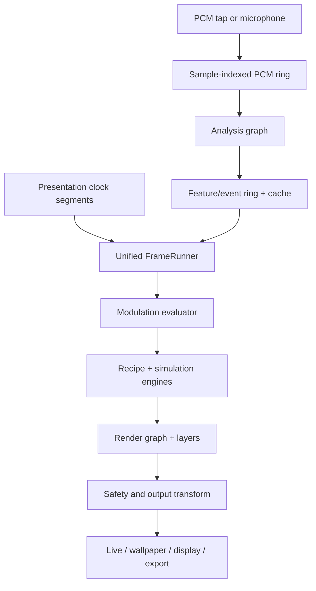

# MusicViz Visualizer 2.0 — definitive implementation plan

**Document status:** execution authority  
**Revision:** 3.0  
**Audited repository:** `tessie1993/music-visualizer-2`  
**Audited branch and commit:** `main` at `54630a822525d7a5aeea24ce416702e0847c0a37`  
**Audit date:** 2026-08-13  
**Primary implementer:** Claude Code  
**Product target:** Android, OpenGL ES 3.0 baseline with an optional OpenGL ES 3.1 enhanced path

This document supersedes every earlier Visualizer 2.0 plan where they disagree, including
`docs/visualizer-v2/ENGINE_V2_PLAN.md` and earlier copies of
`MUSICVIZ_2_IMPLEMENTATION_PLAN.md`. The repository's `CLAUDE.md`, `.codex/AGENTS.md`,
skill instructions, safety policies, and existing user-facing compatibility contracts still
apply. Do not use an obsolete plan to reverse a decision made here.

---

## 0. Mission and non-negotiable outcome

Replace the current visualizer's audio analysis, feature transport, render orchestration,
simulation infrastructure, scene content system, modulation model, live/export timing, and
authoring workflow with one coherent second-generation engine.

This is not a shader-pack expansion. The target is a visual-synthesis platform assembled from
reusable simulation engines, rendering passes, audio features, parameter schemas, and recipes.
The app should be capable of at least 100 recognizably different curated looks without needing
100 unrelated renderer classes.

The finished system must:

1. React to musical structure, rhythm, timbre, harmony, stereo information, and raw PCM—not
   merely four broad FFT bands.
2. Produce distinctive systems: morphing vector fields, cymatic matter, reaction-diffusion,
   Physarum, Particle Lenia, particle ecologies, synchronized oscillators, fluids, acoustic
   waves, recursive feedback, spectral landscapes, raymarched forms, mathematical geometry,
   optical overlays, scopes, and the existing projectM layer.
3. Use the same sample-addressed audio features, state stepping, modulation evaluation, and
   render graph for live playback, full-screen, external display, wallpaper, preview, takes,
   and offline export.
4. Preserve the current app's player, library, crystal UI language, presets, wallpaper,
   recording/export, microphone and projectM capabilities while their engine-facing seams are
   replaced.
5. Keep every real-time audio callback allocation-free and lock-free; keep GL work on the GL
   thread; preallocate all steady-state simulation resources.
6. Run safely by default. Every visual path must pass through the same flash, luminance,
   saturated-red, motion, thermal, and memory safeguards.
7. Remain viable on GLES 3.0 hardware. GLES 3.1 compute shaders and SSBOs are an enhancement,
   never a product-wide requirement.
8. Be implementable in small, test-first, independently reviewable Claude Code slices.

### Explicit non-goals for this overhaul

- No Vulkan, Rust, wgpu, Unity, Unreal, WebView, WebGL, JavaScript runtime, or game-engine rewrite.
- No second MilkDrop-compatible engine. Retain projectM as the classic preset layer.
- No network-controlled visuals, OSC server, NDI, remote phone control, or new `INTERNET`
  permission in this program.
- No wholesale UI redesign. Extend the current crystal-glass visual language.
- No blind port of every public shader. Every external idea receives a provenance, quality,
  performance, and product-fit decision.
- No native FFT or audio dependency unless an Android benchmark and ADR show a material win.
- No DI framework at the start. Use manual composition until the threshold in §5.4 is reached.

---

## 1. Current repository truth

Claude Code must begin from the checked-out commit, re-run discovery, and update these numbers if
the branch has moved. At the audited commit the repository contains:

| Area | Audited state |
|---|---|
| Main Kotlin | 179 files, approximately 51,153 lines |
| Test Kotlin | 165 files, approximately 27,449 lines |
| GLSL resources | 65 files |
| `SceneId` values | 38 |
| `SceneParams` fields | 165 |
| Serialized preset keys | 164 |
| Bundled presets | 19 |
| Modules | one application module |
| GLES declaration | 3.0 baseline |
| Android SDK | min 26; compile/target 36 |
| Native ABI | arm64-v8a |
| Largest coordinator | `PlayerViewModel`, approximately 2,518 lines |
| Source-text tests | 57 tests read implementation or resource text |

The existing 38 scene identifiers are compatibility IDs and must remain loadable until their
replacement or compatibility recipe is proven:

`nebula`, `bursts`, `swarm`, `fountain`, `julia`, `tunnel`, `bars`, `ring`, `scope`, `plasma`,
`kaleido`, `warp`, `grid`, `voronoi`, `mandel`, `liss`, `metaballs`, `ripples`, `starfield`,
`waves`, `hexgrid`, `spiral`, `aurora`, `solar`, `winter`, `lava`, `orbits`, `galaxy`,
`attractor`, `storm`, `inkflow`, `milkdrop`, `fluid`, `curlflow`, `water`, `cymatics`,
`hyperspace`, and `beam`.

The authored style catalogue also contains eleven Hyperspace looks and eleven Cymatics looks.
Preserve their identifiers and recognizable intent:

- Hyperspace: Original Living Fractals, Polytope, Liquid Warp, Caduceus, Cortex, Reliquary,
  Moiré, Foam, Dustskin, Plume, Resonant Wormhole.
- Cymatics: Original Resonant Field, Chladni Sand, Drumhead, Harmonograph, Faraday, Harmonic
  Shell, Caustic Sheet, Levitator, Standing Chamber, Rosensweig Spikes, Kundt Tube.

### 1.1 What is already completed

Commit `b4a3c4be` added the initial V2 source archive, machine-readable provenance, and static
baseline. Retain and expand those artifacts. Do not redo their work from memory.

### 1.2 What is not completed

- No production V2 engine has been integrated.
- Runtime device baselines are missing: golden frames, allocations, CPU/GPU timings, thermal
  behavior, context-loss recovery, and real Mali/Adreno scatter benchmarks.
- The current audio bus still publishes latest-state snapshots on wall-clock cadence rather
  than a sample-addressed feature timeline.
- Live and export analysis/render semantics still diverge.
- Current CPU particle families and monolithic parameter plumbing remain in place.
- The first shared-player acquisition can lose its hold during first application binding.
- safe visuals default to false, and the strobe preset/randomizer remains reachable.
- 16 KB native-library compatibility must be verified in every shipped artifact.

### 1.3 Preserve these current semantics deliberately

They are behaviors, not incidental code:

- The audio tap observes user-facing PCM before the user's DSP is replaced or reordered.
- `AudioFeatures.beatImpulse` retains its legacy foldback behavior during migration.
- `motionImpulse = max(beatImpulse, transient * 0.5)` until the modulation migration explicitly
  versions it.
- An empty chroma array means “no pitch information,” not twelve zero-confidence pitch classes.
- Mono input reports `stereoCorrelation = 1f`.
- `FeatureTimeline.featuresAt(timeMs, spanMs)` ORs beat events and peak-holds onset, spectral
  flux, onset strength, and transient information over the requested span.
- `PulseTracker.decidePulse(...)` remains the reference pulse decision unless corpus evidence
  supports a versioned replacement.

---

## 2. Execution protocol for Claude Code

This plan is a queue of small vertical slices, not permission to modify the whole repository in
one pass.

### 2.1 Required state machine

Maintain exactly one active slice in
`docs/visualizer-v2/STATUS.md` using these states:

`LOCKED → DISCOVERY → SPECIFIED → RED → IMPLEMENTING → VERIFYING → REVIEWING → READY_TO_COMMIT → COMPLETE`

Rules:

1. Never enter `IMPLEMENTING` without a written slice spec and a failing automated test or an
   explicitly documented testability exception.
2. Never begin a second slice while the current slice is before `COMPLETE`.
3. One semantic slice produces one conventional commit.
4. Never combine architecture movement, behavior change, broad formatting, and content additions
   in the same commit.
5. Preserve user changes and unrelated dirty-worktree edits.
6. Do not add dependencies, permissions, ABIs, or license obligations without the slice's ADR
   and explicit plan authority.
7. Never delete a legacy seam in the same slice that first introduces its replacement.
8. A benchmark must record device, OS, GPU, thermal state, build variant, scene, quality tier,
   resolution, sample count, median, p95, and raw evidence location.
9. An external source must be present in the provenance registry before any adapted code enters
   production.
10. Every incomplete verification step remains visibly open; never replace evidence with
    “should pass.”

### 2.2 Required files

Create or maintain:

```text
docs/visualizer-v2/
  MASTER_PLAN.md                 # repository copy of this document
  STATUS.md                      # one active slice and evidence
  DECISIONS.md                   # index of ADRs
  SOURCE_ARCHIVE.md              # human-readable provenance
  provenance.json                # machine-readable provenance
  REFERENCE_COVERAGE.md          # every researched effect/idea and its disposition
  LEGACY_DISPOSITION.md          # keep/bridge/replace/delete status by subsystem
  AUDIO_FEATURE_ABI.md           # names, units, ranges, cadence, latency and normalization
  GPU_RESOURCE_ABI.md            # formats, sizes, ownership and fallbacks
  PRESET_SCHEMA.md               # versioned serialization and migrations
  PERFORMANCE_BASELINE.md        # device evidence
  SAFETY_MODEL.md                # flash/motion/thermal policy and test vectors
  RELEASE_GATES.md               # reproducible final checklist
  adr/
  benchmarks/
  captures/
```

`MASTER_PLAN.md` becomes the repository authority. Existing plan files receive a banner pointing
to it; do not silently leave two live execution plans.

### 2.3 Slice specification template

Every slice entry in `STATUS.md` must contain:

```markdown
## V2-<phase>-<number>: <imperative title>

State:
Goal:
User-visible effect:
In scope:
Out of scope:
Files expected to change:
Compatibility contract:
External source/provenance entries:
Tests written first:
Benchmark or visual evidence:
Rollback:
Risks:
Commands and results:
Review findings:
Commit:
Next slice:
```

### 2.4 Per-slice verification order

Run the narrowest proof first, then widen:

1. Changed unit tests.
2. Changed module tests.
3. Shader compile/link harness and deterministic image checks where applicable.
4. `./gradlew testDebugUnitTest`.
5. `./gradlew ktlintCheck`.
6. `./gradlew lintDebug`.
7. `./gradlew assembleDebug`.
8. Instrumented/device, benchmark, wallpaper, export, or native-package checks required by the
   slice.

Do not make an unrelated pre-existing failure disappear from the report. Identify it separately.

---

## 3. External-source adoption contract

The research corpus is a design archive, not a shopping list. Every source receives one of five
tiers:

| Tier | Meaning |
|---|---|
| **ADAPT** | Per-file code adaptation is permitted after license verification, SPDX/origin annotation, notices and modification notes. |
| **REIMPLEMENT** | Use published algorithms and validate independently; do not copy code, shader text, constant tables, names or layout. |
| **ORACLE** | Use outside the shipped runtime to generate fixtures or expected values. |
| **STUDY** | Learn architecture or behavior; no derived source enters the repository. |
| **EXCLUDE** | License, provenance, duplication or product fit blocks use. |

### 3.1 Primary source ledger and exact product use

| Source | Tier | Ideas incorporated into V2 | Things not incorporated |
|---|---|---|---|
| **SwissGL** — Apache-2.0 | ADAPT selectively | Texture-backed simulation state, deterministic hashes, ping-pong kernels, instanced particles; Particle Life, Particle Lenia, Physarum, reaction-diffusion, Firefly Sync, Wave2D and Neural CA kernels | JavaScript wrapper and browser runtime |
| **ShaderEditor** — MIT | ADAPT selectively | Android GL lifecycle, backbuffer, multi-pass shader preprocessing, last-good compilation, wallpaper behavior, local textures/cubemaps, touch/sensors, resolution and low-battery policies | Its UI and unconstrained shader execution model |
| **PavelDoGreat WebGL Fluid** — MIT | ADAPT/consolidate | Advection, divergence, pressure, gradient subtraction, curl, splats, dye, bloom and format fallbacks; reconcile with existing attributed port | Browser/runtime scaffolding |
| **Colourful Attraction** — MIT | ADAPT verified GLSL only | Persistent particle state; uninterrupted blending between force fields; twelve candidate velocity fields; billboard draw pattern | Unverified constants, application code, and any assumption that the young repo is production proof |
| **Fosfora** — MIT/Apache-2.0 | STUDY plus independent reimplementation | Sample-driven audio architecture, 83-feature vocabulary, multi-resolution analysis, feature interpolation, data-driven effect recipes, logical layers, 13 blend modes, displacement/refract/lens effects, cue lists, fast render path, audio textures, test structure | Rust/wgpu runtime, source layout, network control and media-output features |
| **Wavefield** — MIT | REIMPLEMENT | Persistent modal bank, rectangular and spherical modal fields, spectral-peak-to-mode selection, attack/release, phase and pulse decay | TypeScript/WebGL application |
| **Physarum** — MIT | REIMPLEMENT | Sensor/turn/deposit/diffuse/decay rules and curated parameter regions | CPU reference implementation |
| **Lenia** — MIT | REIMPLEMENT | Continuous CA convolution and growth; stable organism parameter sets | Bundled UI and platform ports |
| **RDSystem** — Unlicense | REIMPLEMENT | Minimal Gray–Scott GPU kernel and test fixtures | Unity-specific host code |
| **Particle Life** — MIT | REIMPLEMENT | Species attraction/repulsion matrix, ecology presets and interaction validation | O(N²) implementation at production counts |
| **Threelab** — MIT | REIMPLEMENT | Attractors, curl fields, Physarum, reaction-diffusion, domain warp, wave interference, electric/magnetic fields, fractals, L-systems, packing, spirograph, Truchet, Voronoi, voxel landscapes, genetic exploration | Web application and node editor |
| **RDPE** — declared MIT but missing license text | STUDY until fixed | Typed rule vocabulary, SoA state, lifecycle rules, spatial hashing, radix/Morton organization, matrices, composable fields and 35-post-effect taxonomy | Any copied code, generated WGSL, or dependency until repository license is complete |
| **Velo Visualiser** — GPL-3.0 | STUDY | Native Android scene lifecycle, Oboe/exact PCM concepts, compute-particle organization, dynamic resolution, staged scene warmup, secondary display, stereo phase views, 48-scene coverage checklist | All code, shaders and derived implementation |
| **vgalizer** — MIT | REIMPLEMENT | Twenty-five compact recipes, beat PLL validation, hot parameter schema, soak harness, trail/glitch/mirror/scanline/VGA post effects | Rust/wgpu runtime |
| **glChAoS.P** — BSD-2-Clause | REIMPLEMENT | Attractor families, glow point sprites, surface/tone-map ideas and mobile-reduced modes | Desktop-scale particle counts |
| **Meyda** — MIT | REIMPLEMENT | Formula cross-check for descriptors, MFCC and chroma | JavaScript runtime |
| **Clubber** — MIT | REIMPLEMENT | Musical log/MIDI band layout and compact feature-to-visual mapping patterns | Browser runtime |
| **Kymatik** — MIT | REIMPLEMENT selectively | Kotlin/JVM FFT/BPM pipeline comparison and Android-oriented tests | Direct adoption without corpus and CPU proof |
| **Audio Shader Studio** — MIT | REIMPLEMENT | Audio scalar/texture shader contract and authoring workflow comparisons | Desktop/browser host code |
| **spectrageist** — MIT | REIMPLEMENT selectively | Real-time feature extraction comparison and fixture vocabulary | Unbenchmarked runtime dependency |
| **Beat-and-Tempo-Tracking** — MIT | ORACLE/REIMPLEMENT after benchmark | Causal onset, tempo and predicted-beat test behavior | Immediate native dependency |
| **librosa** — ISC | ORACLE | Golden fixtures for spectral descriptors, onset, HPSS, chroma, YIN and tempo | Runtime Python |
| **libebur128** — MIT | ORACLE | BS.1770/R128 fixture generation | Runtime C until an ADR justifies it |
| **PFFFT** — BSD-like | BENCHMARK candidate | ARM FFT comparison | Adoption without ≥2× measured advantage or meaningful power reduction |
| **projectM** — LGPL-2.1 | RETAIN | Existing dynamically linked MilkDrop compatibility, library/preset notices and classic feedback layer | New-engine foundation or static linking |
| **Butterchurn** — MIT | STUDY | Preset transition continuity, feedback warp behavior and evaluation semantics | Web runtime or second MilkDrop engine |
| **acidcam-gpu** — BSD-2-Clause | REIMPLEMENT selectively | Temporal history textures, FFT history, shader chains, glitch feedback and HDR history effects | Desktop capture/runtime architecture |
| **Pilka** — MIT | TOOLING reference | Desktop prototype runner, shader hot reload, previous-frame textures, FFT input and recording workflow | Production Android dependency |
| **WebGPU-Lab** — MIT with per-file review | REIMPLEMENT selectively | Compute-fluid, cloud, SDF and light-propagation concepts | Any shader without direct provenance review |
| **KarmaViz** — MIT | REIMPLEMENT selectively | Additional audio-reactive mappings after source-level validation | Earlier incorrect “conflicting license” claim |
| **wavora** — MIT | STUDY | Small Android Media3 separation examples | Architectural authority |
| **Geno-1** — MIT | STUDY | Clock-accurate A/V scheduling, timed pulses, HDR/bloom and host-testable engine separation | Direct architecture transplant |
| **rreusser/sketches** — no license | EXCLUDE | Published mathematics may identify papers to implement independently | All source and shader text |
| **Baryon** — PolyForm Strict | EXCLUDE | High-level volumetric cymatics research questions only | Code, shader text, constants and derivative distribution |
| **ORPHIC / ENTHEA / Hydra** — AGPL | EXCLUDE | Public mathematical ideas only, traced back to permissive papers where used | Code, shader text, scene descriptions copied closely |
| **LYGIA** — non-commercial default | EXCLUDE | None without a separate commercial license | Shader library |
| **Shadertoy and ambiguous collections** | EXCLUDE by default | A separately licensed individual shader may enter only through a new provenance slice | Unverified code or visual clones |

### 3.2 Coverage ledger requirement

`REFERENCE_COVERAGE.md` must enumerate every source effect or concept found in the research, not
only the ones selected for the first release. Each row includes:

```text
source / upstream name / upstream commit / license tier / mathematical family /
V2 family / recipe or engine ID / disposition (PORT, MERGE, DEFER, EXCLUDE) /
rationale / provenance entry / tests / screenshots / shipped version
```

No feature is “incorporated” merely because it is named in this plan. A row becomes complete only
after its V2 implementation, rejection, or merge is evidenced. This prevents repeated research,
untraceable shader borrowing, and a collection of near-duplicates.

### 3.3 License automation

Implement `checkEngineProvenance` before the first adapted source lands. It must:

- scan all new Kotlin, C/C++ and shader files for SPDX and origin markers where required;
- verify that every origin URL and commit exists in `provenance.json`;
- validate shipped MIT, BSD, Apache, Unlicense and LGPL notice bundles;
- fail if STUDY/EXCLUDE sources appear in source comments as an origin;
- scan every module, not only `:app`;
- be wired to `check` and release workflows;
- preserve the projectM dynamic-linking source/patch/build obligations.

---

## 4. Product architecture

### 4.1 Module graph

Create six engine modules around the existing `:app`:

```text
:engine:audio-core       pure Kotlin/JVM analysis, clocks, feature ABI, cache
:engine:visual-core      pure Kotlin/JVM scene/recipe/parameter/render descriptions
:engine:gl               Android GLES runtime, resource pools, render graph, safety pass
:engine:scenes           Android shader assets, simulation engines, recipes and migrations
:engine:audio-android    Media3/PCM tap, microphone, device format adaptation
:engine:runtime          frame runner, lifetimes, output coordination and composition root
:app                     UI, player/library workflows; implements runtime ports only
```

Allowed dependencies:

```text
audio-core        -> Kotlin/JDK only
visual-core       -> Kotlin/JDK only; may depend on audio-core ABI types
gl                -> Android/GLES + visual-core
scenes            -> gl + visual-core + audio-core ABI
audio-android     -> Android/Media3 + audio-core
runtime           -> all engine modules; exposes narrow app-facing API
app               -> runtime and stable engine contracts
```

Forbidden edges:

- `audio-core` or `visual-core` importing Android, Media3, OpenGL or app UI types.
- scene code reaching into `PlayerViewModel`, Compose state or preferences.
- audio callback code invoking GL, flows, locks, allocation-heavy collections or logging.
- `:app` constructing concrete scenes or passing the legacy `SceneParams` bag into V2.
- output-specific runners duplicating analysis, smoothing, modulation or simulation stepping.

Before adding modules, introduce a build-conventions plugin and make `./gradlew check` exercise
every module. Moving packages without these foundations would make the existing path-sensitive
tests misleading or vacuous.

### 4.2 Core runtime topology



There is one semantic frame pipeline. Output surfaces provide size, colorspace, cadence, quality
ceiling, and presentation time; they do not reimplement visual logic.

### 4.3 Lifetimes

| Lifetime | Owns | Ends when |
|---|---|---|
| Process | source registry, shader source cache, capability database, immutable recipe catalogue | process exits |
| Playback session | PCM ring, analysis graph, sample clock, adaptive-normalization state, feature ring | source/session changes |
| Visual session | scene instances, simulation state, modulation state, transition state, deterministic seed | visual session resets |
| GL context | programs, FBOs, textures, buffers, timer queries, pools | context loss |
| Output | EGL surface, viewport, output policy and presentation schedule | surface closes |
| Export | deterministic frame schedule, fixed quality, isolated visual session and encoder bridge | export completes |

All lifetimes have explicit `start`, `reset`/`rebind`, and `close` behavior. No singleton may own a
GL-context resource.

### 4.4 Composition and DI threshold

Use a hand-written composition root in `:engine:runtime` and interfaces at module boundaries.
Re-evaluate Koin only if either condition becomes true:

- more than approximately forty independently constructed production objects; or
- a third lifetime repeatedly requires nontrivial subset/scoped composition.

If that threshold is reached, write an ADR and benchmark startup. Do not introduce Hilt/Koin as a
prerequisite to V2.

---

## 5. Audio engine

### 5.1 The time domain is samples

Every captured frame is stamped with absolute input sample index, sample rate, channel count,
source epoch and discontinuity generation. Analysis hops are triggered by new sample availability,
never by a 16 ms wall-clock timer.

Replace ambiguous reads such as `copyNewSince` with an explicit contract:

```kotlin
sealed interface RingReadResult {
    data class Ok(val firstSample: Long, val sampleCount: Int) : RingReadResult
    data class Gap(val requested: Long, val oldestAvailable: Long) : RingReadResult
    data object NotYetAvailable : RingReadResult
}
```

Requirements:

- one writer; independently tracked readers;
- no silent clamp when a reader falls behind;
- no allocation or lock in the audio callback;
- deterministic epoch reset on seek, source change and unrecoverable format change;
- overrun/gap telemetry off the callback thread;
- stereo preserved through the analysis boundary;
- resize/reformat outside the callback;
- tests for wrap, exact capacity, gap, interleaved stereo, epoch, seek and concurrent readers.

### 5.2 Presentation-time mapping

The tap precedes Sonic speed processing and silence skipping; therefore
`presentationTime = sampleTime + offset` is wrong.

Implement a piecewise `AudioPresentationClock` whose immutable published snapshot contains
segments:

```text
epoch, inputSampleStart, presentationUsStart, inputSamplesPerPresentationUs,
speed, skippedInputSamples, discontinuityGeneration
```

It must map both directions where possible and surface unmappable gaps. Append segments on seek,
speed change, silence-skip discontinuity, route rebuild, or source replacement. The render thread
reads an atomic immutable snapshot; the audio callback does not allocate segments.

### 5.3 One multi-resolution analysis graph

Initial analysis sizes at 48 kHz:

| Branch | Window | Hop | Purpose |
|---|---:|---:|---|
| Transient | 512 | 256 or 512 | kick, onset, attack and high-time-resolution flux |
| General | 1024 | 512 | waveform, spectrum, bands, descriptors and beat evidence |
| Pitch/timbre | 4096 | 512 | chroma, pitch, MFCC and spectral contrast |
| Low-frequency/key | 8192 | 512 or 1024 | bass resolution, stable harmony and structure evidence |

The exact sizes remain benchmarked parameters. All windows must be aligned by their center sample,
not their right edge. A 1024/4096/8192 stack otherwise introduces roughly 75 ms of relative
misalignment at 48 kHz and turns one musical event into four apparent times.

Build reusable allocation-free nodes for:

- DC removal and optional pre-emphasis;
- Hann/window tables and FFT magnitude/power;
- log-frequency spectrum and mel filter bank;
- adaptive noise floor and silence gate;
- band energy, RMS, peak and BS.1770-like loudness;
- centroid, rolloff, flatness, bandwidth/spread, ZCR and spectral flux;
- SuperFlux-style positive-change onset evidence;
- beat/tempo phase, predicted beat, confidence, downbeat and bar phase;
- chroma, dominant pitch, pitch confidence, key mode/confidence;
- MFCC and delta MFCC;
- spectral contrast and timbre flux;
- harmonic/percussive balance using a causal approximation validated against fixtures;
- stereo pan, width, correlation, phase and mid/side energy;
- novelty, section, buildup, drop and return evidence.

Keep `PulseTracker` and `decidePulse(...)` as the first beat-decision implementation. Improve its
inputs and sample timing before replacing it. Compare any proposed tracker against the existing
one, the compact C tracker, and a corpus oracle.

### 5.4 Feature ABI

Define a versioned, fixed-layout feature frame in `AUDIO_FEATURE_ABI.md`. Use at least the
following logical set; reserve slots so additions do not silently reorder shader data.

| Category | Required features |
|---|---|
| Levels | peak, RMS, momentary loudness, short-term loudness, loudness trend, quiet envelope, AGC gain |
| Bands | sub, bass, low-mid, mid, high-mid, presence, brilliance; raw and normalized |
| Shape | centroid, rolloff, flatness, bandwidth, spread, ZCR, flux, timbre flux |
| Events | onset pulse, onset strength, transient, kick, beat pulse, predicted beat, beat confidence, drop, return, section boundary |
| Rhythm | BPM, beat phase, bar phase, beat-in-bar, downbeat confidence, tempo stability |
| Harmony | chroma[12], dominant chroma, key root, mode, key confidence, pitch Hz/MIDI/confidence |
| Timbre | MFCC[13], delta MFCC[13], spectral contrast[6], harmonic energy, percussive energy, H/P ratio |
| Stereo | balance/pan, width, correlation, mid, side, phase/coherence |
| Structure | novelty, density, buildup, section index/confidence, long-term energy trend |
| Stability | sample epoch, analysis warmup, silence state, discontinuity and validity masks |

GPU inputs:

| Resource | Initial representation | Update |
|---|---|---|
| scalar feature block | UBO or tightly packed float texture; versioned layout | every visual frame from sample interpolation |
| log spectrum | 1024×1 `R16F` where supported, proven fallback otherwise | analysis hop |
| stereo waveform | 1024–2048×2 `R16F` | visual frame/sample-addressed |
| mel history | 64×256 `R16F` ring texture | analysis hop |
| spectral history | 512×256 `R16F` ring texture | analysis hop |
| chroma history | 12×128 `R16F` | pitch hop |
| event block | bounded event ring with sample indices and strengths | on event |

The ABI needs units, expected range, normalization, attack/release defaults, validity, latency,
cadence, interpolation mode and silence behavior for every slot.

### 5.5 Normalization and smoothing

Provide three explicit normalization modes:

- **Adaptive live:** causal robust floor/ceiling with attack/release and session reset.
- **Fixed:** documented physical or musical ranges for repeatable presets.
- **Centered:** bipolar standardized value for modulation.

Each feature definition owns its smoothing semantics. Do not apply one generic low-pass filter to
everything. Events are peak-held/ORed over a frame interval. Continuous features interpolate at a
requested sample index. Phase unwraps before interpolation. Categorical features use confidence
and hysteresis.

Continuous audio changes continuous parameters. Events inject state or trigger transitions. Bar
phase drives slow structural movement. Raw bins shape geometry through textures. Raw amplitude
must not directly advance simulation time or camera time.

### 5.6 Feature ring and cache

Replace latest-wins `AudioBus` consumption with:

```text
acquireAt(sampleIndex, spanSamples) ->
  interpolated continuous values + max/OR event evidence + validity + epoch
```

Keep the current `FeatureTimeline` behavior until the new ring proves identical peak-hold/OR
semantics. Build one versioned analysis cache used by live warmup, waveform overview, takes and
export. Cache identity includes media fingerprint, decoder PCM format, analysis ABI version,
window/hop configuration and algorithm version.

Live and offline paths must use the same analysis nodes and normalizers. Offline work may batch
and parallelize independent preprocessing, but may not use a different feature definition.

### 5.7 Audio parity gates

For a fixture corpus containing silence, impulses, sine sweeps, clicks, stereo phase cases,
variable tempo, real percussion, tonal music and speech:

- feature timestamps agree within one analysis hop;
- live/offline scalar feature curves meet per-feature tolerance;
- event count/strength and phase error meet documented tolerance;
- stereo width/correlation survive export;
- chroma and pitch remain populated in export;
- waveform texture sampling is identical, not box-average live versus point-sample offline;
- adaptive normalization has a specified reset and warmup policy;
- the final modulated uniform values match, not only the raw feature frame.

---

## 6. Visual engine foundations

### 6.1 Scene contract

Every stateful simulation engine supports:

```kotlin
interface VisualEngine {
    val descriptor: EngineDescriptor
    fun create(context: CreateContext): EngineState
    fun resize(state: EngineState, size: SimulationSize)
    fun fixedStep(state: EngineState, input: StepInput)
    fun render(state: EngineState, input: RenderInput, target: RenderTarget)
    fun reset(state: EngineState, seed: Long)
    fun snapshot(state: EngineState): StateSnapshot?
    fun restore(state: EngineState, snapshot: StateSnapshot): RestoreResult
    fun release(state: EngineState)
}
```

Descriptors declare GLES features, formats, particle/grid budgets, deterministic capability,
quality tiers, maximum layers, fallback engine, safety risk class and state-transition support.

The displayed item is a **recipe**, not an engine class. A recipe selects one or more engines,
passes, palettes, parameter values, modulation bindings, transitions and quality policy.

### 6.2 Fixed stepping and deterministic state

- Fixed simulation timestep, independent of display cadence.
- Accumulator with a bounded catch-up count; record dropped simulation time.
- Deterministic seed for initial state, event injection and export.
- Export advances from exact sample/frame schedules, never `System.nanoTime()`.
- Simulation and modulation phase accumulators are explicit session state.
- Context loss recreates resources and restores a supported snapshot or deterministic reset.
- Particles are not reset merely to morph a style; preserve state where physics is compatible.

### 6.3 GLES capability paths

**GLES 3.0 baseline**

- fragment-shader simulation with ping-pong textures;
- vertex texture fetch or indexed state texture for draw;
- transform/instancing only where capability probes prove reliable;
- state defaults to `RGBA32UI` with float-bit packing where this avoids optional float render
  attachment support;
- linear accumulation fields prefer `R16F` only after a renderability/blend probe; fallback to a
  pre-scaled `RGBA8` encoding designed for additive deposits.

**GLES 3.1 enhanced**

- compute shaders and SSBO state;
- image load/store;
- tiled/spatial-grid construction where beneficial;
- larger particles/grids and additional solver iterations.

Never log-pack a field that receives additive deposits; deposition must remain linear. Never infer
support from GLES version alone. Probe renderability, filtering, blending, vertex fetch, timer
queries, program binary behavior and memory limits.

### 6.4 Render graph

Build a declarative pass graph with explicit resource lifetime and aliasing:

1. audio texture upload;
2. simulation steps;
3. engine geometry/volume passes;
4. logical layer composition;
5. stateful feedback/history;
6. optical/post passes;
7. global safety limiter;
8. color/output transform;
9. surface or encoder output.

The graph compiler validates cycles, formats, sizes, samples, persistent history, and read/write
hazards. Resource pools preallocate steady-state textures/FBOs/buffers and evict only between
frames.

Support at least eight logical layers in the data model. Initial simultaneous live limits:

| Tier | Active heavy layers | Typical total layers | Export ceiling |
|---|---:|---:|---:|
| Lite | 1 | 2 | 3 |
| Balanced | 1–2 | 3 | 5 |
| Ultra | 2–3 | 4 | 8 |

Layer budget is measured, not a marketing guarantee. A lightweight overlay does not count like a
fluid solver.

### 6.5 Blend and optical library

Implement a tested linear-light blend library with at least:

`normal`, `add`, `screen`, `multiply`, `overlay`, `softLight`, `difference`, `lighten`, `darken`,
`colorDodge`, `colorBurn`, `exclusion`, and `maxLuma`.

Add non-color compositions inspired by Fosfora but independently implemented:

- displacement by luminance/vector field;
- refractive normal/lens layer;
- feedback injection/masking;
- depth/alpha occlusion where a pass provides it.

All blend shaders need CPU reference tests, alpha/NaN/Inf cases and sRGB-versus-linear fixtures.

### 6.6 Common post-processing

Reusable post nodes:

- half/quarter-resolution thresholded bloom and glow;
- tone mapping and exposure;
- temporal feedback/history;
- curl, polar, Droste, Möbius and kaleidoscope coordinate warps;
- mirror groups and radial symmetry;
- chromatic split, prism and lens dispersion;
- trails, phosphor persistence and motion blur with bounded history;
- glitch blocks, scanlines, CRT curvature, VGA/LED masks and dither;
- edge, isoline, caustic and normal-light passes;
- vignette, grain and palette grade;
- final flash/motion safety limiter.

Existing scenes may use the new feedback and optical passes before they are otherwise migrated,
provided this goes through a bridge and does not expand legacy architecture.

### 6.7 Quality manager

Simulation resolution is independent of display resolution. Initial—not guaranteed—budgets:

| Tier | Particles | 2D grids | Solver/substeps |
|---|---:|---:|---:|
| Lite | 8k–16k | 192–256² | 2–4 |
| Balanced | 32k–65k | 320–384² | 4–8 |
| Ultra | 100k–130k | 512² | 8–12 |

Do not lock these numbers until scatter/deposit and overdraw tests run on a real Mali and Adreno
device. Mobile tiler/binning and fill rate may fail before arithmetic does.

The quality manager uses GPU timer queries where trustworthy and CPU fences otherwise. It changes
one dimension at a time with hysteresis:

1. post resolution;
2. solver iterations/substeps;
3. simulation grid;
4. particle count;
5. heavy layer count;
6. volumetric step count.

It never oscillates quality frame-to-frame and never changes deterministic export quality.

---

## 7. Reusable visual families

Implement families as reusable engines plus data-driven recipes. A family is complete only when it
has a baseline recipe, an audio mapping, three quality tiers, context-loss behavior, export proof,
safety classification and at least one distinctive authored style.

### 7.1 Morphic Vector Cathedral

**Goal:** the first signature system and the first full V2 vertical slice.

Particles follow a continuous blend of velocity fields without reset:

\[
\dot{\mathbf p}=(1-\alpha)F_A(\mathbf p,t)+\alpha F_B(\mathbf p,t)
\]

Required field library:

- Thomas cyclic sine;
- Aizawa;
- Halvorsen;
- Lorenz/Rössler/Dadras variants where stable in a bounded projection;
- Peter de Jong map;
- curl/simplex flow;
- radial vortex and orbital field;
- electric dipole/multipole;
- magnetic-pendulum-like field;
- phyllotaxis orbit;
- audio spectrum/spectrogram-derived field;
- the independently verified Colourful Attraction set: Cosine Bloom, Anisotropic Veil,
  Modulated Lattice, Nested Resonance, Harmonic Overtones, Triaxial Weave, Concentric Shell,
  Recursive Fold, Hyperbolic Bloom, Phase Spiral and Dual Web.

Use a fixed timestep and measured substeps. Maintain named, validated parameter domains for every
field. Blend field identity and parameters on bar/section timescales. Bass sets broad force and
orbit radius; mids mix fields; centroid/contrast set filament scale; stereo affects rotation and
separation; onsets inject rings, vortices or emitters. Never let raw amplitude switch the field
every frame.

Render modes share the same simulation state: luminous points, velocity streaks, ribbons,
connected constellation, density fog, topographic density and crystalline billboards.

First recipes:

- Morphic Cathedral;
- Halvorsen Web;
- Cosine Bloom;
- Electric Reliquary;
- Phase Spiral;
- Phyllotaxis Orbit;
- Spectral Loom;
- Strange Attractor Gallery;
- Aurora Drift;
- Crystal Swarm.

### 7.2 Cymatic and Acoustic Matter

For rectangular Chladni-like modes:

\[
\phi_{m,n}(x,y)=\cos(n\pi x)\cos(m\pi y)-\cos(m\pi x)\cos(n\pi y)
\]

Use vibration energy and its gradient:

\[
E=\phi^2,\qquad \mathbf F=-\nabla E
\]

For circular modes:

\[
\phi_{m,n}(r,\theta)=J_m(j_{m,n}r/R)\cos(m\theta+\varphi)
\]

Precompute verified Bessel/mode tables or textures on the CPU. Add square, circular, triangular,
polygonal, membrane, sphere and simple cavity boundaries. The persistent modal bank maps stable
spectral peaks/harmonic ratios to modes with confidence, hysteresis, attack, release, excitation,
phase and pulse decay. Crossfade fields; never jump `m,n` per FFT frame.

Particle matter has inertia, friction, noise, collision/repulsion and beat strikes. Alternate
renderers visualize sand, liquid surface, ferrofluid, shell, caustics, levitated particles,
pressure volume and spectrogram terrain.

Recipes include all existing Cymatics styles plus:

- Rectangular Plate;
- Spherical Harmonics;
- Polygonal Membrane;
- Acoustic Chamber;
- Spectrogram Terrain;
- Water Cavity;
- Modal Cathedral;
- Phase-Split Plate;
- Harmonic Lattice;
- Resonant Shell.

An FDTD Wave2D/acoustic-cavity engine is an Ultra experiment after grid scaling is proven. It uses
pitch as excitation, formant/spectral peaks as geometry controls and beat events as boundary
impulses.

### 7.3 Living Matter

Shared stencil/convolution infrastructure powers:

- Gray–Scott reaction-diffusion;
- Particle Lenia;
- grid Lenia/SmoothLife-inspired continuous CA from permissive sources/papers;
- neural CA presets only after independent implementation and device proof;
- Turing/multiscale fields;
- cellular automata rule textures.

Gray–Scott equations:

\[
\frac{\partial u}{\partial t}=D_u\nabla^2u-uv^2+f(1-u)
\]

\[
\frac{\partial v}{\partial t}=D_v\nabla^2v+uv^2-(f+k)v
\]

Curate stable `(f,k)` regions. Audio drifts within a region slowly; beats seed `v`, perturb a
kernel, or inject a localized organism. Do not fling solver parameters across unstable domains.

Recipes:

- Living Ink;
- Coral Bloom;
- Mitosis;
- Labyrinth;
- Turing Veil;
- Particle Lenia Garden;
- Neural Pyroclastic;
- Brain/Builder/Shell/Clouds CA variants;
- Frost;
- Mycelial Tissue.

### 7.4 Slime, swarm and ecology

One SoA agent kernel supports:

- Physarum sensor/turn/deposit/decay;
- multi-species Slime Choir;
- Particle Life attraction matrices;
- Firefly phase synchronization;
- swarmalator-like position/phase coupling using published equations;
- boids/orbits/swarms;
- mycelium/crystal-growth recipes;
- connected network and constellation draw modes.

The baseline avoids O(N²) interactions. Use a field approximation for lower tiers and a measured
spatial grid for enhanced interactions. RDPE may inform vocabulary only; implement and validate
the grid independently.

Audio mapping:

- sub/bass species move heavily and deposit broad trails;
- mid species establish network structure;
- treble species create fine veins;
- chroma selects species interaction palettes/matrices with hysteresis;
- beat confidence changes phase coupling;
- onsets disturb sensor angles or seed agents;
- section events evolve the matrix rather than resetting the world.

Recipes:

- Polycephalum;
- Slime Choir;
- Symbiosis;
- Mycelium;
- Particle Ecology;
- Firefly Sync;
- Swarmalator Rings;
- Crystal Colony;
- Murmur;
- Living Constellation.

### 7.5 Fluid and flow

Unify the current fluid-related scenes on one solver/runtime:

1. advect velocity and dye;
2. add continuous/event forces;
3. compute divergence;
4. iterate pressure solve;
5. subtract pressure gradient;
6. apply vorticity confinement;
7. advect/diffuse temperature or density where a recipe needs it;
8. shade dye, normals, caustics or volume.

Recipes:

- Living Inkflow;
- Liquid Light;
- Fluid Galaxy;
- Aurora Fluid;
- Smoke Cathedral;
- Chromatic Tide;
- Caustic Sheet;
- Lava;
- Water;
- Storm/Plasma Storm.

Particle tracers can read the velocity texture. The grid and tracer layers share one audio/event
frame and quality budget.

### 7.6 Phase, scope and spectral landscape

This family uses actual stereo PCM and phase, not only magnitude FFT:

- mono/stereo oscilloscope;
- XY/phase scope and phase correlation field;
- Lissajous and harmonograph;
- Fourier epicycles;
- sphere spirals;
- circular spectrum and radial EQ;
- spectrum bars/orbit;
- spectral bloom;
- waveform/spectrogram waterfall;
- spectral canyon/terrain/dunes;
- topographic ridge;
- waveform water surface;
- level/VU/mechanical meters;
- LED matrix and CRT/phosphor modes.

It supplies lower-cost scenes for Lite devices and accurate diagnostic modes for the audio engine.
Existing `scope`, `bars`, `ring`, `liss`, `waves`, `grid`, `water` and related IDs migrate here.

### 7.7 Recursive Temple and optical feedback

Build one safe, bounded previous-frame system combining:

- curl/noise displacement;
- polar/log-polar transforms;
- Droste recursion;
- kaleidoscope and mirror groups;
- tunnel, Möbius and wormhole mappings;
- domain warping;
- temporal FFT/spectrogram history;
- cortical form-constant patterns and independently derived complex-log tunnel/spiral/lattice
  mappings;
- phosphor/trails;
- controlled glitch/scanline/CRT effects.

Centroid changes warp scale; spectral contrast changes local detail; beat/bar events change symmetry
or recursion at quantized boundaries; stereo phase rotates/splits feedback. Bound feedback gain,
clear NaN/Inf and apply the global flash limiter.

Recipes:

- Recursive Temple;
- Resonant Wormhole;
- Kaleido Warp;
- Möbius Grid;
- Living Tunnel;
- Phosphor Scope;
- TV Acid;
- Reliquary;
- Moiré;
- Dustskin/Foam/Plume compatibility styles.

### 7.8 SDF Dream Space and volumetrics

Create a common raymarch library for:

- gyroids and minimal surfaces;
- Mandelbox/Mandelbulb-like distance estimators independently derived from published formulas;
- toroidal knots and polytope projections;
- crystalline lattices;
- clouds/nebula;
- volumetric spectral canyon;
- waveform-deformed water/terrain.

Use conservative step bounds, tiered step counts, half-resolution volume targets, temporal
reprojection only after artifact tests, and non-raymarched fallbacks. Bass changes topology slowly;
spectrum/chroma lights emissive materials; beat events launch bounded shockwaves.

Recipes:

- Gyroid Chapel;
- Mandelbox;
- Polytope;
- Crystal Vault;
- Nebula;
- Spectral Canyon;
- Volumetric Cymatics;
- Hyperspace;
- Solar;
- Aurora.

### 7.9 Mathematical geometry and fields

One analytic/mesh family covers:

- fractals: Julia, Mandelbrot zoom, domain coloring, recursive folds;
- Voronoi/isoline/electric/magnetic fields;
- wave interference;
- L-systems and space-filling curves;
- circle packing and network graphs;
- Truchet tiles and hex grids;
- spirograph, epicycles and harmonographs;
- cloth/ribbon/surface deformation;
- voxel/topographic landscapes;
- line moiré, ring tunnel, wire tunnel and vector terrain.

Recipes expose meaningful bounded mathematical parameters rather than arbitrary shader uniforms.
An offline genetic/evolutionary explorer may search valid recipe parameter space and present
candidate thumbnails; it never mutates live safety limits or create unversioned preset keys.

### 7.10 Image matter and media textures

Preserve and generalize image/logo matter without adding network access:

- local artwork or user-selected image as a texture source;
- image-to-particle sampling;
- luminance/depth-like displacement without claiming real depth;
- mosaic, Voronoi, raster and point-cloud renderers;
- album-art palette extraction;
- logo particle and cover-flow-like field recipes;
- local custom texture/cubemap inputs in Shader Studio.

All image reads occur off the GL thread and enter a bounded texture cache. Respect Android content
permissions and do not retain inaccessible URIs silently.

### 7.11 Overlay instruments

Implement reusable low-cost overlays modeled as recipes, not one-off scenes:

- reticle;
- astrolabe;
- bezel/frame;
- tessera/window lattice;
- limn/contour;
- intarsia/inlay;
- oscilloscope, spectrum, chroma wheel and beat/bar diagnostics;
- title/palette/section indicators for takes and previews.

Overlays can be independently layer-blended, audio-modulated and disabled in clean export.

### 7.12 Compatibility and external engines

- Retain projectM behind a narrow `ExternalVisualEngine` dynamic-library adapter.
- Keep existing MilkDrop preset browsing and current notice/source availability.
- Bridge each legacy scene ID to a V2 recipe or isolated legacy adapter until migration proof.
- User Shader Studio is a V2 recipe engine with strict resource/time limits.
- Do not import Butterchurn or run web content.

---

## 8. Master content catalogue

The catalogue is a target coverage map, not permission to ship low-quality variants. Each item
must be assigned to an engine family and pass the recipe gate in §8.4.

### 8.1 External catalogue coverage

**Fosfora shader concepts:** Aurora, Beam, Chromatica, Drift, Frost, Iris, Lumen, Prism, Protea,
Pulse, Shards, Storm, Strata, Sumi and Tunnel.

**Fosfora particle/simulation concepts:** Accretion, Array, Ascend, Cascade, Chaos, Cleave,
Cymatics, Etch, Flux, Genesis, Helix, Morph, Murmur, Mycelium, Panorama, Pegboard, Polycephalum,
Raster, Reliquary, Splat, Symbiosis, Tesla, Tide, Turing and Vessel.

**Fosfora CA concepts:** 445, Brain, Builder, Chunky, Clouds, Pulse, Pyroclastic and Shells.

**Fosfora overlay concepts:** Tessera, Fenestra, Reticle, Astrolabe, Bezel, Limn and Intarsia.

**SwissGL candidates:** Particle Life, Particle Lenia, Physarum, Reaction Diffusion, Firefly Sync,
Neural CA, Wave2D, cellular automata and permitted 3D variants.

**Velo coverage questions:** Oscilloscope, Tunnel, Fluid, Laser Array, Circular Spectrum, Bars,
Spectral Bloom, Starscape, Raw Scope, Spectrogram, Beat Fireworks, Phyllotaxis, Electric Iris,
Mandala Pulse, Audio Web, Topographic Ridge, LED Matrix, Mechanical Meter, Beat Pulse, Mandelbox,
Reaction Diffusion, Chladni Plate, Strange Attractor, Plasma Storm, Aurora Drift, Odyssey, Logo
Particle, Crystal Swarm, LED Matrix 3D, Liquid Light, Spectral Canyon, Waveform Waterfall, Phase
Scope, Nebula, Slipstream, Veil, Meridian, Lissajous, Chromatic Dots, CRT Scope, Waveform Roll,
Level Meter, Spectrum Analyser and Waveform 3D. These are a feature checklist only; GPL code and
shaders are forbidden.

**vgalizer coverage:** hyperspace, kaleidoscope, ring tunnel, warp grid, morphing geometry,
spectrum bars/orbit/terrain/wave, line moiré, Mandelbrot zoom, wire tunnel, Voronoi pulse, vector
terrain, laser burst, XY scope, wave dunes, radial EQ, harmonograph, TV acid, kaleido warp,
isoline field, Möbius grid, cymatics and vector rabbit; plus trail, glitch, mirror, rotation,
scanline, strobe-safe and VGA post effects.

**Threelab coverage:** attractors, cellular automata, circle packing, cloth, domain warping,
electric field, flow field, fractal, L-systems, Lissajous, magnetic pendulum, network graph,
Physarum, reaction-diffusion, space-filling curves, sphere spirals, spirograph, Truchet, Voronoi,
voxel landscapes, wave interference and evolutionary parameter exploration.

### 8.2 Consolidation rule

Names above are upstream research labels, not automatically product names. Merge near-duplicates:

- multiple tunnel, kaleidoscope, scope, bar, spectrum and aurora references become recipes of one
  family;
- CA rule names become presets of one lattice/continuous-life engine;
- attraction/attractor concepts become fields and render modes inside Morphic Vector;
- cymatic concepts become modes, boundaries, matter models and renderers inside one family;
- trail/glitch/CRT effects become post nodes;
- reticles/frames/meters become overlays;
- legacy scene names remain aliases until preset migration is complete.

The product goal is maximal expressive coverage with minimal duplicated machinery.

### 8.3 Four content waves

| Wave | Families and purpose | Target curated recipes after the wave |
|---|---|---:|
| A — signature core | Morphic Vector, accurate Phase/Scope, universal feedback, overlays | 20–25 |
| B — living systems | Cymatics, reaction-diffusion, Physarum, Particle Life, Firefly, Lenia | 45–55 cumulative |
| C — environmental systems | fluid, waves, spectral landscapes, math fields, image matter | 70–85 cumulative |
| D — depth and authoring | SDF/volumetric, advanced acoustic cavity, Shader Studio, evolutionary explorer, Ultra experiments | 100+ cumulative |

Counts are coverage targets, never a reason to ship a weak clone. A recipe may be deferred if it
does not add a distinct silhouette, motion grammar, material response or musical behavior.

### 8.4 Recipe acceptance gate

Every recipe needs:

- stable recipe ID, schema version and source/coverage entry;
- one-sentence visual identity and documented difference from adjacent recipes;
- parameter bounds and reset/default values;
- at least four musically meaningful modulation bindings;
- silence, sparse, dense, bass-heavy, treble-heavy and stereo test behavior;
- Lite fallback or explicit supported-tier declaration;
- deterministic seed capture and golden screenshot at a fixed feature frame;
- 30-minute soak without GL errors, NaNs, resource growth or unbounded history;
- live/export frame comparison;
- accessibility classification and safe-mode behavior;
- performance evidence on the reference Mali and Adreno devices;
- human review at thumbnail and full-screen scale.

---

## 9. Parameter, modulation, preset and cue systems

### 9.1 Typed parameter schema

Replace the 165-field `SceneParams` bag with typed descriptors:

```text
FloatParam, IntParam, BoolParam, EnumParam, ColorParam, PaletteParam,
Vec2Param, Vec3Param, CurveParam, TextureParam, TriggerParam
```

Each descriptor carries stable ID, display role, units, range, default, step, curve, group,
automation capability, safety bounds and migration aliases. A recipe exposes only relevant
parameters. Unknown serialized keys survive round-trip in an extension map until a schema migration
explicitly retires them.

Current tabs map to semantic roles:

| Existing tab | V2 role |
|---|---|
| Motion | force, advection, emitter, camera and phase |
| Shape | boundary, symmetry, eigenmode, SDF and topology |
| Behavior | morph rate, diffusion, friction, coupling, lifecycle |
| Color | palette, material and energy-to-color mapping |
| FX | feedback, bloom, lens, chromatic and temporal post |
| Fluid | grid, vorticity, pressure, dye and splat parameters |
| Special | stereo phase, cymatics, Lenia, Physarum, rule matrices and advanced inputs |

### 9.2 Modulation matrix

Any compatible feature can modulate any compatible parameter through:

```text
source -> validity/silence gate -> normalization -> curve -> polarity ->
amount -> attack/release or event envelope -> quantization/hysteresis -> clamp -> destination
```

Sources include scalar features, bands, chroma bins, MFCC/contrast entries, beat/bar/section phase,
event envelopes, waveform/spectrum samples, LFOs, deterministic noise, touch/sensor inputs and
optional local Android MIDI.

Support add, multiply, replace, min/max and trigger modes. Evaluate modulation in sample time.
Store resolved destination values in take metadata so live/export parity can be tested.

### 9.3 Preset schema and migration

Use a versioned data model:

```text
PresetDocument
  schemaVersion
  identity and metadata
  recipeId
  engine configuration
  layers[]
  parameter values
  modulation bindings[]
  transition policy
  quality policy
  safety classification
  extension data
```

Migration requirements:

- all 164 current keys have `PRESERVE`, `MAP`, `DROP_WITH_REASON` or `LEGACY_ONLY` disposition;
- all 19 bundled presets load before and after migration;
- all 38 legacy scene IDs resolve;
- migration is deterministic and idempotent;
- old presets are not overwritten until the new document is durably stored;
- user export/import includes schema and provenance metadata;
- unknown future keys round-trip;
- a preset that requires a missing capability receives a named fallback rather than a black frame.

### 9.4 Cue and transition system

Incorporate Fosfora's cue/set-list concept without copying its implementation:

- ordered and shuffled cue lists;
- manual, timed, beat, bar, section, drop and return triggers;
- minimum/maximum dwell and repeat avoidance;
- transition compatibility by engine/state family;
- parameter morph, palette morph, crossfade, feedback carry, physics-field morph and staged warmup;
- deterministic cue playback for takes/export;
- optional auto-DJ policy driven by confidence and bounded by user choices.

A cue transition never instantiates every scene at once. Warm one target incrementally, cap memory,
and preserve compatible simulation state where possible.

### 9.5 User Shader Studio

Generalize the existing shader editor using ShaderEditor-inspired Android patterns:

- GLSL ES 3.0 baseline with optional declared 3.1 path;
- single and bounded multi-pass recipes;
- previous-frame/backbuffer inputs;
- V2 scalar/audio/history textures;
- local custom textures and cubemaps;
- touch, resolution, time, frame and safe sensor inputs;
- includes from an approved built-in library;
- editor error mapping and last-good program;
- background compile/link and atomic GL-thread swap;
- preview, full-screen, wallpaper and deterministic export where the shader declares support;
- import/export with explicit author/license metadata;
- watchdog policy, bounded target sizes/passes/history and reset/disable on repeated failure.

Do not expose arbitrary file/network access. Do not allow user shaders to bypass the global safety
and output passes.

---

## 10. Unified outputs and takes

### 10.1 One `FrameRunner`

`FrameRunner.render(outputRequest)` receives:

```text
presentation timestamp / target sample index / output size / colorspace /
quality ceiling / deterministic mode / surface target / safety policy
```

It resolves the feature span, evaluates modulation, advances fixed steps, executes the render
graph, applies safety/output transforms and returns timing/telemetry. The same implementation serves:

- player card;
- full-screen visualizer;
- external/secondary display;
- live wallpaper;
- preset/editor preview;
- take playback;
- offline video export.

### 10.2 Takes

A take records decisions rather than raw GL frames:

- media/cache identity and feature ABI;
- recipe/preset snapshot;
- deterministic seed;
- user parameter changes;
- cue/transition decisions;
- touch/MIDI/sensor controls if opted in;
- quality policy or fixed export override;
- presentation-clock segments and discontinuities;
- engine/schema versions.

Take replay must be deterministic for a fixed device capability class and output format within the
documented numerical tolerance.

### 10.3 Export

Export uses cached/analyzed stereo PCM, exact frame sample targets and the normal FrameRunner. It
must not use a separate mono analyzer or duplicate compositor.

Gates:

- chroma, pitch, stereo and event features match live;
- feature smoothing and modulation are sample-locked;
- fixed timestep and deterministic seed;
- no wall-clock inputs;
- frame count and timestamps exactly match encoder schedule;
- chosen quality is stable and reported;
- audio/video sync tested across seek, speed changes where supported and silence skipping;
- safe-visual policy encoded in metadata and applied unless an explicitly permitted export policy
  says otherwise.

### 10.4 Wallpaper and external display

- respect visibility, battery saver, thermal status, low-battery and screen-off states;
- no hidden player hold leak;
- pause simulation or reduce cadence according to policy;
- recreate cleanly after context loss;
- never allocate an independent analysis engine when the playback session already owns one;
- external display shares feature/cache/session state but owns its surface and viewport.

---

## 11. Safety, accessibility and resilience

### 11.1 Safe by default

Before broadening beat effects, change visual safety from an opt-in boolean defaulting false to a
versioned, explicit user choice. New/unknown choice resolves to safe behavior. Existing users
receive a clear migration explanation; do not silently infer consent from an old false default.

### 11.2 Global flash limiter

Every output passes a final limiter that tracks temporal luminance and saturated-red change. It
must enforce a conservative default of no more than three high-risk flashes in any one-second
interval unless measured area/luminance are demonstrably below the documented threshold.

Implement:

- downsampled luminance/red-risk analysis;
- bounded temporal history;
- clamp/rolloff of global exposure and event impulse;
- special handling for full-screen inversions and high-contrast feedback;
- recipe risk metadata;
- deterministic test sequences for flashes, alternating stripes and red transitions;
- safety telemetry in debug builds;
- a hard rule that Shader Studio, projectM and legacy bridges also traverse the limiter.

### 11.3 Reduced motion and sensory controls

Provide independent controls for:

- reduced camera/warp motion;
- reduced particle velocity;
- feedback persistence reduction;
- flash suppression;
- chromatic separation suppression;
- automatic scene transitions off;
- maximum brightness and bloom;
- stable horizon/camera where relevant.

Safe mode is not “turn the music response off.” Favor color, texture, density and slow structural
changes while suppressing risky impulses.

### 11.4 Robustness

All engines must handle:

- silence and invalid/missing feature channels;
- mono, stereo, route and sample-rate changes;
- seek and discontinuity;
- background/foreground and wallpaper visibility;
- GL context loss;
- shader compile/link failure with last-good or fallback;
- allocation or target-creation failure with quality downgrade;
- thermal/battery pressure;
- NaN/Inf sanitization;
- encoder/output loss;
- process recreation and preset schema migration.

---

## 12. Legacy disposition

Complete `LEGACY_DISPOSITION.md` during discovery. The following decisions are binding unless a
new ADR supplies repository evidence.

| Current subsystem | Decision | Migration proof before legacy removal |
|---|---|---|
| Player/library/Media3 workflow | KEEP | Only narrow engine ports change |
| PCM tap placement | KEEP semantic order; MOVE implementation to `audio-android` | Runtime stage-order assertion, waveform fixtures and route tests |
| `PlaybackSession` process lifetime | KEEP/REFACTOR | First-acquire hold fixed; lifecycle and multi-consumer tests |
| `PcmRingBuffer` | REPLACE contract incrementally | `Ok/Gap/NotYetAvailable`, wrap and competing-reader tests |
| `AnalysisEngine` | REPLACE after V2 graph parity | corpus features, CPU/allocation and live/export parity |
| `AudioBus` / `BandSmoother` latest-state transport | BRIDGE then DELETE | time-addressed ring serves every consumer |
| `PulseTracker` | KEEP and improve inputs | beat corpus comparison before any replacement |
| `FeatureTimeline` | KEEP until semantics reproduced | event span and cache tests |
| `VisualizerRenderer` | BRIDGE then DELETE | all outputs use FrameRunner and every legacy ID resolves |
| current `Scene` interface | PRESERVE useful lifecycle shape; ADAPT | V2 bridge and context-loss tests |
| `ParticleSceneBase` + nine CPU subclasses | REPLACE then DELETE | GPU family parity/fallback, screenshots and device benchmarks |
| existing GLSL scenes | RECIPE, ADAPT or LEGACY bridge individually | coverage ledger row and golden image |
| `SceneParams` | FREEZE then REPLACE | 164-key disposition and preset round trips |
| `VisualStyleCatalog` | MIGRATE IDs/names | all Hyperspace/Cymatics looks resolve recognizably |
| `CompositeGrade` / `FxCompositor` | CONSOLIDATE into render graph | blend/color/golden tests |
| `VideoExporter` visual loop | REPLACE duplicate path | unified FrameRunner parity and sync tests |
| live wallpaper integration | KEEP shell, REPLACE runner | lifecycle, visibility, battery and context-loss tests |
| shader editor | GENERALIZE into Shader Studio | last-good, bounded multipass, audio ABI and wallpaper tests |
| projectM | RETAIN isolated dynamic adapter | notices, source offer, ABI and fallback checks |
| `PlayerViewModel` | DECOMPOSE only at proven seams | behavior tests; no speculative rewrite |

Paths currently pinned by source-text tests—including `SceneParams.kt`, `CymaticsScene.kt`,
`VisualizerRenderer.kt`, `CompositeGrade.kt`, `FxCompositor.kt`, `VideoExporter.kt`, Beam scene
and shaders, and `TapRenderersFactory`—must not be moved until a behavioral twin replaces the
source-text assertion. `AudioChainContractTest` becomes vacuous if stages move; add a runtime
order assertion in the same slice before changing its old text target.

### 12.1 Hard-delete gates

Delete only after the named proof and a separate removal slice:

- `VisualizerRenderer`: all outputs on FrameRunner; no construction sites; legacy screenshot pack
  resolved.
- CPU particle base/subclasses: V2 GPU/fallback recipes cover their scene IDs; Lite tier meets
  budget; preset migration passes.
- legacy `AnalysisEngine`: cached and streaming V2 analysis match corpus; all consumers migrated.
- `AudioBus`/`BandSmoother`: no producer/consumer references; peak/event behavior preserved.
- `SceneParams`: every current key has a migration disposition; round-trip test and user-preset
  backup path pass.
- duplicate export compositor: live/export uniform-frame parity and encoder soak pass.

Never use repository-wide deletion or cleanup as an implementation shortcut.

---

## 13. Ordered implementation program

The IDs below are the intended slice queue. Claude Code may split a slice that exceeds one focused
commit; it may not merge slices merely for speed. Update `STATUS.md` after every state transition.

### Phase A — install this plan as authority

#### V2-A-01 — re-audit branch and install authority documents

- Re-read `CLAUDE.md`, `.codex/AGENTS.md`, applicable skill files and current Gradle topology.
- Confirm HEAD, dirty state and audit counts; record drift from §1.
- Add this document as `docs/visualizer-v2/MASTER_PLAN.md`.
- Banner obsolete plan documents as historical and point them here.
- Add `STATUS.md`, `REFERENCE_COVERAGE.md`, `LEGACY_DISPOSITION.md` and ADR index templates.
- Do not change production behavior.

**Tests/gates:** document link checker; no duplicate live authority marker; existing unit/ktlint/
lint/assemble gates.

#### V2-A-02 — expand provenance and coverage registry

- Add every source in §3 and every upstream effect in §8.
- Pin actual reviewed commits and verified license-file hashes.
- Correct stale claims: rreusser is not MIT; RDPE remains study-only while the license file is
  missing; KarmaViz is MIT; Colourful Attraction requires independent validation.
- Extend provenance validation to future engine modules.

**Tests/gates:** malformed/missing/forbidden provenance fixture tests; shipped notice consistency.

### Phase 0 — urgent containment and real baseline

#### V2-0-01 — fix the first shared-player hold

- Reproduce the first `acquireForUi` path where `uiHolds++` occurs before initial `rebindTo`, then
  binding resets holds.
- Specify hold ownership and rebind invariants.
- Write first-acquire, repeated-acquire, rebind, release-order and multi-consumer tests.
- Fix without changing unrelated playback behavior.

**Gate:** no negative/lost holds; app/player lifecycle suite; review all acquire sites.

#### V2-0-02 — make visual safety a versioned choice

- Add preference schema `Unknown/Safe/ReducedMotion/Custom` rather than relying on
  `safeVisuals=false`.
- Unknown/new installations run safe; surface one clear choice flow.
- Disable or tame Strobe and randomizer paths under safe/reduced settings.
- Add a temporary legacy global limiter before the V2 limiter exists.

**Gate:** preference migration, randomizer/preset reachability, three-flash and saturated-red test
vectors, UI semantics and no accessibility regression.

#### V2-0-03 — verify and gate 16 KB native libraries

- Inspect packaged projectM/native `.so` alignment for every release ABI and bundle/APK workflow.
- Rebuild through the checked-in native recipe where necessary.
- Add CI packaging verification and record NDK/linker provenance.

**Gate:** release artifacts, not just loose `.so` files, pass 16 KB page-size checks; projectM
loads on a compatible emulator/device.

#### V2-0-04 — collect runtime baseline

- Freeze deterministic seed/parameter/audio fixtures for representative current scenes.
- Capture golden frames for all 38 IDs and 22 named Hyperspace/Cymatics looks.
- Measure cold/warm scene creation, steady allocations, CPU/GPU p50/p95, memory, context loss,
  transition spikes, export and wallpaper.
- Run scatter/deposit, float-target, vertex-fetch and timer-query probes on at least one current
  Mali and one current Adreno device.
- Record Lite/Balanced/Ultra starting budgets from evidence.

**Gate:** `PERFORMANCE_BASELINE.md` includes raw captures and device/build metadata; do not set final
particle counts before this slice completes.

### Phase 1 — build and module foundations

#### V2-1-01 — add build conventions and whole-project gates

- Extract common Android/Kotlin/test/ktlint/lint settings into convention plugins.
- Define one root `check` path that covers every existing and future module.
- Replace duplicated `repoFile` source-text helpers with a stable test fixture abstraction in
  small follow-up commits if needed.

**Gate:** clean build results unchanged; source-text tests still prove what they claim.

#### V2-1-02 — create the six engine modules

- Add modules and dependency boundaries from §4.1 with no production migration.
- Add architecture tests that reject forbidden imports/edges.
- Put new GLSL under `:engine:scenes/src/main/assets/...`, not `res/raw`.

**Gate:** all modules compile, `check` includes each one, empty-module APK/package impact recorded.

#### V2-1-03 — establish manual composition and lifetime contracts

- Define ports and owners for playback session, visual session, GL context, output and export.
- Create idempotent close/reset behavior and test fakes.
- Add the composition root without switching production consumers.

**Gate:** lifecycle/state-machine tests and dependency-boundary review.

#### V2-1-04 — add capability and provenance build gates

- Implement `checkEngineProvenance`.
- Add shader asset enumeration, include validation and offline syntax fixtures.
- Define immutable capability reports and a debug capability screen/export.

**Gate:** negative tests for forbidden source tier, missing notice and unsupported recipe fallback.

### Phase 2 — PCM, sample clock and Android audio boundary

#### V2-2-01 — specify the PCM and presentation-clock ABIs

- Write `AUDIO_FEATURE_ABI.md` time/epoch/channel sections.
- Document tap stage order relative to user DSP, Sonic and silence skipping.
- Replace source-text-only chain proof with a runtime stage-order assertion before movement.

#### V2-2-02 — build the sample-indexed ring in `audio-core`

- Implement explicit reader cursors and `Ok/Gap/NotYetAvailable`.
- Test wrap, epochs, interleaved stereo, exact capacity, lag and simultaneous analysis/UI readers.
- Benchmark write/read under callback-size loads.

#### V2-2-03 — bridge the current PCM tap through `audio-android`

- Preserve exact captured sample order and current user-facing semantics.
- Adapt formats outside the callback.
- Publish immutable ring/clock state without locks/allocations in the callback.

#### V2-2-04 — implement segmented presentation clock

- Model speed, seek, skip and discontinuity segments.
- Add property tests for monotonic intervals, round trips and gaps.
- Instrument real Media3 events and compare predicted versus presented position.

**Phase gate:** the legacy analyzer can consume the new ring through a bridge with no feature or
playback regression; callback allocation benchmark is clean.

### Phase 3 — analysis graph, feature ABI and cache

#### V2-3-01 — fixture corpus and oracle generator

- Add generated PCM fixtures and expected curves/events from librosa/libebur128 outside runtime.
- Include silence, impulses, sweeps, tones, AM, click tracks, tempo ramps, stereo polarity/phase,
  short real-music excerpts permitted for tests, and malformed/discontinuous streams.
- Store generator version and tolerances.

#### V2-3-02 — FFT/window graph with center-aligned hops

- Implement reusable window/FFT/spectrum nodes.
- Prove all branches share a center-sample coordinate.
- Benchmark current Kotlin FFT versus alternatives; do not add PFFFT yet.

#### V2-3-03 — levels, bands and spectral descriptors

- Implement level/loudness, log bands, centroid, rolloff, flatness, bandwidth, ZCR and flux.
- Add adaptive/fixed/centered normalization and validity/silence semantics.

#### V2-3-04 — rhythm and event graph

- Feed sample-aligned onset evidence into current PulseTracker.
- Add predicted beat, confidence, phase, tempo stability, downbeat/bar state and kick evidence.
- Compare against the current tracker and compact C oracle on the corpus.

#### V2-3-05 — harmony, pitch and timbre

- Add chroma, pitch/confidence, key/mode/confidence, MFCC/delta, spectral contrast and timbre flux.
- Use confidence/hysteresis; emit invalid rather than false certainty.

#### V2-3-06 — stereo, HPSS-like balance and structure

- Add mid/side, pan, width, correlation and phase.
- Add causal harmonic/percussive evidence, novelty, buildup, section, drop and return.
- Validate latency and false positives; mark experimental ABI slots if thresholds remain unstable.

#### V2-3-07 — time-addressed feature/event ring

- Implement interpolation and interval peak-hold/OR.
- Mirror `FeatureTimeline` span semantics.
- Bridge a legacy `AudioFeatures` snapshot without latest-wins peak loss.

#### V2-3-08 — versioned analysis cache and offline parity

- Serialize the feature/resource timeline with identity/version/checksum.
- Run the exact graph offline and live.
- Test stereo/chroma/waveform and modulated-value parity.

**Phase gate:** no app-wide consumer switch until corpus accuracy, callback allocations, CPU budget,
epoch behavior and live/offline parity pass.

### Phase 4 — GL runtime, render graph and audio bridge

#### V2-4-01 — GL capability probes and format policy

- Probe GLES 3.0/3.1, formats, filter/blend/render behavior, VTF, SSBO/image-store, timer queries
  and program binaries.
- Persist only device-driver-specific cacheable facts with version invalidation.
- Write `GPU_RESOURCE_ABI.md`.

#### V2-4-02 — shader preprocessing and last-good programs

- Add includes, defines, origin line mapping, capability variants and atomic swap.
- Run compile/link on GL thread; prepare source off-thread.
- Produce actionable errors for built-in and user shaders.

#### V2-4-03 — resource pool and ping-pong primitives

- Implement textures, FBOs, buffers, persistent histories, resize and context-loss recreation.
- Add `RGBA32UI`, verified FP16 and `RGBA8` fallbacks.
- Test no read/write alias and no steady allocation growth.

#### V2-4-04 — declarative render graph

- Add pass/resource declarations, topological validation, transient aliasing and timing.
- Implement global output/color/safety slots even before full safety pass.

#### V2-4-05 — GPU audio resources

- Upload scalar feature ABI, stereo waveform, spectrum, mel/spectral/chroma histories and events.
- Use dirty ranges/ring offsets and fixed units.
- Golden-test shader sampling against CPU feature fixtures.

#### V2-4-06 — layers, blends and common optics

- Implement linear-light blends, displacement/refract/lens and core bloom/feedback/warp nodes.
- Add CPU references and deterministic image tests.

#### V2-4-07 — quality manager and telemetry

- Add per-pass CPU/GPU timing, memory/budget state, hysteretic downgrade and debug overlay.
- Calibrate from Phase 0 devices.

**Phase gate:** a diagnostic recipe renders audio textures through the same graph to live,
wallpaper test surface and offline framebuffer with matching output.

### Phase 5 — first signature vertical slice

#### V2-5-01 — Morphic Vector simulation kernel

- Begin with six verified fields, deterministic state, field/parameter morphing and GLES 3.0
  ping-pong.
- Add 3.1 compute only after identical behavior fixtures.
- Benchmark state update separately from scatter/draw.

#### V2-5-02 — Morphic Vector render modes and audio mapping

- Add point/streak/density renderers and curated mappings.
- Author Morphic Cathedral, Halvorsen Web, Electric Reliquary and Spectral Loom.

#### V2-5-03 — use Morphic Vector in every output

- Integrate through FrameRunner for player, full-screen, wallpaper test, take and export.
- Prove sample-locked deterministic playback and context loss.

#### V2-5-04 — release-gate the first V2 scene

- Safety, recipe, device, soak, parity and fallback gates.
- Enable only behind `visualEngineV2` and explicit recipe selection.

**Phase gate:** one distinctive V2 recipe is production-quality end-to-end before broad content
work begins.

### Phase 6A — scopes, overlays and migration bridge

#### V2-6A-01 — accurate waveform/spectrum family

- Stereo/XY scope, spectrum bars/ring, waveform and spectrogram histories.
- Map legacy `scope`, `bars`, `ring`, `liss` and low-cost IDs.

#### V2-6A-02 — overlays

- Implement reticle, astrolabe, bezel, tessera, limn and diagnostic overlays.

#### V2-6A-03 — legacy-scene recipe bridge

- Route V2 and legacy scenes through FrameRunner without changing their code.
- Ensure both traverse common output and temporary safety passes.

### Phase 6B — cymatics

#### V2-6B-01 — mode math and persistent modal bank

- CPU/golden tests for square/circular/polygonal modes and Bessel tables.
- Spectral peak/harmonic selection with hysteresis, attack/release and phase.

#### V2-6B-02 — Cymatic Matter GPU particles

- Nodal energy gradient, inertia, friction, collisions/noise and beat strikes.
- Square and circle boundaries first.

#### V2-6B-03 — material renderers and existing-style migration

- Sand, surface, shell, caustic and levitator materials.
- Map all eleven existing Cymatics style IDs recognizably.

#### V2-6B-04 — Wave2D/FDTD experiment

- Ultra-only prototype with strict GPU/thermal gate; defer shipping if it misses budget.

### Phase 6C — living and ecology systems

#### V2-6C-01 — shared stencil/convolution engine and Gray–Scott

- Curated stable domains, audio seeds and Living Ink/Coral/Labyrinth recipes.

#### V2-6C-02 — Physarum and Slime Choir

- Linear deposit field, species bands and sensor disturbances.
- Benchmark deposit overdraw before raising counts.

#### V2-6C-03 — Particle Life and spatial interactions

- Field approximation baseline; optional measured grid enhancement.
- Ecology matrices transition on musical structure.

#### V2-6C-04 — Firefly Sync and phase-coupled systems

- Phase-color, coupling confidence and ring/cluster recipes.

#### V2-6C-05 — Particle Lenia and continuous CA

- Stable organism presets; Lite fallback; CA recipes covering the eight lattice concepts.

### Phase 6D — fluid, landscape and feedback

#### V2-6D-01 — consolidate fluid solver

- Reuse/adapt attributed existing/Pavel code; eliminate parallel solvers only after parity.
- Add tracer interface and quality tiers.

#### V2-6D-02 — spectral terrain and wave family

- Waterfall, canyon, topographic ridge, wave dunes, water surface and voxel landscape.

#### V2-6D-03 — Recursive Temple

- Feedback graph, polar/Droste/kaleido/Möbius warps, phosphor and history effects.
- Migrate existing Hyperspace compatibility looks.

#### V2-6D-04 — math geometry family

- Fractals, fields, Voronoi/isoline, interference, Truchet, spirograph, packing and L-systems.

#### V2-6D-05 — image matter

- Local artwork, palette extraction, particles, mosaic and raster modes.

### Phase 6E — SDF and volumetric depth

#### V2-6E-01 — raymarch library and conservative quality model

- SDF primitives/composition, normals, lighting, step diagnostics and fallbacks.

#### V2-6E-02 — gyroid, knot, crystal and Mandelbox recipes

- Independently implement formulas; no excluded-source code/constants.

#### V2-6E-03 — volume/nebula/canyon recipes

- Half-resolution volume, bounded temporal history and thermal tests.

**Phase 6 gate:** each content wave meets cumulative coverage, recipe and device gates. Deferred
Ultra experiments remain marked DEFER rather than holding the stable release hostage.

### Phase 7 — parameters, presets, modulation, cues and authoring

#### V2-7-01 — typed parameter descriptors

- Build types, validation, grouping and Compose adapters in `:app`.
- Keep legacy `SceneParams` frozen behind translation.

#### V2-7-02 — modulation matrix

- Implement routing, curves, envelopes, hysteresis and sample-time evaluation.
- Add visual routing UI in the existing crystal language.

#### V2-7-03 — V2 preset document and current-key migrations

- Complete all 164 key and 38 scene-ID dispositions.
- Migrate 19 bundled presets and user fixtures.

#### V2-7-04 — cue/set-list and transitions

- Beat/bar/section triggers, dwell/repeat policy, compatible state morph and staged warmup.

#### V2-7-05 — Shader Studio baseline

- Single-pass editor, last-good compile, audio ABI and bounded local textures.

#### V2-7-06 — Shader Studio multipass/backbuffer and wallpaper

- Bounded pass graph, prior-frame inputs, export and safety integration.

#### V2-7-07 — optional local Android MIDI

- Add only after an ADR confirms platform/API behavior and no new broad permission burden.
- MIDI maps into the normal modulation matrix; it does not create a second control system.

#### V2-7-08 — evolutionary recipe explorer

- Offline/background candidate generation inside validated parameter domains.
- Thumbnail comparison and explicit user save; no unattended preset mutation.

### Phase 8 — output convergence

#### V2-8-01 — make FrameRunner the production live path

- Player/full-screen/external display switch behind flag; compare legacy and V2 telemetry.

#### V2-8-02 — wallpaper convergence

- Visibility, battery, thermal, context-loss and player-hold integration.

#### V2-8-03 — takes

- Record/replay deterministic controls, cues, clock segments and engine versions.

#### V2-8-04 — export convergence

- Replace duplicate visual analysis/compositor with cache + FrameRunner.
- Prove stereo/chroma/waveform/events/modulated uniform parity and A/V sync.

#### V2-8-05 — remove output-specific visual loops

- Separate deletion slice after all output gates and rollback rehearsal.

### Phase 9 — UI, discovery and accessibility

#### V2-9-01 — catalogue navigation

- Browse by family, energy, material, device tier and favorites; search recipes and compatible
  legacy names.

#### V2-9-02 — layer and modulation editing

- Make complex capabilities understandable without exposing raw render-graph machinery.

#### V2-9-03 — cue, take and Shader Studio workflows

- Preview, errors, recovery, undo, import/export and author/license fields.

#### V2-9-04 — accessibility and safety controls

- Complete Reduced Motion, Flash, Brightness, Transition and Chromatic controls.
- Test keyboard/switch access, TalkBack labels, focus, contrast and large text.

### Phase 10 — legacy removal

Run one separate slice per deletion target in §12.1. For each:

1. prove no production construction/reference;
2. prove migration and rollback;
3. remove source and obsolete source-text tests;
4. run complete gates and representative device pack;
5. record APK/DEX/native/resource size change;
6. commit only that removal.

Do not remove projectM, the player/library, current user data, or compatibility aliases covered by
supported preset versions.

### Phase 11 — release qualification

#### V2-11-01 — long soak and lifecycle matrix

- Eight-hour playback, four-hour wallpaper, multi-scene cue cycles, repeated context loss,
  background/foreground, route changes, seeks, source changes and thermal pressure.

#### V2-11-02 — device/performance qualification

- At least one lower-tier GLES 3.0 device, one Mali, one Adreno and one GLES 3.1 enhanced device.
- Confirm tier selection, memory, jank, sustained thermal behavior and fallbacks.

#### V2-11-03 — content and legal audit

- Every shipped recipe has a coverage row, origin, notices, tests and screenshots.
- No STUDY/EXCLUDE text or artifact contamination.
- projectM source/patch/build offer remains accessible.

#### V2-11-04 — migration and rollback rehearsal

- Upgrade from supported historic app/preset versions; downgrade/flag-off behavior; corrupted
  preset/cache handling; backup and recovery.

#### V2-11-05 — staged enablement

- Internal/debug → opt-in beta → percentage rollout → default-on.
- Keep a narrow runtime fallback during the measured stabilization window; do not maintain two
  evolving architectures indefinitely.

---

## 14. Performance and correctness budgets

Numbers below are release goals. Phase 0 measurements may tighten or relax them through an ADR,
never by silently changing a test.

### 14.1 Audio

| Measure | Goal |
|---|---:|
| Audio callback allocations/locks/logging | zero steady-state |
| Ring write p99 | below 10% of callback period |
| Analysis steady allocations | zero per hop after warmup |
| General feature latency | documented and ≤ one window + one hop |
| Beat phase median error on stable click fixtures | ≤ 30 ms |
| Live/offline scalar difference | per-feature tolerance, generally ≤ 1e-4 fixed-mode |
| Event timestamp difference | ≤ one hop |

### 14.2 Render

| Mode | Frame target |
|---|---:|
| 60 Hz live | p50 ≤ 13 ms, p95 ≤ 16.7 ms after warmup |
| 30 Hz Lite/wallpaper | p95 ≤ 33.3 ms |
| GL thread steady allocations | zero after resource warmup |
| Scene transition | no black frame; no unbounded allocation spike |
| Context recovery | fallback frame immediately; target recipe recreated without crash |
| Memory | tier budget measured and enforced; no monotonic growth in 30-minute soak |

Track simulation, geometry, post, safety and output time separately. Average FPS alone is not
adequate evidence.

### 14.3 Content

- No shader compile/link errors on the qualified device matrix.
- No NaN/Inf reaches output after sanitization.
- Deterministic golden frames use explicit tolerances for cross-GPU floating-point variation.
- Every current scene ID and named authored style resolves to a valid output.
- Every shipped recipe has silence behavior and a safe-mode transform.
- A disabled/unsupported recipe reports why and offers a fallback.

### 14.4 APK and startup

Record module/dependency/resource/native size deltas at every content wave. Avoid loading shader
source, compiling all programs or instantiating all scene engines at startup. Catalogue metadata is
lightweight; programs and state are lazy with staged warmup.

---

## 15. Testing strategy

### 15.1 Pure JVM tests

- ring/epoch/clock property tests;
- window/FFT/feature formulas and corpus fixtures;
- normalization/smoothing/event interpolation;
- pulse/beat/bar/section state machines;
- parameter bounds, modulation curves and migrations;
- recipe/cue selection and deterministic decisions;
- render-graph validation independent of GL where possible;
- blend CPU references and safety limiter reference model;
- take serialization/replay schedule.

### 15.2 Host GL tests

Use a reproducible GLES test environment where reliable for:

- shader preprocessing and variant enumeration;
- program compile/link smoke tests;
- one-pass deterministic kernels;
- resource alias/hazard failures;
- simple image comparisons.

Host GL never replaces real Android GPU qualification.

### 15.3 Instrumented/device tests

- PCM stage order and playback holds;
- GL capability/format probes;
- all shader variants required by the device tier;
- context loss, resize, background and wallpaper visibility;
- per-family deterministic captures;
- timer query/fallback behavior;
- live/export comparison;
- native 16 KB load;
- safety limiter and accessibility UI;
- sustained performance and thermal downgrade.

### 15.4 Visual regression packs

Maintain three packs:

1. **Legacy contract:** current 38 IDs and 22 named styles.
2. **Engine kernels:** deterministic diagnostic visualization of every reusable field/solver/pass.
3. **Curated catalogue:** one or more golden frames plus a short deterministic motion capture for
   every shipped recipe.

Review perceptual differences rather than requiring bit identity across GPUs. Any tolerance update
must show old/new/difference images and a rationale.

### 15.5 Fuzz and soak

- randomized valid parameter documents;
- corrupted/unknown preset keys;
- rapid scene/cue transitions;
- feature NaNs, invalid masks and gaps;
- random resize/context-loss sequences;
- silence and extreme impulses;
- shader compile failure and resource exhaustion;
- long feedback and accumulation runs;
- repeated player acquire/release and wallpaper attach/detach.

---

## 16. Key architectural risks and mitigations

| Risk | Prevention and evidence |
|---|---|
| Six modules create ceremony before value | Build conventions first; boundary tests; one end-to-end scene before broad migration |
| Audio richness overruns CPU/battery | Sample-driven hops, reusable spectra, tiered expensive features, corpus/CPU benchmarks, validity masks |
| Multiple windows misalign music | Center-sample alignment and timestamp property tests |
| Live/export still diverge behind shared names | Same nodes/cache/FrameRunner; compare modulated uniforms and final frames |
| GLES 3.0 deposit/scatter collapses on tilers | Real Mali/Adreno probes; linear fallback fields; cap overdraw; field approximations |
| FP16/render-target assumptions fail | Capability probes and `RGBA32UI`/`RGBA8` fallback paths |
| Recipe count becomes clone count | Family consolidation and distinctiveness gate |
| Shader compilation causes transition jank | Lazy cache, background preparation, staged GL compilation and last-good programs |
| Stateful transitions double memory | Compatibility classes, warmup caps, snapshot/morph where possible, crossfade budget |
| RDPE or excluded-code contamination | Machine provenance gate and no-copy tiers |
| GPL/projectM obligations regress | Dynamic boundary, notice/source/patch CI gate |
| Flashy new content harms users | safe default, global limiter and recipe risk metadata |
| Koin/Hilt adds complexity | manual composition until explicit measured threshold |
| Native dependency fragments builds | benchmark + ADR + 16 KB gate before adoption |
| Path-sensitive tests become false confidence | behavioral twins before movement; runtime chain assertion |
| Player lifecycle regression blocks engine | Phase 0 hold fix before refactor |
| Giant rewrite branch becomes unreviewable | one stateful slice, one semantic commit, feature flag and rollback |

---

## 17. Release definition of done

Visualizer 2.0 is complete only when all conditions are true:

### Architecture

- Six modules and dependency boundaries are enforced.
- One FrameRunner serves every output.
- No output owns a separate analysis/modulation/compositor path.
- Legacy systems named for deletion are removed or explicitly retained with an owner and reason.

### Audio

- Sample-indexed stereo PCM, explicit gaps/epochs and segmented presentation clock are production.
- Feature ABI and GPU textures are versioned/documented.
- Live/offline parity includes events, chroma, stereo, waveform, normalization and modulated values.
- Callback and analysis allocation/CPU gates pass.

### Visuals

- All twelve families have a supported implementation or an explicitly documented defer decision.
- 100+ curated recipe target is reached, or every unshipped catalogue row has a justified defer/
  merge/exclude disposition and the shipped set satisfies the product distinctiveness review.
- Every current scene/style ID resolves through a V2 recipe or supported projectM compatibility
  path.
- GLES 3.0 and enhanced 3.1 paths pass qualified-device gates.

### Authoring and controls

- Typed parameters, modulation matrix, versioned presets, cues and Shader Studio are production.
- Current presets and user fixtures migrate reversibly.
- No new network permission or web runtime was introduced.

### Safety and quality

- Safe behavior is the default for unknown/new users.
- All render paths, including projectM/user shader/legacy bridges, traverse the limiter.
- reduced-motion and sensory controls pass accessibility review.
- performance, thermal, context-loss, wallpaper, export, soak and 16 KB gates pass.

### Legal and evidence

- Every shipped adapted/reimplemented external influence is accounted for at the chosen tier.
- Notices, SPDX/origin markers and projectM obligations pass automation.
- No excluded/study-only source text or shader has entered production.
- `STATUS.md`, ADRs, benchmark evidence, coverage and release gates are complete and reproducible.

---

## 18. Claude Code launch and resume protocol

### 18.1 First launch instruction

Use this exact operational instruction after placing the plan in the repository:

```text
Read CLAUDE.md, .codex/AGENTS.md, the applicable Music Visualizer 2 skill, and
docs/visualizer-v2/MASTER_PLAN.md in full. Then read docs/visualizer-v2/STATUS.md.

Do not start implementation until you have:
1. verified the current branch, HEAD and dirty worktree;
2. reconciled any repo drift with the plan without overwriting user changes;
3. selected exactly the first incomplete slice;
4. written its full STATUS specification;
5. entered the required state machine at DISCOVERY;
6. identified the tests that will be red first.

Execute only that slice. Preserve the existing audio tap semantics, do not add dependencies,
permissions, ABIs or license obligations without the slice's authority, and do not delete legacy
code in the same slice that introduces a replacement. Run narrow-to-wide verification, perform
review, update STATUS with exact commands/evidence, and create one conventional commit only when
the slice reaches READY_TO_COMMIT. Stop after COMPLETE and report the next slice without starting
it.
```

### 18.2 Resume instruction

```text
Read the project instructions, MASTER_PLAN.md and STATUS.md. Verify branch, HEAD, dirty state and
the last recorded evidence. Resume the single active slice from its recorded state. If the state
or repository does not match, return to DISCOVERY and document the discrepancy; do not guess and
do not start another slice. Complete tests, implementation, verification, review, STATUS and one
commit for this slice only, then stop.
```

### 18.3 Review checklist before every commit

- Does the change satisfy only the active slice?
- Are callback and GL-thread constraints intact?
- Did a source/license/provenance obligation change?
- Did a test become vacuous because a file or stage moved?
- Are live and export semantics still shared?
- Is there a capability/fallback path?
- Does the result pass safe/reduced-motion policy?
- Are resources released and context loss handled?
- Is preset/scene-ID compatibility preserved?
- Are measurements reproducible and recorded?
- Are unrelated user changes untouched?
- Can the slice be rolled back by reverting one commit?

---

## 19. First execution queue

The immediate queue is intentionally short. Do not begin visual content ports before it is done:

1. **V2-A-01:** install this plan and re-audit the branch.
2. **V2-A-02:** complete provenance and reference-coverage ledgers.
3. **V2-0-01:** fix first shared-player acquisition hold.
4. **V2-0-02:** make visual safety a versioned safe default.
5. **V2-0-03:** verify/gate 16 KB native artifacts.
6. **V2-0-04:** capture real baseline and Mali/Adreno capability/performance evidence.
7. **V2-1-01:** add build conventions and whole-project checks.
8. **V2-1-02:** create the six module boundaries.

Only then start the audio/GL foundations. The highest-value first visual remains Morphic Vector
Cathedral because it is distinctive, state-preserving, mathematically broad, mobile-scalable and
capable of many styles from one reusable kernel. Its release comes only after the sample-time,
render-graph, safety and output foundations are real.

---

## 20. Final decision summary

- Build a platform of reusable engines and recipes, not another preset pile.
- Use Fosfora as the completeness benchmark, SwissGL as the portable GPU-kernel reference,
  ShaderEditor as the Android GL/lifecycle reference, Wavefield as the cymatic-math reference and
  RDPE only as a no-copy rule-architecture study.
- Incorporate the full research catalogue through a tracked `PORT/MERGE/DEFER/EXCLUDE` ledger.
- Prefer permissively licensed, independently validated mathematics; quarantine restrictive or
  incomplete-license repositories.
- Move to six Gradle engine modules with manual composition.
- Make sample indices and presentation-clock segments the source of time.
- Provide a rich fixed feature ABI and audio textures through one live/offline graph.
- Keep GLES 3.0 viable and use GLES 3.1 compute opportunistically.
- Prove one Morphic Vector scene end-to-end before scaling content production.
- Preserve current IDs, styles and workflows while replacing their internals deliberately.
- Make safety, accessibility, device measurement, provenance and deterministic export core engine
  requirements rather than release cleanup.

This sequence maximizes the content, features and styles discovered in the external archive while
keeping the rewrite lawful, mobile-realistic, reviewable and executable by Claude Code.

---

## 21. Primary reference index

These links are the inputs to `SOURCE_ARCHIVE.md`, not dependencies. V2-A-02 must record full
commit hashes and license-file hashes before use. Short pins below identify the revision inspected
for this plan or the already archived revision.

| Reference | Audited pin | Planned tier |
|---|---:|---|
| [MusicViz repository](https://github.com/tessie1993/music-visualizer-2) | `54630a8` | product source |
| [Fosfora](https://github.com/kevinraymond/fosfora) | `7fb1598` current audit; reconcile archived `09132c0` | STUDY/reimplement |
| [SwissGL](https://github.com/google/swissgl) | `489dfcf` | ADAPT |
| [ShaderEditor](https://github.com/markusfisch/ShaderEditor) | `513e79f` | ADAPT |
| [PavelDoGreat Fluid](https://github.com/PavelDoGreat/WebGL-Fluid-Simulation) | `a2d2929` | ADAPT/consolidate |
| [Colourful Attraction](https://github.com/QC20/Colourful-Attraction) | `6e502d3` | ADAPT verified GLSL |
| [Wavefield](https://github.com/niko-dellic/wavefield) | `3858a65` | REIMPLEMENT |
| [RDPE](https://github.com/sqrew/rdpe) | `28db17f` | STUDY pending license file |
| [Velo Visualiser](https://github.com/rorygallagher2024/velo-visualiser) | `bebf723` | STUDY, GPL boundary |
| [vgalizer](https://github.com/Hornfisk/vgalizer) | `faa19ee` | REIMPLEMENT |
| [Threelab](https://github.com/jonradoff/threelab) | `9b37d76` | REIMPLEMENT |
| [Physarum](https://github.com/fogleman/physarum) | `704dda7` | REIMPLEMENT |
| [Lenia](https://github.com/Chakazul/Lenia) | `adfc542` | REIMPLEMENT |
| [RDSystem](https://github.com/keijiro/RDSystem) | `7899466` | REIMPLEMENT |
| [Particle Life](https://github.com/hunar4321/particle-life) | `2562787` | REIMPLEMENT |
| [glChAoS.P](https://github.com/BrutPitt/glChAoS.P) | `f3b604a` | REIMPLEMENT |
| [Meyda](https://github.com/meyda/meyda) | `ecf2566` | REIMPLEMENT |
| [Clubber](https://github.com/wizgrav/clubber) | `a8dad7c` | REIMPLEMENT |
| [Kymatik](https://github.com/xsoophx/Kymatik) | `bbeca37` | REIMPLEMENT selectively |
| [Audio Shader Studio](https://github.com/sandner-art/Audio-Shader-Studio) | `3d5a6f1` | REIMPLEMENT |
| [WebGPU-Lab](https://github.com/s-macke/WebGPU-Lab) | `ea1a8c0` | per-file REIMPLEMENT |
| [spectrageist](https://github.com/gijzelaerr/spectrageist) | `0a177a4` | REIMPLEMENT selectively |
| [KarmaViz](https://github.com/karmatripping/KarmaViz) | `67e8a15` | REIMPLEMENT selectively |
| [wavora](https://github.com/muhamedamin308/wavora) | `cd49ad3` | STUDY |
| [Beat and Tempo Tracking](https://github.com/michaelkrzyzaniak/Beat-and-Tempo-Tracking) | `c039090` | ORACLE/reimplement |
| [Butterchurn](https://github.com/jberg/butterchurn) | `fbac2f6` | STUDY |
| [rreusser/sketches](https://github.com/rreusser/sketches) | `82eb3ce` | EXCLUDE, no license |

If a URL is not the canonical upstream or the license/pin has changed, stop that adoption slice,
correct the archive, and re-evaluate obligations before touching production source.
